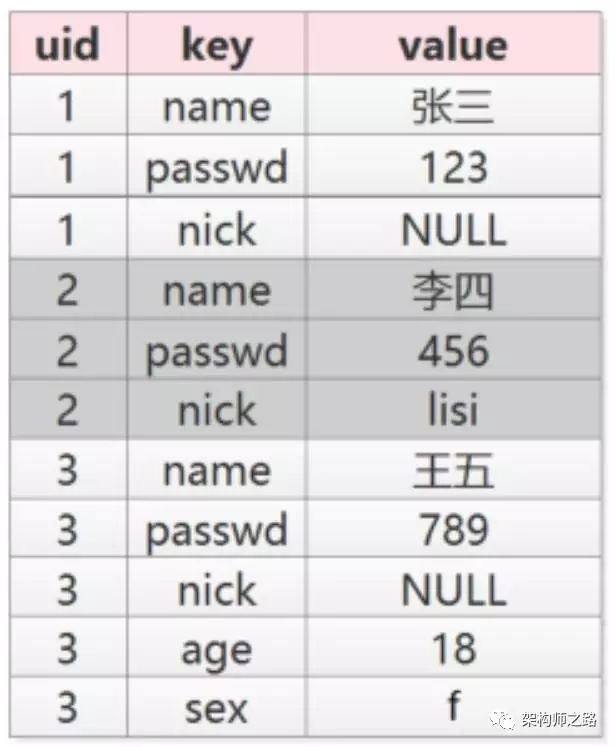

## 表扩展方案

讨论问题域：

（1）**数据量大、并发量高场景**，在线数据库属性扩展

（2）数据库 **表结构扩展性设计**

### 一、哪些方案一定是不行的

（1）alter table add column

要坚持这个方案的，也不多解释了，大数据高并发情况下，一定不可行

（2）通过增加表的方式扩展，通过外键join来查询

大数据高并发情况下，join性能较差，一定不可行

（3）通过增加表的方式扩展，通过视图来对外

一定不可行。大数据高并发情况下，互联网不怎么使用视图，至少58禁止使用视图

（4）必须遵循“第x范式”的方案

一定不可行。互联网的**主要矛盾之一是吞吐量**，为了保证吞吐量甚至可能牺牲一些事务性和一致性，通过反范式的方式来确保吞吐量的设计是很常见的，例如：冗余数据。互联网的**主要矛盾之二是可用性**，为了保证可用性，常见的技术方案也是数据冗余。在互联网数据库架构设计中，第x范式真的没有这么重要

（5）打产品经理

朋友，这是段子么，这一定不可行  

### 二、哪些方案可行，但文章未提及

（1）提前预留一些reserved字段

这个是可以的。但如果预留过多，会造成空间浪费，预留过少，不一定达得到扩展效果。

（2）通过增加表的方式扩展列，上游通过service来屏蔽底层的细节

这个也是可以的。Jeff同学提到的 *UserExt(uid, newCol1, newCol2)* 就是这样的方案（但join连表和视图是不行的）

### 三、哪些读者没有仔细看文章

（1）version+ext 太弱了，ext不支持索引

回复：属于没有仔细看文章，文章也提了如果有强需求索引可以使用MongoDB，它就是使用的json存储（评论中有不少朋友提到，还有其他数据库支持json检索）

（2）第二种key+value方案不支持索引

回复：uid可以索引

### 四、key+value方式使用场景

服务端，wordpress，EAV，配置，统计项等都经常使用这个方案。

客户端（APP或者PC），保存个人信息也经常使用这个方案。

### 五、在线表结构变更

在《啥，又要为表增加一列属性？》文章的开头，已经说明常见“ **新表+触发器+迁移数据+rename** ”方案（pt-online-schema-change），这是业内非常成熟的扩展列的方案（以为大伙都熟悉，没有展开讲，只重点讲了两种新方案，这可能是导致被喷得厉害的源头），今天补充说一下。

以 **user(uid, name, passwd)** 扩展到 **user(uid, name, passwd, age, sex)** 为例

基本原理是：

（1）先创建一个扩充字段后的新表 **user_new(uid, name, passwd, age, sex)**

（2）在原表 *user* 上创建三个触发器，对原表 *user* 进行的所有 *insert/delete/update* 操作，都会对新表 *user_new* 进行相同的操作

（3）分批将原表user中的数据insert到新表 *user_new* ，直至数据迁移完成

（4）删掉触发器，把原表移走（默认是drop掉）

（5）把新表 *user_new* 重命名（rename）成原表 *user*

扩充字段完成。

**优点**：整个过程不需要锁表，可以持续对外提供服务

操作过程中需要 **注意** ：

（1）变更过程中，最重要的是冲突的处理，一条原则，以触发器的新数据为准，这就要求被迁移的表必须有主键（这个要求基本都满足）

（2）变更过程中，写操作需要建立触发器，所以如果原表已经有很多触发器，方案就不行（互联网大数据高并发的在线业务，一般都禁止使用触发器）

（3）触发器的建立，会影响原表的性能，所以这个操作建议在流量低峰期进行

**pt-online-schema-change** 是DBA必备的利器，比较成熟，在互联网公司使用广泛。

楼主非专业的dba，上面的过程有说的不对的地方，欢迎指出。要了解更详细的细节，可以百度一下。有更好的方法，也欢迎讨论，后续会梳理汇总share给更多的朋友。

### 六、结束

欢迎用批判的眼光看问题，欢迎任何友善的技术讨论，不太欢迎“纯属误导”“非常蠢的方案”这样的评论（但我还是会加精选，任何人都有发声的权利）。

借评论中@张九云 朋友的一句话“不要以为自己见过的就是全世界，**任何方案都有使用场景，一切都是tradeoff** 作为今天的结尾，谢谢大家的支持，感谢大家。
