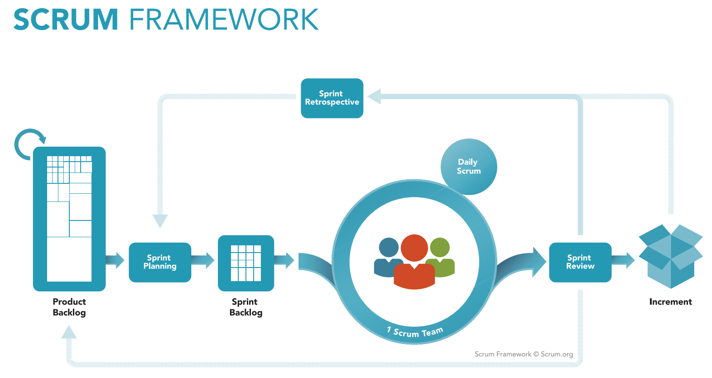

## Scrum Master 问答

### 1. 实施Scrum模式的好处有哪些？

- 降低变更对系统造成的风险
- 提高ROI（投入产出比）
- 帮助我们持续改进
- 持续快速的发布可用的软件产品
- 所有人对真实可用的软件产品都有明确的认识，并在迭代过程中不停的改进

### 2. Scrum包含怎样的组织结构？

Scrum的组织结构根据不同的项目不同而不同，一般来说，它采用2-4周的迭代周期，并包含以下角色
- Scrum Master 项目经理
SM这个角色就是：教整个团队怎么做，如何估时，跟进每天进度，风险控制，定期总结，计划排定。
- Product Owner 产品经理
PO这个角色就是：告诉产品团队要做什么，做功能的先后顺序是怎样的，需求有变动时该如何处理。
- 团队

### 3. 请解释Scrum中的用户情景是什么？

在Scrum中，用户情景是一个短小的，一般用一句话可以说明的特性或者功能的描述。

### 4. Scrum过程中都使用哪些工件/工具？

Scrum所使用的工具很简单，主要包括
- 冲刺积压工作列表 Sprint Backlog
- 产品积压工作列表 Product Backlog
- 团队速率图 Velocity Chart
- 燃尽图 Burn-down Chart
- Sprint Report
- Cumulative Flow Diagram

### 5. 请解释Scrum的冲刺

Scrum项目采用一个接一个的“冲刺”完成开发工作。冲刺是一个可重复的，标准化的工作循环单元，在这个单元中采用了Scrum的各种方法，并随时准备进行评审和改进。

### 6. 最佳的冲刺周期是多长，这个周期对工作方式有怎样的影响？

Scrum采用2-4周的冲刺周期。一般来说，大多数团队采用2周的周期，这主要是因为2周的冲刺让团队更加容易和接近现实的进行规划并完成手头的工作。同时，2周的长度也给予Product Owner足够的时间来调整优先级，并给团队和业务需求之间提供足够的缓冲，让他们可以专注于现有需求的开发。

### 7. 什么是产品积压工作列表Product Backlog?

在团队获取可用的冲刺积压工作列表sprint backlog之前，PO需要使用另外一个列表来管理新特性，变更请求，功能改进和缺陷等内容，并对他们进行优先级排序，这就是产品积压工作列表product backlog。这些内容在得到了PO和团队的认可后会交付给团队进行开发，就变成了sprint backlog，这个过程可能很复杂（比如包含多层分解，涉及多个子产品/组件，多个团队协作），也可能很简单；转换成sprint backlog的过程一般还包括了任务分解和工期估算的工作内容。

### 8. Scrum计划会议上一般需要做哪些工作？
在Scrum计划会议上，一般需要完成以下工作
- 团队针对当前冲刺需要完成的积压工作项进行分析，并给出工期估算
- 将产品挤压工作分解为任务
- 如果经过估算，冲刺中仍然有剩余工作量可用，则按照优先级从产品积压工作中继续拿取需求放入冲刺
- 对于需求描述中的不清晰内容与PO进行沟通，澄清

### 9. Scrum Master的主要职责有哪些？
– 帮助团队铲除一切阻碍，让团队可以顺利完成冲刺目标
– 帮助团队最大化生产力
– 使用技术手段帮助团队变得更加高效，比如：引入自动化脚本，单元测试，持续集成等敏捷实践
– 协助团队和PO更好的进行协作
– 保证Scrum实践的正确推行

### 10. 列出Scrum的不足
– 对于目标不够清晰的项目，Scrum Master比较难以把控
– Daily scrum在开始阶段会让团队感受比较大的压力，并占用一定的工作时间
– 对于团队成员的技术水平，协作水平有较高要求
– Scrum中对于变更的容忍度非常高，但这也会让项目干系人感受比较大的不安
– 会暴露非常多的问题，如果组织对于变化的接受度不高，会有很大的组织性冲击
– 对引发很多变革的发生，一定程度造成混乱的局面

### 11. 什么是Scrum of Scrum？
一般在大型团队中很常见，就是每天的Daily Scrum后，团队负责人还会参加更多的会议进行团队间的沟通和进一步的规划。

### 12. 什么是“增量（Increment）”？
增量指在一个冲刺内完成的产品积压工作项的数量，在每一个冲刺结束时，所有的增量必须处于完成状态。这里的完成必须是可以用的，可部署的，无论PO是否决定进行新的生产部署。

### 13. 团队速率 Velocity
速率是一个团队在一个冲刺内能够完成的需求量，需求量的单位一般使用工作量或者商业价值衡量。工作量使用“故事点”来代表，商业价值一般也作为产品积压工作的评估指标之一。速率标识一个团队完成工作的速度，是评估团队效率的重要指标。

### 14. 什么是Sashimi和Impediments？
Sashimi的原意是“生鱼片”，在Scrum中是团队用来表达“完成”的一种说法；不同团队对于“完成”的定义可以是不一样的，但在一个团队内必须统一，在Scrum中一个团队需要定义不同级别的“完成规范”来统一这个概念，“完成规范”可是是任务级别的，团队级别的或者产品特定级别的。
Impediments的意思是“障碍”，是团队在向着“完成规范”所定义的状态努力过程中遇到的阻碍，一般来说，Scrum Master需要作为消除障碍的主要负责人！

### 15. 燃尽图可以说明什么问题？
燃尽图一般用来跟踪一个冲刺的进度状态，团队把燃尽图作为预测指标来使用，可以直观得看到当前进度是快还是慢。一般团队需要在Daily Scrum的最后查看燃尽图的最新状态，并根据情况采取措施。

### 16. 冲刺回顾会议（Sprint Retrospective）的作用是什么？
冲刺回顾会议为团队提供了总结和改进的方式，在每个冲刺结束后大家一起总结在这个冲刺中的改进和不足，并一同商讨应对措施，进行持续改进。

### 17. Scrum中的冲刺（Sprint）和迭代（Iteration）有什么区别？
迭代是一个通用词汇，表达的是开发过程中的某个循环过程的单元，这个单元可以是开发人员编写代码时的编写，编译，调试，重构；也可以是一个开发周期的规划，开发，测试，回归，发布；也就是说，这个单元可大可小，都可以使用迭代来进行描述。
冲刺特指在Scrum中的某个产品开发周期，是一个2-4周的规划，开发，测试，回归和发布过程。

### 18. Scrum中的故事点是什么意思？
在Scrum中使用用户故事（情景）作为描述一个产品特性的方式，同时使用“故事点”作为这个产品特性大小的定量估算单位，故事点的大小标识了一个产品特性的开发难度和所需要的投入（小时/人天等）。但我们一般不使用直接的小时或人天等时间单位来表示这个值，使用斐波纳奇数列中的数值来标识不同特性的相对大小，这样做的好处时我们可以屏蔽直接使用时间单位所造成的主观差异，更快更准确的进行评估（因为在没有进行实际开发之前是很难直接估算时间，但是不同特性的相对大小是比较容易评估的）。最终，我们可以使用数据分析手段在故事点单位和时间单位之间建立换算关系，帮助我们掌控项目进度。

### 19. 在什么情况下Scrum并不适用？
Scrum模式并不适用于所有的团队，特别当团队规模很大（几十上百上千）的时候，我们无法在整个团队范围内实施Scrum而必须将团队分割成5-10人的小团队，并在团队间进行Scrum of Scrum 的实施。
Scrum也不适合跨部门，跨职能的协作，如果团队成员分散于不同的地理位置或者不同的部门，我们需要首先在组织结构上进行调整，至少需要合并开发和测试部门，组成按照特性或产品领导的团队，同时从其他不同部门抽调人员组成团队。

### 20. 什么是 Daily Scrum
Daily Scrum 是一个简短的团队会议，由团队的所有成员在每天固定的时间和地点进行，会议上每个成员需要回答3个问题：1） 你昨天做了什么？2）今天计划做什么？ 3）是否遇到了障碍，需要其他人的帮助？
Daily Scrum 不是一个汇报会议，因为在所有的参与者都必须抱着平等的心态参加，你所回答的3个问题是说给所有人听的，所有人的3个问题也都是说给你听的。Daily Scrum 一般由Scrum Master进行协调和组织，但Scrum Master并不对成员所描述的业务特性/任务内容进行评价，而只关注会议本身是否高效。
Daily Scrum 必须站立进行，所有有很多人称之为Daliy stand-up，站立的目的是为了让会议高效并让每个人都集中精力，放下手头的工作。
