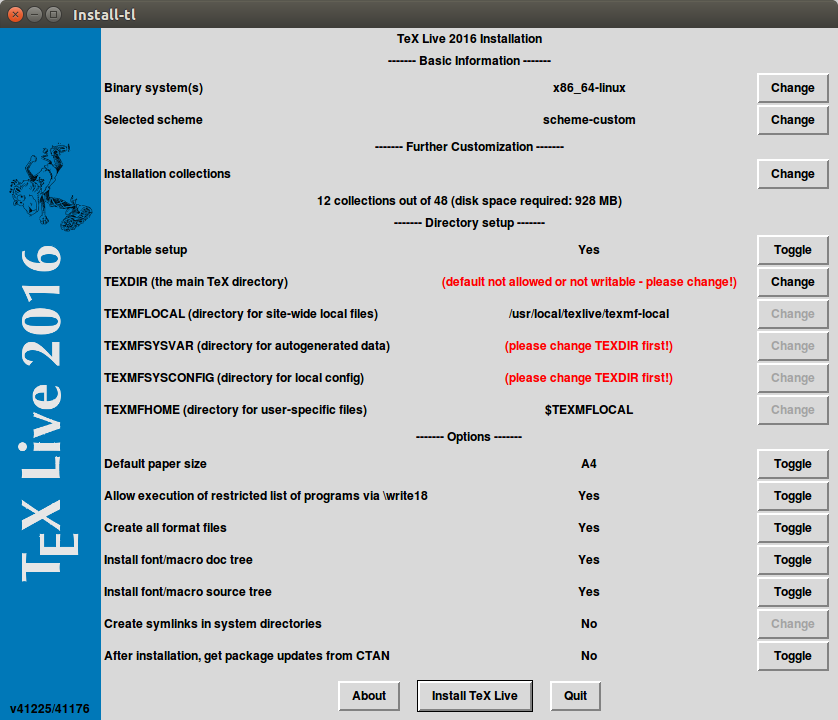
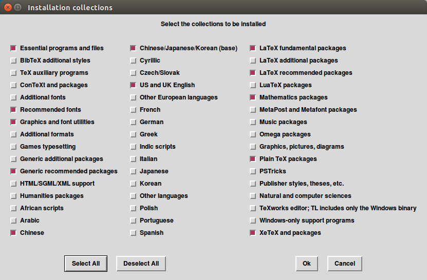

# atom的latex插件配置笔记

## latex安装配置

### 安装前准备

如果已经安装了其它版本的TeX Live，需要先卸载掉。

下载最新版本程序 [阿里云镜像](http://mirrors.aliyun.com/CTAN/systems/texlive/Images/texlive2016.iso)

为了使用图形化安装界面，需要安装perl的tk组件：

```bash
sudo apt-get install perl-tk
```

### 加载镜像文件

```bash
sudo mount -o loop texlive2016.iso /mnt
```

### 启动安装程序的图形化界面进行配置

```bash
cd /mnt
sudo ./install-tl -gui
```

配置如图:





- latex additional packages

安装完成之后,添加环境变量,卸载镜像文件

```bash
cd /; sudo umount /mnt
```

### 安装latexmk

```bash
tlmgr install latexmk
```

## atom插件安装

1. 打开atom

File -> Settings -> Install

2. 搜索并安装：

language-latex
latex
pdf-view
