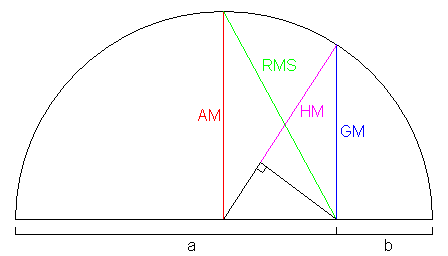

# 几何级数命名由来

中学时，学习平均数的时候，学到有四种平均数:

$$\begin{array}{lll}
\text{平方平均数} & \text{Root-Mean Square} & \sqrt[]{\cfrac{x_1^2+\cdots+ x_n^2}{n}} \\
\text{算数平均数} & \text{Arithmetic Mean} & \cfrac{x_1+\cdots+x_n}{n} \\
\text{几何平均数} & \text{Geometric Mean} & \sqrt[n]{x_1 \cdots x_n} \\
\text{调和平均数} & \text{Harmonic mean} & \cfrac{n}{\cfrac{1}{x_1}+ \cdots + \cfrac{1}{x_n}} \\
\end{array}$$

这几个平均数有个经典的不等式

$$\sqrt[]{\cfrac{x_1^2+\cdots+ x_n^2}{n}} ≥ \cfrac{x_1+\cdots+x_n}{n} ≥  \sqrt[n]{x_1 \cdots x_n} ≥ \cfrac{n}{\frac{1}{x_1}+ \cdots + \frac{1}{x_n}}$$

当$n=2$时，不等式有下图

其中平方平均数和算数平均数的概念比较明显，而集合平均数和调和平均数的命名就有点渊源了。

几何平均数：$x_1,\ldots ,x_n$ 的几何平均数是有实际集合意义的。$x_1,\ldots ,x_n$为边长的$n$维超立方体的体积为这些数相称，而开n次方之后就是等体积的标准n维超立方体的边长。

调和平均数：这个级数名字源于音乐中的泛音列（[harmonic series](https://en.wikipedia.org/wiki/Harmonic_series_(music))）（泛音列与调和级数英文同为harmonic series）：一条振动的弦的泛音的波长依次是基本波长的1/2、1/3、1/4……等等。调和序列中，第一项之后的每一项都是相邻两项的调和平均数。
