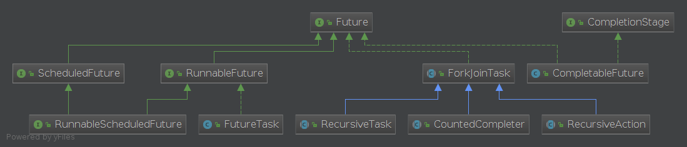
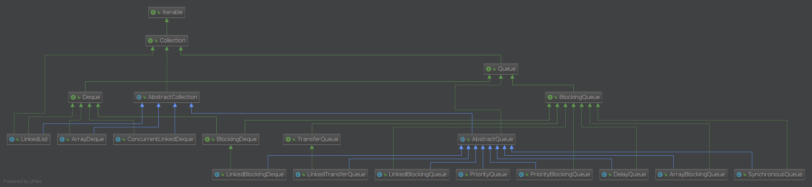
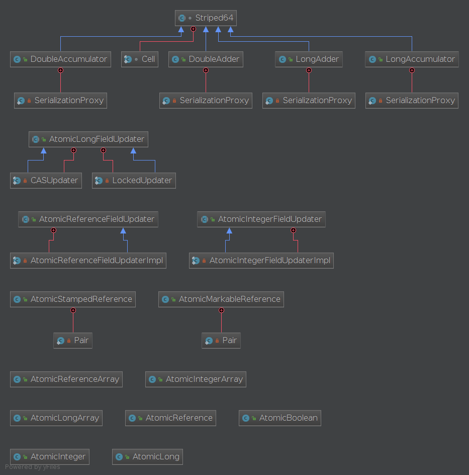
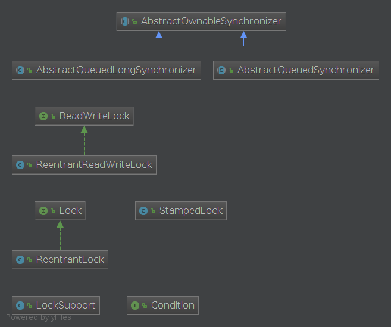
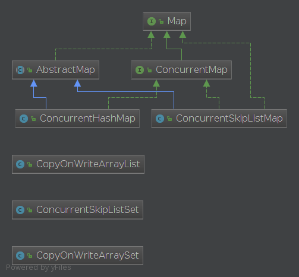

# Concurrent包分析

jdk8中java.util.concurrent包分析

## Executor相关类

## Future相关类

## Queue相关类

## atomic相关类

## lock相关类

## Synchronizers

Five classes aid common special-purpose synchronization idioms.

**Semaphore** is a classic concurrency tool.
**CountDownLatch** is a very simple yet very common utility for blocking until a given number of signals, events, or conditions hold.
A **CyclicBarrier** is a resettable multiway synchronization point useful in some styles of parallel programming.
A **Phaser** provides a more flexible form of barrier that may be used to control phased computation among multiple threads.
An **Exchanger** allows two threads to exchange objects at a rendezvous point, and is useful in several pipeline designs.

## Concurrent Collections

Besides Queues, this package supplies Collection implementations designed for use in multithreaded contexts: ConcurrentHashMap, ConcurrentSkipListMap, ConcurrentSkipListSet, CopyOnWriteArrayList, and CopyOnWriteArraySet. When many threads are expected to access a given collection, a **ConcurrentHashMap** is normally preferable to a synchronized HashMap, and a **ConcurrentSkipListMap** is normally preferable to a synchronized TreeMap. A **CopyOnWriteArrayList** is preferable to a synchronizedArrayList when the expected number of reads and traversals greatly outnumber the number of updates to a list.
