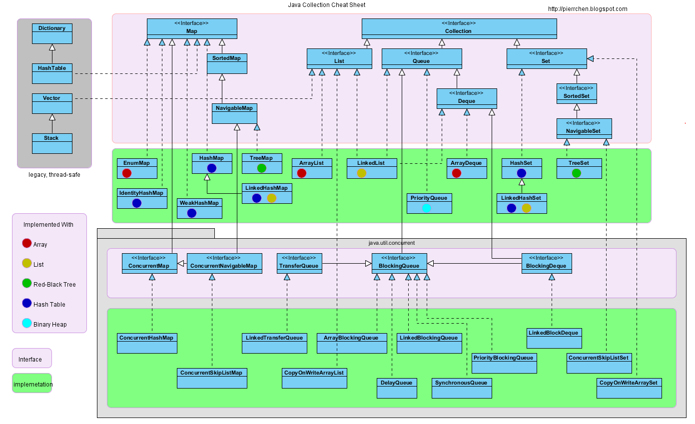
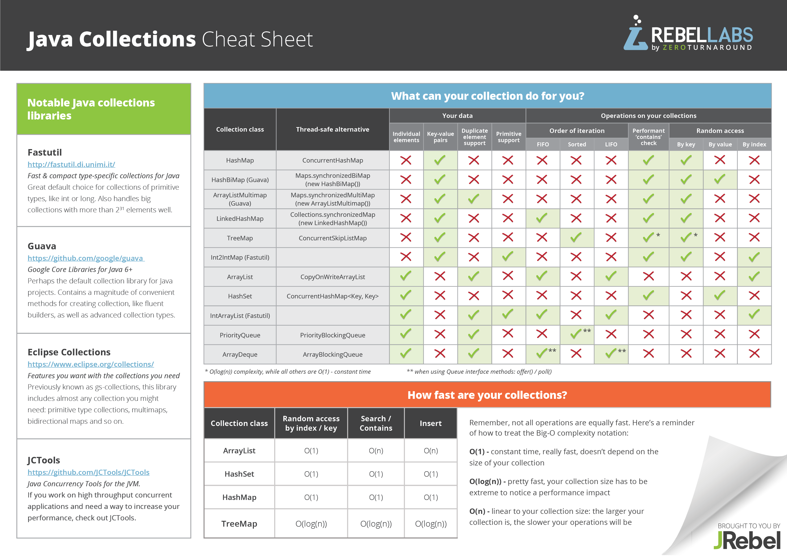
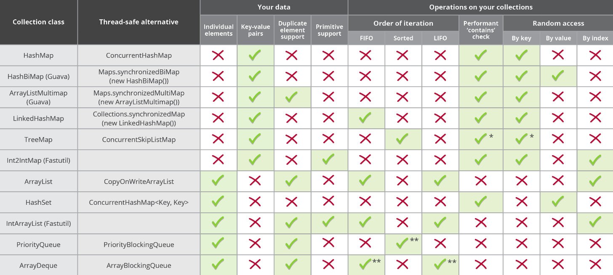
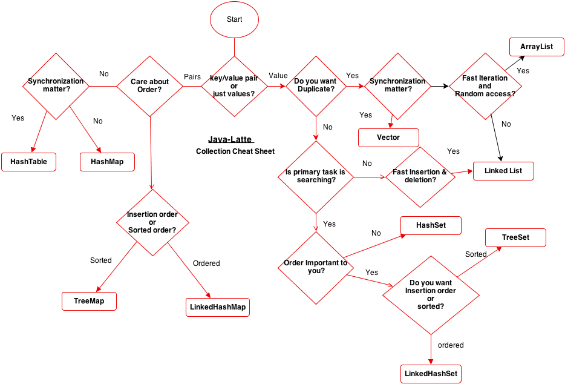

## Java Collection

### Overview

### Summary in one sheet

<!--  -->

### Java Collection Select

<!--  -->

### Collection

|               | Insert Order | Sorting | Null Element |
|:-------------:|:------------:|:-------:|:------------:|
|   ArrayList   |       ✔      |         |       ✔      |
|   LinkedList  |       ✔      |         |       ✔      |
|    HashSet    |              |         |       ✔      |
| LinkedHashSet |       ✔      |         |       ✔      |
|    TreeSet    |              |    ✔    |              |

### Map

|                   | Insert Order | Sorting | Duplicate Keys | Duplicate Values | Key Null | Value Null | Thread Safe |
|:-----------------:|:------------:|:-------:|:--------------:|:----------------:|:--------:|:----------:|:-----------:|
|      HashMap      |              |         |                |         ✔        |     ✔    |      ✔     |             |
|   LinkedHashMap   |       ✔      |         |                |         ✔        |     ✔    |      ✔     |             |
|      TreeMap      |              |    ✔    |                |         ✔        |          |      ✔     |             |
|     Hashtable     |              |         |                |         ✔        |          |            |      ✔      |
| ConcurrentHashMap |              |         |                |         ✔        |          |            |      ✔      |

### BlockingQueue

A BlockingQueue does not accept null elements.

FIFO: First in, First out.
LIFO: Last in, First out.

|         | Throws exception | Special value | Blocks         | Times out            |
|---------|------------------|---------------|----------------|----------------------|
| Insert  | add(e)           | offer(e)      | put(e)         | offer(e, time, unit) |
| Remove  | remove()         | poll()        | take()         | poll(time, unit)     |
| Examine | element()        | peek()        | not applicable | not applicable       |

### BlockingDeque

#### First Element (Head)

|         | Throws exception | Special value | Blocks         | Times out                 |
|---------|------------------|---------------|----------------|---------------------------|
| Insert  | addFirst(e)      | offerFirst(e) | putFirst(e)    | offerFirst(e, time, unit) |
| Remove  | removeFirst()    | pollFirst()   | takeFirst()    | pollFirst(time, unit)     |
| Examine | getFirst()       | peekFirst()   | not applicable | not applicable            |

#### Last Element (Tail)

|         | Throws exception | Special value | Blocks         | Times out                |
|---------|------------------|---------------|----------------|--------------------------|
| Insert  | addLast(e)       | offerLast(e)  | putLast(e)     | offerLast(e, time, unit) |
| Remove  | removeLast()     | pollLast()    | takeLast()     | pollLast(time, unit)     |
| Examine | getLast()        | peekLast()    | not applicable | not applicable           |

#### BlockingQueue vs BlockingDeque

Like any BlockingQueue, a BlockingDeque is thread safe, does not permit null elements

| BlockingQueue Method | Equivalent BlockingDeque Method |
|----------------------|---------------------------------|
| Insert               |                                 |
| add(e)               | addLast(e)                      |
| offer(e)             | offerLast(e)                    |
| put(e)               | putLast(e)                      |
| offer(e, time, unit) | offerLast(e, time, unit)        |
| Remove               |                                 |
| remove()             | removeFirst()                   |
| poll()               | pollFirst()                     |
| take()               | takeFirst()                     |
| poll(time, unit)     | pollFirst(time, unit)           |
| Examine              |                                 |
| element()            | getFirst()                      |
| peek()               | peekFirst()                     |
