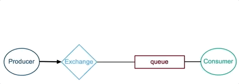
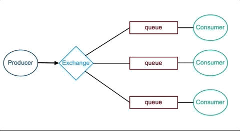
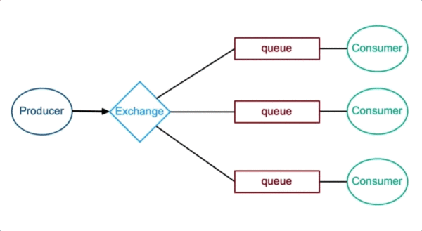
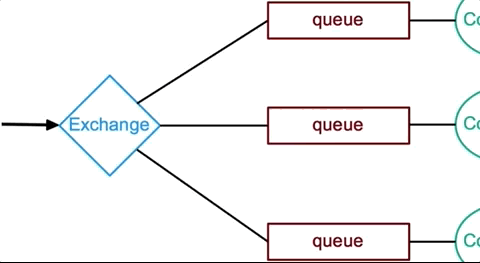
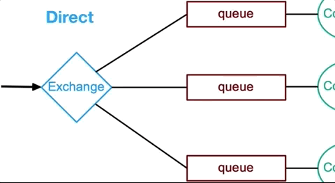
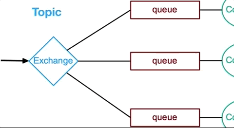
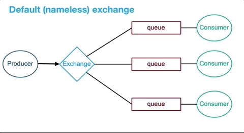

## 图解RabbitMQ

消息队列可以实现流量削峰、降低系统耦合度、提高系统性能等。

**RabbitMQ**是一个实现了AMQP协议（Advanced Message Queue Protocol）的消息队列。
  

**RabbitMQ中的概念**
----------------

*   **producer**： producer 是一个发送消息的应用
*   **exchange**：producer 并不会直接将消息发送到 queue 上，而是将消息发送给 exchange，由 exchange 按照一定规则转发给指定queue
*   **queue**： queue 用来存储 producer 发送的消息
*   **consumer**： consumer是接收并处理消息的应用

**RabbitMQ运作原理**
----------------

**RabbitMQ消息传递（单个队列）：**

**RabbitMQ消息传递（多个队列）**：

多个Queue的场景中，**消息会被Exchange按一定的路由规则分发到指定的Queue中去**：

*   生产者指定Message的routing key，并指定Message发送到哪个Exchange
*   Queue会通过binding key绑定到指定的Exchange
*   Exchange根据对比Message的routing key和Queue的binding key，然后按一定的分发路由规则，决定Message发送到哪个Queue

**每一类Exchange都有自己的分发路由规则：**

**Fanout Exchange**：忽略key对比，发送Message到Exchange下游绑定的所有Queue

**Direct Exchange**：比较Message的routing key和Queue的binding key，完全匹配时，Message才会发送到该Queue

**Topic Exchange**：比较Message的routing key和Queue的binding key，按规则匹配成功时，Message才会发送到该Queue

*   **routing key命名规则**：用"."分割的字母或数字
*   **匹配规则**：

*   \*：匹配单个字母或数字
*   #：匹配0~多个字母或数字
*   比如：\*.stock.#与usd.stock、eur.stock.db匹配；但与stock.nasdaq不匹配

**默认Exchange**：比较Message的routing key和Queue的名字，完全匹配时，Message才会发送到该Queue

**RabbitMQ控制台**
---------------

RabbitMQ控制台可以：

*   创建Queue
*   创建Exchange
*   通过binding key绑定Queue到Exchage
*   发送消息到Exchange
*   从Queue接收消息
*   其他运维监控功能
