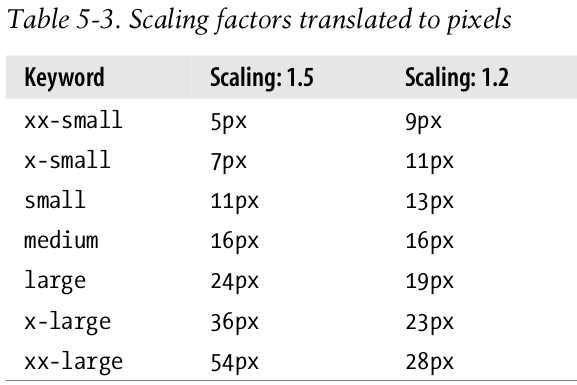

# Font

## Font Families

设置或检索用于对象中文本的字体名称序列，序列可包含嵌入字体。

### syntax

```
font-family：[ <family-name> | <generic-family> ] [, <family-name> | <generic-family>]*
<family-name> = arial | georgia | verdana | helvetica | simsun and etc.
<generic-family> = cursive | fantasy | monospace | serif | sans-serif
default : medium
```

### generic-family

- Serif fonts
	衬线字体族 具有末端加粗、扩张或尖细末端，或以实际的衬线结尾的一类字体
	因为衬线字体的可读性非常好，所以它应用的最多的地方也正是出版物或者印刷品的正文内容等以大段文字作为表现形式的作品上。
- Sans-serif fonts
	无衬线字体族 sans- 前缀是法语，发音为 /san/，意为“无”
	无衬线字体比较圆滑，线条一般粗细均匀。比较适合用作艺术字、标题等。因为无衬线字体通常粗细比较均匀，所以在小字体显示的时候，可读性会降低，容易引起视觉疲劳。
- Monospace fonts
	所谓的等宽字体，是指每个字符宽度都一致的字体。一个著名的例子就是 Courier New 字体。因为字符宽度一致，所以特别容易对齐，能快速精确的定位到某行某列，因此经常用来显示代码。
	典型的字体有：Courier、MS Courier New、Prestige
- Cursive fonts
	相当于印刷学中的手写体
	典型的字体有：Caflisch Script、Adobe Poetica、迷你简黄草、华文行草
- Fantasy fonts
	主要用在图片中，字体看起来很艺术，实际网页上用得不多。
	典型的字体有：WingDings、WingDings 2、WingDings 3、Symbol

字体名称。按优先顺序排列。以逗号隔开。如果字体名称包含空格或中文，则应使用引号括起

```css
p {font-family: Times, TimesNR, 'New Century Schoolbook', Georgia, 'New York', serif;}
```

Quotation marks are needed in a font-family declaration only if a font name has one or more spaces in it, such as New York, or if the font name includes symbols such as # or $.

## Font Weights

设置或检索对象中的文本字体的粗细。

### syntax

```
font-weight：normal | bold | bolder | lighter | <integer>
default : normal
normal： 正常的字体。相当于number为400
bold： 粗体。相当于number为700。
bolder： 特粗体。也相当于strong和b对象的作用
lighter： 细体
<integer>： 用数字表示文本字体粗细。取值范围：100 | 200 | 300 | 400 | 500 | 600 | 700 | 800 | 900
```
## Font Size

设置或检索对象中的字体尺寸。

### syntax

```
font-size：<absolute-size> | <relative-size> | <length> | <percentage>
<absolute-size>： 根据对象字体进行调节。可选参数值：xx-small | x-small | small | medium | large | x-large | xx-large
<relative-size>： 相对于父对像中字体尺寸进行相对调节。使用成比例的em单位计算。可选参数值：smaller | larger
<length>： 用长度值指定文字大小。不允许负值。
<percentage>： 用百分比指定文字大小。其百分比取值是基于父对象中字体的尺寸。不允许负值。
```

the effect of font-size is to provide a size for the em box of a given font. This does not guarantee that any of the actual displayed characters will be this size.

### Absolute Sizes



### Percentages and Sizes

Percentages, unlike the relative-size keywords, permit much finer control over the computed font size.
In practice, a web browser would very likely round the values off to the nearest whole-number pixel, such as 14px , although advanced user agents may approximate fractional pixels.
although font-size is inherited in CSS, it is the computed values that are inherited, not percentages. This will cause runaway scaling(缩放失控)

## Font Style

设置或检索对象中的文本字体样式。

### syntax

```
font-style：normal | italic | oblique
default : normal
normal： 指定文本字体样式为正常的字体
italic： 指定文本字体样式为斜体。对于没有斜体变量的特殊字体，将应用oblique
oblique： 指定文本字体样式为倾斜的字体
```

Font faces with labels like “Italic,” “Cursive,” and “Kursiv” are usually mapped to the italic keyword, while oblique is often assigned faces with labels such as “Oblique,” “Slanted,” and “Incline.”

## Font Variant

设置或检索对象中的文本是否为小型的大写字母。

### syntax

```
font-variant：normal | small-caps
default : normal
```

## Font

设置或检索对象中的文本特性。该属性是复合属性。

### syntax

```
font：[ [ <font-style> || <font-variant> || <font-weight> ]? <font-size> [ / <line-height> ]? <font-family> ] | caption | icon | menu | message-box | small-caption | status-bar
<font-style>： 指定文本字体样式
<font-variant>： 指定文本是否为小型的大写字母
<font-weight>： 指定文本字体的粗细
<font-size>： 指定文本字体尺寸
<line-height>： 指定文本字体的行高
<font-family>： 指定文本使用某个字体或字体序列
caption： 使用有标题的系统控件的文本字体（如按钮，菜单等）（CSS2）
icon： 使用图标标签的字体（CSS2）
menu： 使用菜单的字体（CSS2）
message-box： 使用信息对话框的文本字体（CSS2）
small-caption： 使用小控件的字体（CSS2）
status-bar： 使用窗口状态栏的字体（CSS2）
```

使用第一种声明方式参数必须按照如上的排列顺序，且font-size和font-family是不可忽略的。每个参数仅允许有一个值。忽略的将使用其参数对应的独立属性的默认值。
