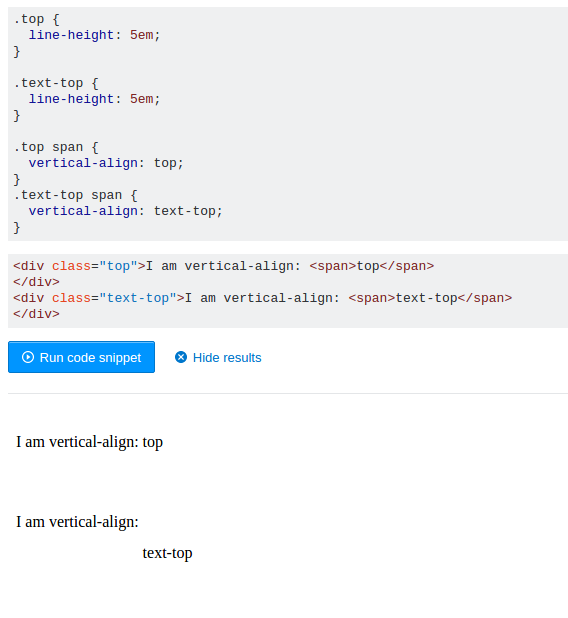
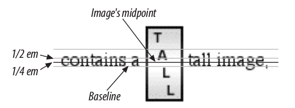
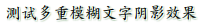

# Text Properties

## Indentation

检索或设置对象中的文本的缩进

### syntax

```
text-indent：[ <length> | <percentage> ]
<length>：用长度值指定文本的缩进。可以为负值。
<percentage>：用百分比指定文本的缩进。可以为负值。
```

内联对象要使用该属性必须先使该对象表现为块级或内联块级。

## Horizontal Alignment

设置或检索对象中内容的水平对齐方式。

### syntax

```
text-align：start | end | left | right | center | justify | match-parent | justify-all
left：内容左对齐。
center：内容居中对齐。
right：内容右对齐。
justify：内容两端对齐，但对于强制打断的行（被打断的这一行）及最后一行（包括仅有一行文本的情况，因为它既是第一行也是最后一行）不做处理。（CSS3）
start：内容对齐开始边界。（CSS3）
end：内容对齐结束边界。（CSS3）
match-parent：这个值和 inherit 表现一致，只是该值继承的 start 或 end 关键字是针对父母的 <' direction '> 值并计算的，计算值可以是 left 和 right 。（CSS3）
justify-all：效果等同于 justify，但还会让最后一行也两端对齐。（CSS3）
```

text-align不处理强制打断的行，也不处理块内的最后一行，换句话说，如果块内仅有一行文本（该行既是第一行也是最后一行），这时仅设置text-align:justify无法让该行两端对齐

块内的最后一行文本（包括块内仅有一行文本的情况，这时既是第一行也是最后一行）及被强制打断的行，其两端对齐需使用 <' text-align-last '>；

## Vertical Alignment

### The Height of Lines

检索或设置对象的行高。即字体最底端与字体内部顶端之间的距离。

### syntax

```
line-height：normal | <length> | <percentage> | <number>
normal：允许内容顶开或溢出指定的容器边界。
<length>：用长度值指定行高。不允许负值。
<percentage>：用百分比指定行高，其百分比取值是基于字体的高度尺寸。不允许负值。
<number>：用乘积因子指定行高。不允许负值。
```

line-height values inherit from the parent element as computed from the parent, not the child.
the scaling factor can be an inherited value instead of a computed value.

### Vertically Aligning Text

设置或检索内联元素在行框内的垂直对其方式。

### syntax

```
vertical-align：baseline | sub | super | top | text-top | middle | bottom | text-bottom | <percentage> | <length>
baseline：将支持valign特性的对象的内容与基线对齐
	If a vertically aligned element doesn’t have a baseline—that is, if it’s an image, a form input, or another replaced element—then the bottom of the element is aligned with the baseline of its parent
sub：垂直对齐文本的下标
super：垂直对齐文本的上标
top：将支持valign特性的对象的内容与对象顶端对齐
middle：将支持valign特性的对象的内容与对象中部对齐
bottom：将支持valign特性的对象的文本与对象底端对齐
text-top：Aligns the top of the element with the top of the parent element's font.
text-bottom：Aligns the bottom of the element with the bottom of the parent element's font.
<percentage>：用百分比指定由基线算起的偏移量。可以为负值。基线对于百分数来说就是0%。
<length>：用长度值指定由基线算起的偏移量。可以为负值。基线对于数值来说为0。（CSS2）
```

#### text-top和top的区别




#### sub and super

the values sub and super do not change the element’s font size.Any text in the sub- or superscripted element should be, by default, the same size as text in the parent element.
The declaration vertical-align : sub causes an element to be subscripted, meaning that its baseline (or bottom, if it’s a replaced element) is lowered with respect to its parent’s baseline.

#### middle

middle aligns the middle of an inline element’s box with a point that is 0.5ex above the baseline of the parent element, where 1ex is defined relative to the font-size for the parent element.

Since most user agents treat 1ex as one-half em, middle usually aligns the vertical midpoint of an element with a point one-quarter em above the parent’s baseline.



#### Percentages

Percentages don’t let you simulate align="middle" for images. Instead, setting a percentage value for vertical-align raises or lowers the baseline of the element (or the bottom edge of a replaced element) by the amount declared, with respect to the parent’s baseline.

## Word Spacing and Letter Spacing

### Word Spacing

检索或设置对象中的单词之间的最小，最大和最佳间隙。
该属性将指定的间隔添加到每个单词(词内不发生)之后，但最后一个字将被排除在外。
判断是否为单词的依据是单词间是否有空格。

#### syntax

```
normal | <length> | <percentage>
normal：默认间隔
<length>：用长度值指定间隔。可以为负值。
<percentage>：用百分比指定间隔。可以为负值。（CSS3）
```

### Letter Spacing

检索或设置对象中的字符之间的最小，最大和最佳间隙。
该属性将指定的间隔添加到每个文字(包括单词内的每个字母)之后。
<' letter-spacing '> 不能被应用于一行的开始和结束
#### syntax

```
normal | <length> | <percentage>
normal：默认间隔
<length>：用长度值指定间隔。可以为负值。
<percentage>：用百分比指定间隔。可以为负值。（CSS3）
```

## Text Transformation

### text-transform

检索或设置对象中的文本的大小写。

#### syntax

```
none | capitalize | uppercase | lowercase | full-width
none：无转换
capitalize：将每个单词的第一个字母转换成大写
uppercase：将每个单词转换成大写
lowercase：将每个单词转换成小写
full-width：将所有字符转换成fullwidth形式。如果字符没有相应的fullwidth形式，将保留原样。这个值通常用于排版拉丁字符和数字等表意符号。（CSS3）
```

## Text Decoration

### text-decoration

#### css2.1

```
none | [ underline || overline || line-through || blink ] | inherit
text-decoration is not inherited
```

the value of text-decoration is not inherited, the strong element assumes a default value of none. Therefore, the strong element has no underline. Now, there is very clearly a line under the strong element, so it seems silly to say that it has none. Nevertheless, it doesn’t. What you see under the strong element is the paragraph’s underline, which is effectively “spanning” the strong element.

#### css3

复合属性。检索或设置对象中的文本的装饰。

```
text-decoration：<' text-decoration-line '> || <' text-decoration-style '> || <' text-decoration-color '>
<' text-decoration-line '>：指定文本装饰的种类。相当于CSS2.1的 <' text-decoration '> 属性，可取值：none | underline | overline | line-through | blink
<' text-decoration-style '>：指定文本装饰的样式。
<' text-decoration-color '>：指定文本装饰的颜色。
```

浏览器支持较少

## Text Shadows

### text-shadow

设置或检索对象中文本的文字是否有阴影及模糊效果

#### syntax
```
text-shadow：none | <shadow> [ , <shadow> ]*
<shadow> = <length>{2,3} && <color>?
none：无阴影
<length>①：第1个长度值用来设置对象的阴影水平偏移值。可以为负值
<length>②：第2个长度值用来设置对象的阴影垂直偏移值。可以为负值
<length>③：如果提供了第3个长度值则用来设置对象的阴影模糊值。不允许负值
<color>：设置对象的阴影的颜色。
```

```css
p{text-shadow:1px 1px 0 rgba(255,255,255,1),1px 1px 2px rgba(0,85,0,.8);}
```


## Handling Whitespace

### white-space

设置或检索对象内空格的处理方式。

#### syntax

```
normal | pre | nowrap | pre-wrap | pre-line
normal：默认处理方式。
pre：用等宽字体显示预先格式化的文本，不合并文字间的空白距离，当文字超出边界时不换行。
nowrap：强制在同一行内显示所有文本，合并文本间的多余空白，直到文本结束或者遭遇br对象。
pre-wrap：用等宽字体显示预先格式化的文本，不合并文字间的空白距离，当文字碰到边界时发生换行。
pre-line：保持文本的换行，不保留文字间的空白距离，当文字碰到边界时发生换行。
```

## Text Direction

### direction

检索或设置文本流的方向。

#### syntax

```
direction：ltr | rtl
ltr：文本流从左到右。
rtl：文本流从右到左。
```
