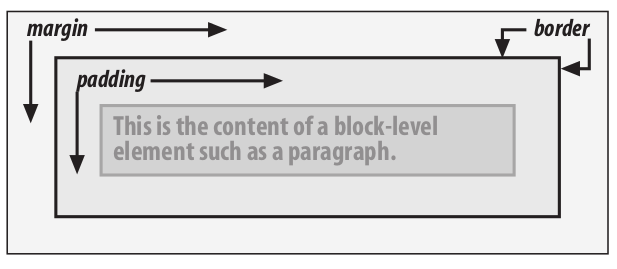
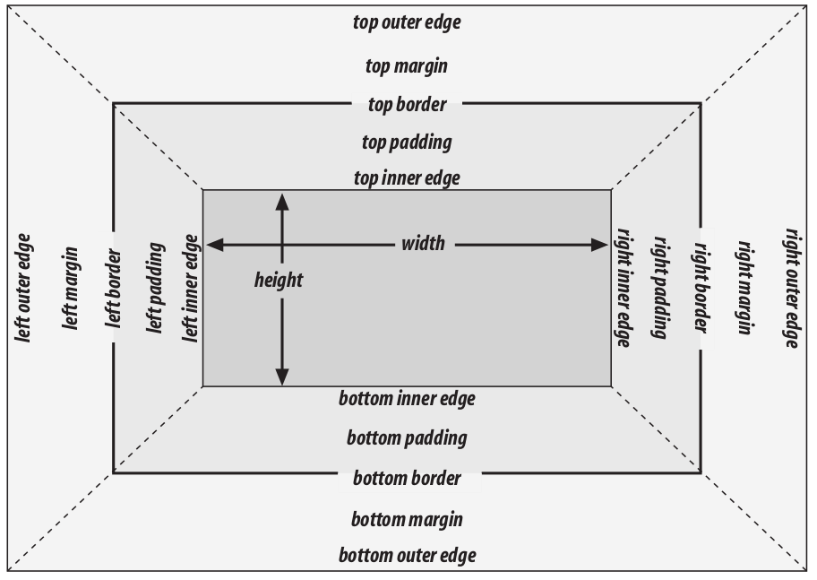
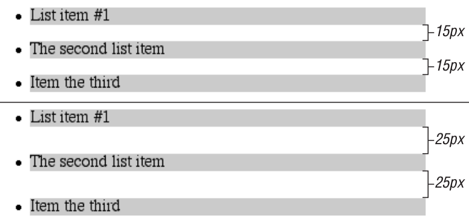
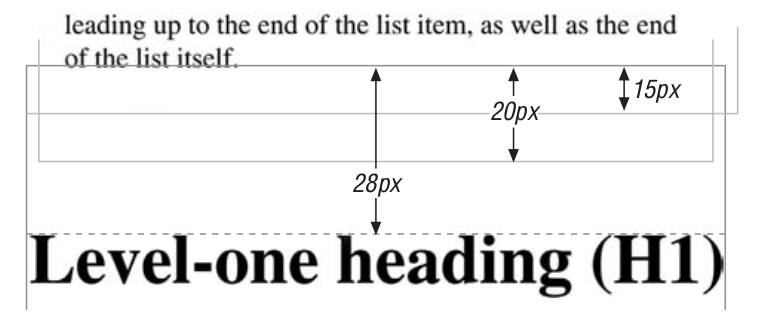

# Basic Visual Formatting

## concept

**Normal flow**

The left-to-right, top-to-bottom rendering of text in Western languages and the familiar text layout of traditional HTML documents. Note that the flow direction may be changed in non-Western languages. Most elements are in the normal flow, and the only way for an element to leave it is to be floated or positioned

**Nonreplaced element**

An element whose content is contained within the document.

**Replaced element**

An element that serves as a placeholder for something else.

**Block-level element**

An element such as a paragraph, heading, or a div . These elements generate “new lines” both before and after their boxes when in the normal flow, so that block-level elements in the normal flow stack vertically.

**Inline element**

An element such as strong or span . These elements do not generate “line breaks” before or after themselves, and they are descendants of a block-level element. You can cause an element to generate an inline-level box by declaring display : inline .

**Root element**

The element at the top of the document tree.

## Block-Level Elements

### Basic Boxes




border color : If no color is set, then the border takes on the foreground color of the element’s content. For example, if the text of a paragraph is white, then any borders around that paragraph will be white unless theauthor explicitly declares a different border color.

### Horizontal Formatting

margin-right is forced to be auto only for left-to-right languages such as English. In right-to-left languages, everything is reversed, so margin-left is forced to be auto , not margin-right .

Note that since horizontal margins do not collapse, the padding, borders, and margins of a parent element can affect its children. The effect is indirect in that the margins (and so on) of an element can induce an offset for child elements.

#### Negative margins

With a negative left margin, not only does the paragraph spill beyond the borders of the div , but it also spills beyond the edge of the browser window itself!

#### Replaced elements

All of the rules for nonreplaced blocks hold true, with one exception: if width is left as auto , then the width of the element is the content’s intrinsic width.
Note that the height of the elements also increases. When a replaced element’s width is changed from its intrinsic width, the value of height is scaled to match, unless height has been set to an explicit value of its own. The reverse is also true: if height is set, but width is left as auto , then the width is scaled proportionately to the change in height.

### Vertical Formatting

Suppose the specified height is greater than that needed to display the content ,the extra height has a visual effect somewhat like extra padding.
Suppose the height is less than what is needed to display the content,the browser may add a scrollbar to the element.

#### Collapsing vertical margins




```
ul {margin-bottom: 15px;}
li {margin-top: 10px; margin-bottom: 20px;}
h1 {margin-top: 28px;}
```

Negative margins
Negative margins do have an impact on vertical formatting, and they affect how mar-
gins are collapsed.

## Inline Elements

### Basic Terms and Concepts
			Anonymous text
				This is any string of characters that is not contained within an inline element.Thus, in the markup <p> I'm <em>so</em> happy!</p> , the sequences “ I’m ” and “ happy!” are anonymous text. Note that the spaces are part of the text since a space is a character like any other.
			Em box
				This is defined in the given font, otherwise known as the character box.
			Content area
				In nonreplaced elements,it's the em box.
				In replaced elements, the content area is the intrinsic height of the element plus any margins, borders, or padding.
			Leading
				The leading is the difference between the values of font-size and line-height .
				This difference is actually divided in half and applied to the top and bottom of the content area.
				Leading is not applied to replaced elements
			Inline box
				This is the box described by the addition of the leading to the content area.
				nonreplaced elements
					line-height
				replaced elements
					the content area
			Line box
				This is the shortest box that bounds the highest and lowest points of the inline boxes that are found in the line.
