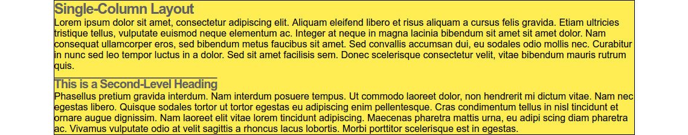
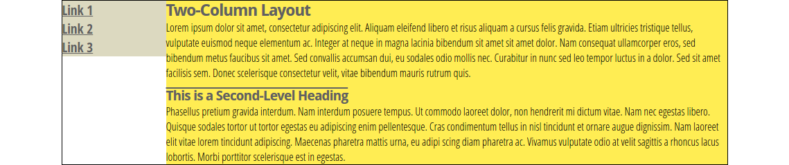
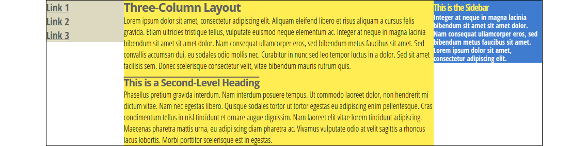
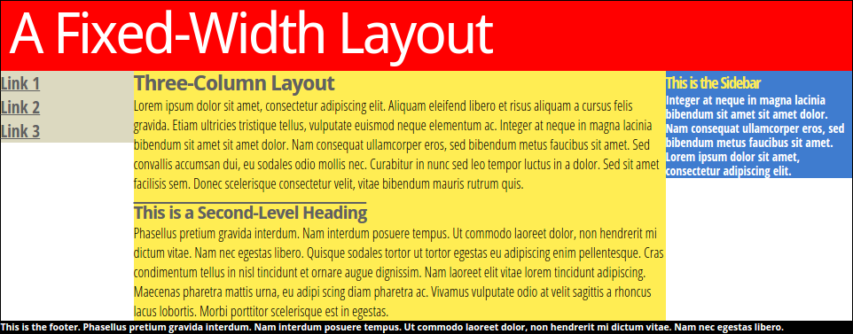
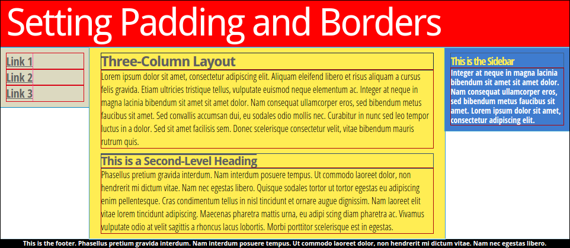

# 页面布局

## 布局的基本概念

**固定宽度**

布局的大小不会随用户调整浏览器窗口大小而变化

960 像素是最常见的

**流动布局**

大小会随用户调整浏览器窗口大小而变化

更好地适应大屏幕,但同时也意味着放弃对页面某些方面的控制,比如随着页面宽度变化,文本行的长度和页面元素之间的位置关系都可能变化

适应各种屏幕宽度的可变固定布局,正逐步取代流动布局。这种可变的固定布局能够适应最大和最小的屏幕,业界称之为响应式设计。

**弹性布局**

弹性布局与流动布局类似,在浏览器窗口变宽时,不仅布局变宽,而且所有内容元素的大小也会变化,让人产生一种所有东西都变大了的感觉

**布局高度**

多数情况下,布局中结构化元素(乃至任何元素)的高度是不必设定的。事实上,我甚至想告诉你根本不应该给元素设定高度。除非你确实需要这样做,比如在页面中创造一个绝对定位的元素。

超出的内容要么被剪掉,要么会跑到容器之外——取决于元素overflow 属性的设定

**布局宽度**

与高度不同,我们需要更精细地控制布局宽度,以便随着浏览器窗口宽度的合理变化,布局能够作出适当的调整,确保文本行不会过长或过短。

即使必须设定栏宽,也不要给包含在其中的内容元素设定宽度,应该让这些内容元素自动扩展到填满栏的宽度。本书前面已经讲过了,这是块级元素的默认行为。简言之,就是让栏宽限制其中内容元素的宽度。

## 三栏-固定宽度布局

### 第一步：内容栏

```css
#wrapper {width:960px; margin:0 auto; border:1px solid;}
article {}
```



### 第二步：添加左边栏

给nav和article添加浮动

```css
nav {
	width: 150px;
	float: left;
}
article {
	width:810px;
	float:left;
}
```



### 第三步：添加右边栏

```css
nav {
	width: 150px;
	float: left;
}
article {
	width:600px;
	float:left;
}
aside {
	width:210px;
	float:left;
}
```



通过把三个浮动容器的总宽度设定为恰好等于外包装的宽度(150 +600 + 210 = 960),就有了三栏布局的框架。就用这种办法,我可以想加多少栏就加多少栏,只要它们的总宽度等于外包装的宽度即可。

### 第四步：添加页眉页脚

```html
<div id="wrapper">
	<header></header>
	<nav></nav>
	<article></article>
	<aside></aside>
	<footer></footer>
</div>
```

```css
footer {clear:both;}
```



为页脚应用 `clear:both` (`clear:left` 效果也一样,因为这里只有左浮动元素),就可以阻止它向上移动,不让它超过浮动元素的下方边界。这么一条简单的规则,就可以保证页脚始终都位于最长栏的下方。

### 缺点

- 内容与各栏边界紧挨在一起太拥挤
- 每栏高度由文本多少决定,而如果每栏都与布局一样高则更好

### 浮动滑移

#### 问题起因

为栏设定内边距和边框

只要一调整各栏中的内容,布局就可能超过容器宽度,而右边的栏就可能滑到左边的栏下方

#### 发生场景

为了让内容与栏边界空开距离,为栏添加水平外边距和内边距,或者为了增加栏间距,为栏添加外边距在栏中添加大图片,或者没有空格的长字符串(如长 URL),也会导致栏宽超过布局宽度。

#### 解决办法

- 重设宽度以抵消内边距和边框
	每次只要调整内、外边距就要重设布局宽度,有点烦人。

- 给容器内部的元素应用内边距和边框
	必须每个元素都要进行调整,不仅麻烦,而且容易出错。

- 转换思路，添加内部div

```css
article {
	width: 600px;
	float: left;
	padding: 10px 20px;
}
article .inner {
	margin:10px;
	border:2px solid red;
	padding:20px;
}
```

```html
<article>
	<div class="inner">
	<!-- 文本 -->
	</div>
</article>
```



- 使用 `box-sizing:border-box`

最简单的一个办法，添加`{box-sizing:border-box}`

#### 预防过大的元素

- 添加`.inner img {max-width:100%;}` 限制图片的宽度不超过其父元素

- 给每个栏添加 `overflow:hidden` 声明

- 一些长 URL,甚至一些长单词,在栏比较窄的情况下,都会导致栏宽过大。因此,还应该给所有栏的外包装元素应用 `word-wrap:break-word` 声明,以便所有栏及其内容继承这个设定。有了这条声明,浏览器会把过长的词断开显示在不同行上。

## 三栏-中栏流动布局

### 概念

左栏和右栏宽度不变，屏幕变宽时，中栏变宽，变窄时，中栏变窄

### 用负外边距实现

适合比较老的浏览器

当设置了width或者长度大于`max-width`时，`margin:0px auto;`意思就是：上下边界为0，左右根据宽度自适应，这样就会产生居中的效果，如果没设置width，就没有这个效果

```html
<div id="main_wrapper">
	<header></header>
	<div id="threecolwrap">
		<div id="twocolwrap">
		    <nav></nav>
		    <article></article>
		</div>
		<aside></aside>
	</div>
	<footer></footer>
</div>
```

```css
div#main_wrapper {
	min-width: 600px;
	max-width: 1100px;
	margin: 0 auto; /* centers layout when > max width */
}
div#threecolwrap {
	float:left; /*浮动强制它包围浮动的栏*/
	width:100%;
}
div#twocolwrap {
	float:left; /*浮动强制它包围浮动的栏*/
	width:100%;
	margin-right:-210px; /*把右栏拉到区块外边距腾出的位置上*/
}
nav {
	float:left; width:150px;
}
article {
	width:auto;
	margin-left:150px;
	margin-right:210px; /*在流动居中的栏右侧腾出空间*/
}
aside { float:left; width:210px; }
```

中栏 `aticle` 元素的宽度是 `auto` ,因此它仍然会力求占据浮动左栏剩余的所有空间。

缺点：侧边栏不能真正到底

### 用CSS3单元格实现

#### 解决办法

通过 CSS 把布局中的栏设定为 `table-cell`

#### 解决方案

- 单元格(table-cell)不需要浮动就可以并排显示,而且直接为它们应用内边距也不会破坏布局
- 默认情况下,一行中的所有单元格高度相同,因而也不需要人造的等高栏效果了
- 任何没有明确设定宽度的栏都是流动的

```html
<div id="wrapper">
	<header></header>
	<div class="col_wrap">
		<nav></nav>
		<article></article>
		<aside></aside>
	</div>
	<footer></footer>
</div>
```

```css
div#main_wrapper {
	min-width: 600px;
	max-width: 1100px;
	margin: 0 auto; /* centers layout when > max width */
	overflow: hidden;
}
nav { display: table-cell; width: 150px; padding: 10px; }
article { display: table-cell; background: #ffed53; padding: 10px 20px; }
aside { display: table-cell; width: 210px; padding: 10px; }
```
