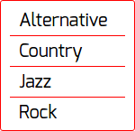
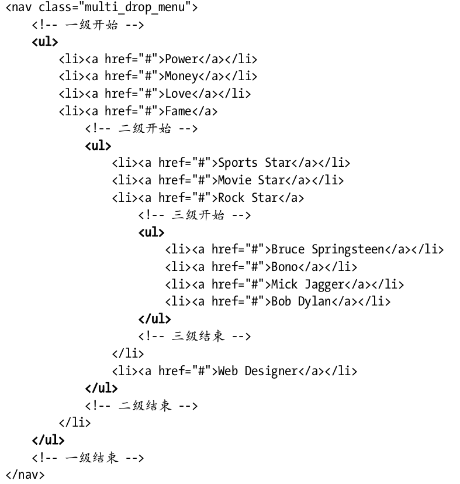

# 界面组件

## 导航菜单

### 普通菜单HTML

```html
<nav class="list1">
	<ul>
		<li><a href="#">Alternative</a></li>
		<li><a href="#">Country</a></li>
		<li><a href="#">Jazz</a></li>
		<li><a href="#">Rock</a></li>
	</ul>
</nav>
```

### 纵向菜单

```css
/*去掉默认的内边距和外边距*/
* { margin:0; padding:0; }
/*设定本例中菜单的大小和位置*/
nav { margin:50px; width:150px; }
/*给菜单加上边框*/
.list1 ul { border:1px solid #f00; border-radius:3px; padding:5px 10px 3px; }
/*去掉项目符号并为链接添加间距*/
.list1 li { list-style-type:none; padding:3px 10px; }
/*“非首位子元素”选择符*/
.list1 li + li { border-top:1px solid #f00; }
/*为链接添加样式*/
.list1 a { text-decoration:none;font:20px Exo, helvetica, arial, sans-serif; font-weight:400; color:#000; background:#ffed53; }
/*悬停高亮*/
.list1 a:hover { color:#069; }
```



### 横向菜单

默认情况下,列表项是垂直堆叠在一起的。不过,要把它们变成水平排列的横向菜单也十分容易。方法就是浮动列表项。

```css
.list1 ul {
  overflow:hidden; /*强制 ul 包围浮动的 li 元素*/
}
.list1 li {
  float:left; /*让 li 元素水平排列*/
  list-style-type:none; /*去掉项目符号*/
}
.list1 a {
  display:block; /*让链接填满 li 元素*/
  padding:0 16px;
  text-decoration:none; /*去掉链接的下划线*/
  color:#999;
}
.list1 li + li a {border-left:1px solid #aaa;}
.list1 a:hover {color:#555;}
```

浮动让 li 元素从垂直变成水平

`display:block` 让链接从收缩变成扩张,从而整个 li 元素都变成了可以点击的

效果：


### 下拉菜单

#### 1. 建立嵌套列表



#### 2. 建立顶级菜单

##### 视觉样式

```css
.multi_drop_menu { font:1em helvetica, arial, sans-serif; }
.multi_drop_menu a {
  display:block; /*让链接充满列表项*/
  color:#555; /*文本颜色*/
  background-color:#eee; /*背景颜色*/
  padding:.2em 1em; /*链接的内边距*/
  border-width:3px; /*分隔线宽度*/
  border-color:transparent; /*可以有颜色,也可以透明*/
}
.multi_drop_menu a:hover {
  color:#fff; /*悬停时文本颜色*/
  background-color:#aaa; /*悬停时背景色*/
}
.multi_drop_menu a:active {
  background:#fff; /*点击时背景变色*/
  color:#ccc; /*点击时文本变色*/
}
```

##### 功能样式

```css
.multi_drop_menu * {margin:0; padding:0;}
/*强制 ul 包围 li*/
.multi_drop_menu ul { float:left; }
.multi_drop_menu li {
  float:left; /*水平排列菜单项*/
  list-style-type:none; /*去掉默认的项目符号*/
  position:relative; /*为子菜单提供定位上下文*/
}
.multi_drop_menu li a {
  display:block; /*让链接填充列表项*/
  border-right-style:solid; /*给每个链接添加一个右边框*/
  background-clip:padding-box; /*背景只出现在内边距区域后面*/
  text-decoration:none; /*去掉链接的下划线*/
}
.multi_drop_menu li:last-child a { border-right-style:none; }
/*临时隐藏低级菜单*/
.multi_drop_menu li ul { display:none; }
```

为了让 `ul`包围列表项,没有使用 `overflow:hidden` ,而是使用了 `float:left` ,是因为前者会导致后来添加到下拉菜单中的子菜单无法显示——它们最终会显示在父元素 ul 的外面,结果会因为“溢出”(overflow)而被隐藏(hidden)。

##### 热区(可点击区域)最大化

所有视觉样式——内边距、背景、边框,等等,都要应用给链接 a ,而不要应用给 ul 或 li

##### 从视觉上分隔链接

- 使用 `background-clip:padding-box` 声明,阻止链接的背景(像常规状态下一样)延伸到边框后面

- 不用外边距也能分隔链接

- 而且鼠标从一个菜单项移动到另一个菜单项时,也不会出现光标切换

- 菜单项之间从视觉上是分开,但实际上却是紧挨在一块的

给 li 元素应用了 position:relative ,这是给添加子菜单作准备的

最后一行 CSS 隐藏了子菜单,以防显示它们影响我们创建顶级菜单

### 3. 菜单的下拉部分

#### 视觉样式

```css
.multi_drop_menu li ul {width:9em;}  /*二级菜单宽度*/
.multi_drop_menu li li a {
border-right-style:none; /*去掉继承的右边框*/
border-top-style:solid; /*添加上边框*/
}
```

#### 功能样式

```css
.multi_drop_menu li ul {
	display:block; /*临时显示二级下拉菜单*/
	position:absolute; /*相对于父菜单项定位*/
	left:0; /*左边与父菜单项对齐*/
	top:100%; /*顶边与父菜单项底边对齐*/
}
.multi_drop_menu li li {
	float:none; /*停止浮动,恢复堆叠*/
}
.multi_drop_menu li li ul {
	display:none; /*继续隐藏三级下拉菜单*/
}
```

绝对定位下拉菜单,以便它能精确地对齐父元素(包含子菜单的 li ),而这个父元素已经在上一步被设定成相对定位了

通过将其顶边位置( top )设定为100% (相对于其相对定位的父元素 li )，其顶边会与父元素底边恰好对齐。它与父元素之间的间隙,实际上是下拉菜单中第一个链接的边框。

#### 4. 让下拉菜单响应鼠标事件

```css
.multi_drop_menu li ul {
  display:none; /*隐藏二级下拉菜单*/
  position:absolute; /*相对于父菜单项定位*/
  left:0; /*左边与父菜单项对齐*/
  top:100%; /*顶边与父菜单项底边对齐*/
}
.multi_drop_menu li:hover > ul {
  display:block; /*父元素悬停时显示*/
}
```

注意,这里的 :hover 触发器是设定在 li 元素而非链接自身上的。这样做是因为我们想要显示li 的子元素 ul ,而它不是想链接的子元素。

为了只显示其子元素,悬停列表项与子列表之间还有一个子选择符 > 。如果没有这个子选择符,当顶级菜单项处于悬停状态时,会同时显示二级和三级菜单。

#### 5. 添加三级菜单

```css
.multi_drop_menu li li ul {
  position:absolute; /*相对于父菜单定位*/
  left:100%; /*与父菜单右侧对齐*/
  top:0; /*与父菜单项顶边对齐*/
}
```

把三级菜单放到二级菜单右侧,让它的顶边与鼠标所在菜单项的底边对齐

#### 6. 效果图


