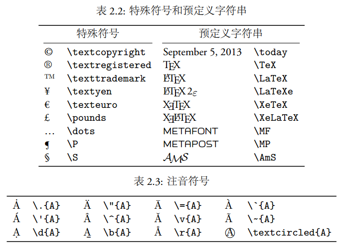
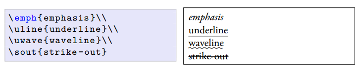
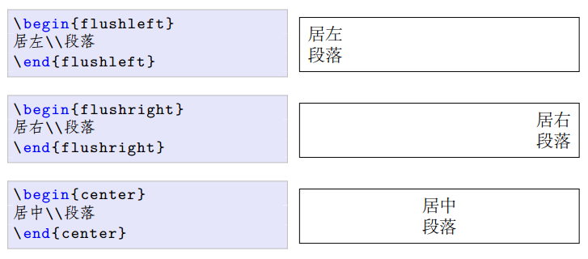
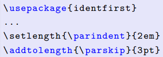
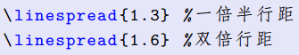
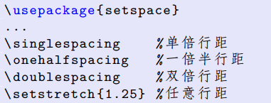
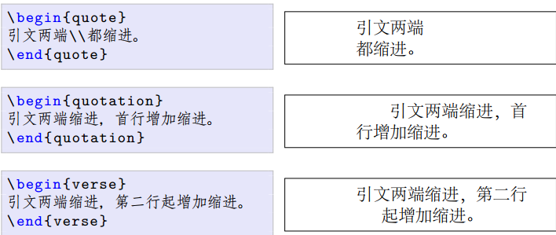
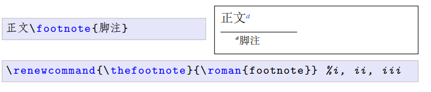

# 入门

## 语法和结构

### 语法

LATEX 源文件的语句可以分为三种：命令 (command) 、数据和注释(comment)

命令又分为普通命令和环境 (environment) 。普通命令以 \ 起始，大多只有一行；而环境包含一对起始声明和结尾声明，用于多行内容的场合。

命令和环境可以互相嵌套。

数据就是普通内容。

注释语句以 % 起始，它在编译过程中被忽略。

### 物理结构

物理结构指的是源文件的组织形式，包括序言 (preamble) 和正文两部分。

序言用来完成一些设置，比如指定文档类型，引入宏包，定义命令、环境等；文档的实际内容则放在正文部分。

```latex
\documentclass[options]{class} % 文档 类声 明
\usepackage[options]{package}  % 引入宏包
...
\begin{document}               % 正文
...
\end{document}
```

常用的文档类 (documentclass) 有三种： article、 report、 book

### 逻辑结构

逻辑结构是最终输出文档的结构，包括标题、目录、章节等。

```latex
\title{LaTeX Notes}
\author{Alpha Huang}
\date{\today}
\maketitle
```

LATEX 提供了七种层次结构命令，每个高级层次可以包含若干低级层次。article 中没有 chapter，而 report 和 book 则支持所有层次。

```
\part{...}            % Level -1
\chapter{...}         % Level 0
\section{...}         % Level 1
\subsection{...}      % Level 2
\subsubsection {...}  % Level 3
\paragraph{...}       % Level 4
\subparagraph {...}   % Level 5
```

\tableofcontents 命令用来生成目录。

```
\setcounter{tocdepth}{2}    % 设定目录深度
\tableofcontents            % 列出目录
```
## 文字

文档的内容可以分为文本模式和数学模式。

### 字符输入

文档中可以输入的文字符号大致可以分为：普通字符、控制符、特殊符号、预定义字符串、注音符号等。



### 字体样式和大小

拉丁文字体主要有三大类：衬线字体 (roman, serif) 、无衬线字体 (sansserif) 和等宽字体 (monospace, typewriter) 。衬线字体笔画的边缘部分有些修饰，类似于中文的宋体、仿宋、楷体、魏体等。无衬线字体的笔画则是平滑的，类似于中文的黑体。


### 换行、换页和断字

通常 LATEX 会自动换行，我们也可以用 \\ 或 \newline 命令来强制换行；用 \newpage 命令来强制换页。

LATEX 也会自动断字 (hyphenate) ，使得每一行的字间距分布均匀。



## 长度

## 对齐和间距

### 段落对齐



### 缩进和段间距

用 identfirst 宏包使得第一段也缩进首行。段落首行缩进的距离可以用 \parindent 变量来控制，段落之间的距离可以用 \parskip 变量来控制。



### 行间距





## 特殊段落

### 摘录



### 脚注



## 列表

### 基本列表

三种基本列表环境：无序列表、有序列表、描述列表。

```
\begin{itemize}
\item C++
\item Java
\item HTML
\end{itemize}
```
## 盒子

类似HTML中的盒模型
