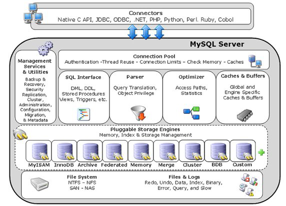

# MySQL体系结构和存储引擎

## 定义数据库和实例

**数据库** 物理操作系统文件或其他形式文件类型的集合。

**数据库实例** 由数据库后台进程/线程以及一个共享内存区组成。数据库实例是应用程序，是位于用户与操作系统之间的一层数据管理软件。

mysql体系架构

## MySQL表存储引擎

### InnoDB存储引擎

InnoDB存储引擎支持事务，主要面向在线事务处理（OLTP）方面的应用。其特点是行锁设计、支持外键，并支持类似于Oracle的非锁定读。

InnoDB存储引擎同样可以使用裸设备(row disk) 来建立其表空间。

InnoDB通过使用多版本并发控制（MVCC）来获得高并发性，并且实现了SQL标准的4种隔离级别，默认为REPEATABLE级别。同时使用一>种被称为next-key locking的策略来避免幻读（phantom）现象的产生。InnoDB储存引擎还提供了插入缓冲（insert buffer）、二次写（double write）、自适应哈希索引（adaptive hash index）、预读（read ahead) 等高性能和髙可用的功能。

对于表中数据的存储，InnoDB存储引擎采用了聚集（clustered)的方式，这种方式类似于Oracle的索引聚集表（index organized table,IOT)。每张表的存储都按主键的顺序存放，如果没有显式地在表定义时指定主键，InnoDB存储引擎会为每一行生成一个6字节的ROWID，并以此作为主键。

### MyISAM存储引擎

不支持事务、表锁和全文索引，对于一些OLAP(Online Analytical Processing,在线分析处理）操作速度快。

MyISAM存储引擎表由MYD和MYI组成，MYD用来存放数据文件，MYI用来存放索引文件。

对于MyISAM存储引擎表， MySQL数据库只缓存其索引文件，数据文件的缓存交由操作系统本身来完成，这与其他使用LRU算法缓存数据的大部分数据库大不相同。

### NDB存储引擎

NDB存储引擎是一个集群存储引擎，类似于Oracle的RAC集群。NDB的特点是数据全部放在内存中，因此主键査找（primary key lookup)的速度极快，并且通过添加NDB数据存储节点（DataNode)可以线性地提髙数据库性能，是高可用、髙性能的集群系统。

NDB存储引擎的连接操作（JOIN)是在MySQL数据库层完成的，而不是在存储引擎层完成的。这意味着，复杂的连接操作需要巨大的网络开销，因此査询速度很慢。

### Memory存储引擎

Memory存储引擎（之前称为HEAP存储引擎）将表中的数据存放在内存中，如果数据库重启或发生崩溃，表中的数据都将消失。它非常适合用于存储临时数据的临时表，以及数据仓库中的纬度表。它默认使用哈希索引，而不是我们熟悉的B+树索引。

### Archive存储引擎

Archive存储引擎只支持INSERT和SELECT操作，其使用zlib算法将数据行(row)进行压缩后存储，设计目标主要是提供高速的插入和压缩功能。

### Federated存储引擎

Federated存储引擎表并不存放数据，它只是指向一台远程MySQL数据库服务器上的表。

### Maria存储引擎

它可以看作是MyISAM的后续版本。其特点是：缓存数据和索引文件，行锁设计，提供MVCC功能，支持事务和非事务安全的选项支持，以及更好的BLOB字符类型的处理性能。

## 各种存储引擎之间的比较

|                Feature                | MyISAM | Memory | InDB | Archive | NDB   |
|:-------------------------------------:|:------:|:------:|:----:|---------|-------|
| Storage limits                        |  256TB |   RAM  | 64TB |   None  | 384EB |
| Transactions                          |    √   |        |   √  |         |   √   |
| Locking granularity                   |  Table |  Table |  Row |   Row   |  Row  |
| MVCC                                  |        |        |   √  |         |       |
| Geospatial data type support          |    √   |        |   √  |    √    |   √   |
| Geospatial indexing support           |    √   |        | √[a] |         |       |
| B-tree indexes                        |    √   |    √   |   √  |         |       |
| T-tree indexes                        |        |        |      |         |   √   |
| Hash indexes                          |        |    √   |  [b] |         |   √   |
| Full-text search indexes              |    √   |        | √[c] |         |       |
| Clustered indexes                     |        |        |   √  |         |       |
| Data caches                           |        |   N/A  |   √  |         |   √   |
| Index caches                          |    √   |   N/A  |   √  |         |   √   |
| Compressed data                       |  √[d]  |        | √[e] |    √    |       |
| Encrypted data[f]                     |    √   |    √   |   √  |    √    |   √   |
| Cluster database support              |        |        |      |         |   √   |
| Replication support[g]                |    √   |    √   |   √  |    √    |   √   |
| Foreign key support                   |        |        |   √  |         |       |
| Backup / point-in-time recovery[h]    |    √   |    √   |   √  |    √    |   √   |
| Query cache support                   |    √   |    √   |   √  |    √    |   √   |
| Update statistics for data dictionary |    √   |    √   |   √  |    √    |   √   |

[a] InnoDB support for geospatial indexing is available in MySQL 5.7.5 and higher.

[b] InnoDB utilizes hash indexes internally for its Adaptive Hash Index feature.

[c] InnoDB support for FULLTEXT indexes is available in MySQL 5.6.4 and higher.

[d] Compressed MyISAM tables are supported only when using the compressed row format. Tables using the compressed row format with MyISAM are read only.

[e] Compressed InnoDB tables require the InnoDB Barracuda file format.

[f] Implemented in the server (via encryption functions). Data-at-rest tablespace encryption is available in MySQL 5.7 and higher.

[g] Implemented in the server, rather than in the storage engine.

[h] Implemented in the server, rather than in the storage engine.

## 连接MySQL

## TCP/IP

## Unix套接字
