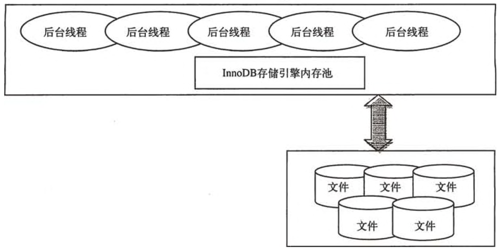
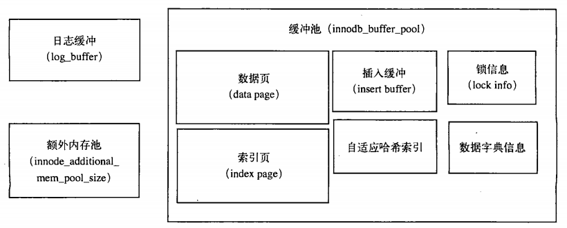
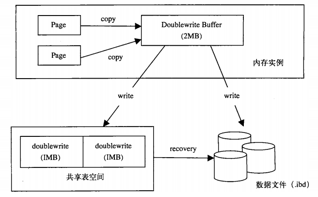

# InnoDB存储引擎

## InnoDB体系架构



### 后台线程

后台线程的主要作用是负责刷新内存池中的数据，保证缓冲池中的内存缓存的是最近的数据。此外，将已修改的数据文件刷新到磁盘文件，同时保证在数据库发生异常情况下InnoDB能恢复到正常运行状态。

## 内存

InnoDB存储引擎内存由以下几个部分组成：缓冲池（buffer pool)、重做日志缓冲池(redo log buffer)以及额外的内存池（additional memory pool),分别由配置文件中的参数innodb_buffer_pool_size和innodb_log_buffer_size的大小决定。

- InnoDB存储引擎的缓冲池

```
mysql> show variables like 'innodb_buffer_pool_size'\G;
*************************** 1. row ***************************
Variable_name: innodb_buffer_pool_size
        Value: 134217728
```

- 重做日志缓冲池

```
mysql> show variables like 'innodb_log_buffer_size'\G;
*************************** 1. row ***************************
Variable_name: innodb_log_buffer_size
        Value: 8388608
```

- 额外的内存池

```
mysql> show variables like 'innodb_additional_mem_pool_size'\G;
*************************** 1. row ***************************
Variable_name: innodb_additional_mem_pool_size
        Value: 8388608
```

缓冲池是占最大块内存的部分，用来存放各种数据的缓存。因为InnoDB的存储引擎的工作方式总是将数据库文件按页（每页16K)读取到缓冲池，然后按最近最少使用（LRU)的算法来保留在缓冲池中的缓存数据。如果数据库文件需要修改，总是首先修改在缓存池中的页（发生修改后，该页即为脏页），然后再按照一定的频率将缓冲池的脏页刷新(flush)到文件。


```
mysql> show engine innodb status\G;
*************************** 1. row ***************************
  Type: InnoDB
  Name:
Status:
=====================================
2017-03-02 06:41:29 7f65f4279700 INNODB MONITOR OUTPUT
=====================================
Per second averages calculated from the last 29 seconds
-----------------
BACKGROUND THREAD
-----------------
srv_master_thread loops: 3 srv_active, 0 srv_shutdown, 15625 srv_idle
srv_master_thread log flush and writes: 15626
----------
SEMAPHORES
----------
OS WAIT ARRAY INFO: reservation count 20
OS WAIT ARRAY INFO: signal count 20
Mutex spin waits 1, rounds 0, OS waits 0
RW-shared spins 20, rounds 600, OS waits 20
RW-excl spins 0, rounds 0, OS waits 0
Spin rounds per wait: 0.00 mutex, 30.00 RW-shared, 0.00 RW-excl
------------
TRANSACTIONS
------------
Trx id counter 17173
Purge done for trx's n:o < 16615 undo n:o < 0 state: running but idle
History list length 844
LIST OF TRANSACTIONS FOR EACH SESSION:
---TRANSACTION 0, not started
MySQL thread id 57, OS thread handle 0x7f65f4279700, query id 40258 localhost root init
show engine innodb status
---TRANSACTION 17161, not started
MySQL thread id 60, OS thread handle 0x7f65f759d700, query id 40202 192.168.44.199 root
---TRANSACTION 17146, not started
MySQL thread id 59, OS thread handle 0x7f65f42ba700, query id 39853 192.168.44.199 root
---TRANSACTION 17171, not started
MySQL thread id 55, OS thread handle 0x7f65f761f700, query id 40252 192.168.44.232 root
---TRANSACTION 17143, not started
MySQL thread id 40, OS thread handle 0x7f65f76a1700, query id 40167 192.168.44.44 root
---TRANSACTION 17138, not started
MySQL thread id 54, OS thread handle 0x7f65f7660700, query id 39964 192.168.44.44 root
---TRANSACTION 16926, not started
MySQL thread id 53, OS thread handle 0x7f65f75de700, query id 35227 192.168.44.232 root
---TRANSACTION 17040, not started
MySQL thread id 52, OS thread handle 0x7f65f78ea700, query id 40145 192.168.44.44 root
---TRANSACTION 17172, not started
MySQL thread id 51, OS thread handle 0x7f65f78a9700, query id 40257 192.168.44.44 root
---TRANSACTION 16925, not started
MySQL thread id 44, OS thread handle 0x7f65f7868700, query id 35229 192.168.44.232 root
---TRANSACTION 17020, not started
MySQL thread id 39, OS thread handle 0x7f65f76e2700, query id 40142 192.168.44.44 root
---TRANSACTION 16763, not started
MySQL thread id 38, OS thread handle 0x7f65f7723700, query id 40138 192.168.44.44 root
---TRANSACTION 0, not started
MySQL thread id 35, OS thread handle 0x7f65f77e6700, query id 11491 192.168.44.199 root
---TRANSACTION 14259, not started
MySQL thread id 36, OS thread handle 0x7f65f7764700, query id 11531 192.168.44.199 root
---TRANSACTION 14023, not started
MySQL thread id 25, OS thread handle 0x7f65f7827700, query id 8059 192.168.44.232 root
--------
FILE I/O
--------
I/O thread 0 state: waiting for completed aio requests (insert buffer thread)
I/O thread 1 state: waiting for completed aio requests (log thread)
I/O thread 2 state: waiting for completed aio requests (read thread)
I/O thread 3 state: waiting for completed aio requests (read thread)
I/O thread 4 state: waiting for completed aio requests (read thread)
I/O thread 5 state: waiting for completed aio requests (read thread)
I/O thread 6 state: waiting for completed aio requests (write thread)
I/O thread 7 state: waiting for completed aio requests (write thread)
I/O thread 8 state: waiting for completed aio requests (write thread)
I/O thread 9 state: waiting for completed aio requests (write thread)
Pending normal aio reads: 0 [0, 0, 0, 0] , aio writes: 0 [0, 0, 0, 0] ,
 ibuf aio reads: 0, log i/o's: 0, sync i/o's: 0
Pending flushes (fsync) log: 0; buffer pool: 0
528 OS file reads, 600 OS file writes, 83 OS fsyncs
0.00 reads/s, 0 avg bytes/read, 0.00 writes/s, 0.00 fsyncs/s
-------------------------------------
INSERT BUFFER AND ADAPTIVE HASH INDEX
-------------------------------------
Ibuf: size 1, free list len 0, seg size 2, 0 merges
merged operations:
 insert 0, delete mark 0, delete 0
discarded operations:
 insert 0, delete mark 0, delete 0
Hash table size 276671, node heap has 5 buffer(s)
0.00 hash searches/s, 0.00 non-hash searches/s
---
LOG
---
Log sequence number 12207323
Log flushed up to   12207323
Pages flushed up to 12207323
Last checkpoint at  12207323
0 pending log writes, 0 pending chkp writes
48 log i/o's done, 0.00 log i/o's/second
----------------------
BUFFER POOL AND MEMORY
----------------------
Total memory allocated 137363456; in additional pool allocated 0
Dictionary memory allocated 180056
Buffer pool size   8191
Free buffers       7690
Database pages     496
Old database pages 0
Modified db pages  0
Pending reads 0
Pending writes: LRU 0, flush list 0, single page 0
Pages made young 0, not young 0
0.00 youngs/s, 0.00 non-youngs/s
Pages read 496, created 0, written 26
0.00 reads/s, 0.00 creates/s, 0.00 writes/s
Buffer pool hit rate 1000 / 1000, young-making rate 0 / 1000 not 0 / 1000
Pages read ahead 0.00/s, evicted without access 0.00/s, Random read ahead 0.00/s
LRU len: 496, unzip_LRU len: 0
I/O sum[0]:cur[0], unzip sum[0]:cur[0]
--------------
ROW OPERATIONS
--------------
0 queries inside InnoDB, 0 queries in queue
0 read views open inside InnoDB
Main thread process no. 1, id 140075915282176, state: sleeping
Number of rows inserted 0, updated 4, deleted 0, read 5109
0.00 inserts/s, 0.00 updates/s, 0.00 deletes/s, 0.00 reads/s
----------------------------
END OF INNODB MONITOR OUTPUT
============================
```

> **show engine innodb status** 的命令显示的不是当前的状态，而是过去某个时间范围内InnoDB存储引擎的状态

在BUFFER POOL AND MEMORY里可以看到InnoDB存储引擎缓冲池的使用情况

Buffer pool size 一共有多少个缓冲帧(buffer frame),每个buffer frame为16K

Free buffers 表示当前空闲的缓冲帧

Database pages表示已经使用的缓冲帧

Modified db pages表示脏页的数量

缓冲池中缓存的数据页类型有：索引页、数据页、undo页、插入缓冲(insert buffer)、自适应哈希索引（adaptive hash index)、InnoDB存储的锁信息（lock info〉、数据字典信息（data dictionary)等。



**重做日志缓冲** 将重做日志信息先放入这个缓冲区，然后按一定频率(一般情况是一秒)将其刷新到重做日志文件。

**额外内存池** 存放缓冲池中的帧缓冲(frame buffer)对应的缓冲控制对象

## 关键特性

### 插入缓冲

**插入缓冲** 是对于非聚集类索引的插入和更新操作，不是每一次都直接插入到索引页中，而是先插入到内存中。具体做法是：如果该索引页在缓冲池中，直接插入；否则，先将其放入插入缓冲区中，再以一定的频率和索引页合并，这时，就可以将同一个索引页中的多个插入合并到一个IO操作中，大大提高写性能。

这个设计思路和HBase中的LSM树有相似之处，都是通过先在内存中修改，到达一定量后，再和磁盘中的数据合并，目的都是为了提高写性能。

插入缓冲的启用需要满足一下两个条件：

1） 索引是辅助索引（secondary index）
2） 索引不适合唯一的

如果辅助索引是唯一的，就不能使用该技术，原因很简单，因为如果这样做，整个索引数据被切分为2部分，无法保证唯一性。

插入缓冲带来的问题:

1） 可能导致数据库宕机后实例恢复时间变长。如果应用程序执行大量的插入和更新操作，且涉及非唯一的聚集索引，一旦出现宕机，这时就有大量内存中的插入缓冲区数据没有合并至索引页中，导致实例恢复时间会很长。
2） 在写密集的情况下，插入缓冲会占用过多的缓冲池内存，默认情况下最大可以占用1/2，这在实际应用中会带来一定的问题。

### 两次写

有人也许会想，如果发生写失效，可以通过重做日志进行恢复。这是一个办法。但是必须清楚的是，重做日志中记录的是对页的物理操作，如偏移量800,写'aaaa'记录。如果这个页本身已经损坏，再对其进行重做是没有意义的。这就是说，在应用（apply)重做日志前，我们需要一个页的副本，当写入失效发生时，先通过页的副本来还原该页，再进行重做，这就是double write。



1）当刷新缓冲池脏页时，并不直接写到数据文件中，而是先拷贝至内存中的两次写缓冲区。
2）接着从两次写缓冲区分两次写入磁盘共享表空间中，每次写入1MB
3）待第2步完成后，再将两次写缓冲区写入数据文件

这样就可以解决上文提到的部分写失效的问题，因为在磁盘共享表空间中已有数据页副本拷贝，如果数据库在页写入数据文件的过程中宕机，在实例恢复时，可以从共享表空间中找到该页副本，将其拷贝覆盖原有的数据页，再应用重做日志即可。

第2步是额外的性能开销，但由于磁盘共享表空间是连续的，因此开销不是很大。可以通过参数skip_innodb_doublewrite禁用两次写功能，默认是开启的，强烈建议开启该功能。

> 有些文件系统本身就提供了部分写失效的防范机制，如ZFS文件系统。在这种情况下，我们就不要启用doublewrite了。

###  自适应哈希索引

InnoDB存储引擎会监控对表上索引的査找，如果观察到建立哈希索引可以带来速度的提升，则建立哈希索引，所以称之为自适应（adaptive)的。自适应哈希索引通过缓冲池的B+树构造而来，因此建立的速度很快。而且不需要将整个表都建哈希索引，InnoDB存储引擎会自动根据访问的频率和模式来为某些页建立哈希索引。

其设计思想是数据库自优化(self-tuning) , 即无需DBA对数据库进行调整。

## 启动、关闭与恢复

参数 **innodb_fast_shutdown** 影响着表的存储引擎为InnoDB的行为。

**0** 当MySQL关闭时，InnoDB需要完成所有的full purge和merge insert buffer操作，在缓冲池的数据脏页刷新到磁盘。

**1** 默认值。不需要完成full purge和merge insert buffer操作，在缓冲池的数据脏页刷新到磁盘。

**2** 不完成full purge和merge insert buffer操作，也不将缓冲池中的数据脏页写回磁盘，而是将日志都写入日志文件。这样不会有任何事务会丢失，但是MySQL数据库下次启动时，会执行恢复操作(recovery)。

参数 **innodb_force_recovery** 影响了整个InnoDB存储引擎的恢复状况。

**0** 默认值。表示当需要恢复时执行所有的恢复操作。
