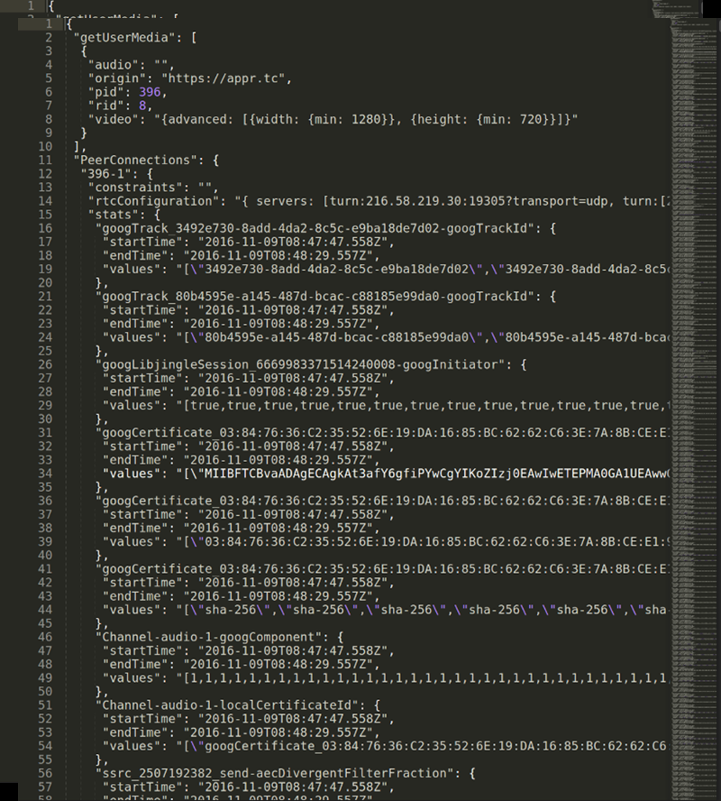
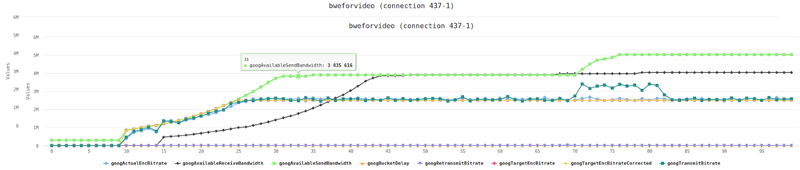
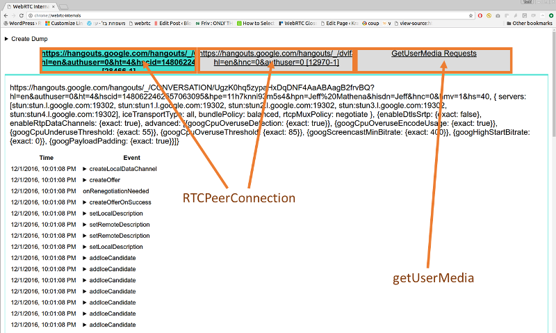
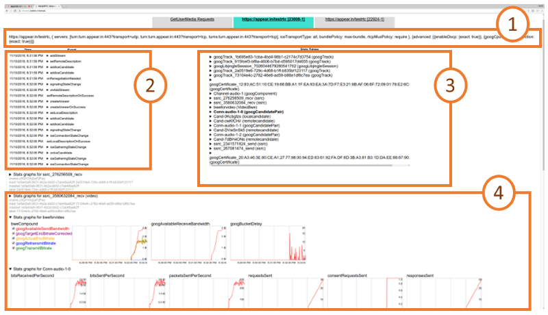
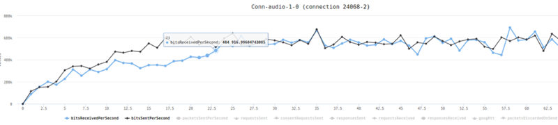
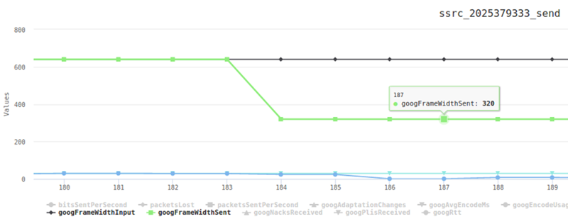
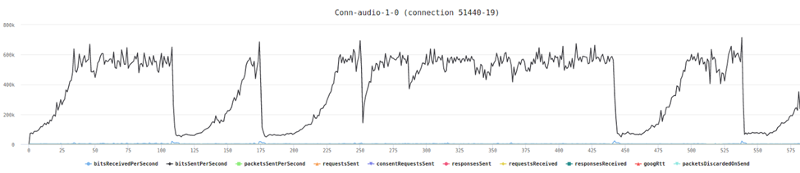

# How to obtain a webrtc-internals stats dump?

If you aren’t familiar with this tool, then open a WebRTC session in your Chrome browser, and while in that session, open another tab and direct it to this “internal” URL: chrome://webrtc-internals/


Do it. We will be here waiting.

webrtc-internals allows downloading the trace as a large JSON thingy that you can layer look at, but when you do, you’ll see something like this:




## Visualizing webrtc-internals stats

One of the first thing people start asking is – what exactly do these numbers say? It is what one of our own testers said the moment we’ve taken the code Fippo contributed to the community that enables shoving all these values into a time series graph and filtering them out.

This gives us graphs which are much larger than the 300×140 pixels from webrtc-internals:



The graphs are made using the HighCharts library and offer quite a number of handy features such as hiding lines, zooming into an area of interest or hovering to find out the exact value. This makes it much easier to reason about the data than the JSON dump shown above.

Back to the basic webrtc-internals page. At the top of this page we can see a number of tabs, one for all getUserMedia calls and one tab for each RTCPeerConnection.





On the GetUserMedia Requests tab we can see each call to getUserMedia and the constraints passed to it. We don’t get to see the results unfortunately or the ids of the MediaStreams acquired.

## RTCPeerConnection stats

For each peerconnection, we can see four things here:



1. How the RTCPeerConnection was configured, i.e. what STUN and TURN servers are used and what options are set
2. A trace of the PeerConnection API calls on the left side. These API traces show all the calls to the RTCPeerConnection object and their arguments (e.g. createOffer) as well as the callbacks and event emitters like onicecandidate.
3. The statistics gathered from the getStats() API on the right side
4. Graphs generated from the getStats() API at the bottom

The RTCPeerConnection API traces are a very powerful tool that allows for example reasoning about the cause of ICE failures or can give you insights where to deploy TURN servers. We will cover this at length in a future blog post.

The statistics shown on webrtc-internals are the internal format of Chrome. Which means they are a bit out of sync with the current specification, some names have changed as well as the structure. At a high level, what we see on the webrtc-internals page is similar to the result we get from calling

```js
RTCPeerConnection.getStats(function(stats) { console.log(stats.result()); )};
```

This is an array of (legacy) RTCStatsReport objects which have a number of keys and values which can be accessed like this:

```js
RTCPeerConnection.getStats(function(stats) {

   var report = stats.result()[0];

   report.names().forEach(function(name) {

       console.log(name, report.stat(name));

   });

)}
```

Keep in mind that there are quite a few differences between these statistics (which chrome currently exposes in getStats) and the specification. As a rule of thumb, any key name that ends with “Id” contains a pointer to a different report whose id attribute matches the value of the key. So all of these reports are connected to each other. Also note that most values are string even if they look like numbers of boolean values.

The most important attribute of the RTCStatsReport is the type of the report. There are quite a few of them:

- googTrack
- googLibjingleSession
- googCertificate
- googComponent
- googCandidatePair
- localCandidate
- remoteCandidate
- ssrc
- VideoBWE

Lets drill down into these reports.

### googTrack and googLibjingleSession reports

The **googTrack** and **googLibjingleSession** don’t contain much information so we’ll skip them.

### googCertificate report

The **googCertificate** report contains some information about the DTLS certificate used by the local side and the peer such as the certificate itself (encoded as DER and wrapped in base64 which means you can decode it using openssls x509 command if you want to), the fingerprint and the hash algorithm. This is mostly as specified in the [RTCCertificateStats dictionary](https://w3c.github.io/webrtc-stats/#certificatestats-dict*).

### googComponent report

The **googComponent** report is acting as a glue between the certificate statistics and the connection. It contains a pointer to the currently active candidate pair (described in the next section) as well as information about the ciphersuite used for DTLS and the SRTP cipher.

### googCandidatePair report

A report with a type of **googCandidatePair** describes a pair of ICE candidates, i.e. the low-level connection. From this report you can get quite some information such as:

* The overall number of packets and bytes sent and received (bytesSent, bytesReceived, packetsSent; packetsReceived is missing for unknown reasons). This is the raw UDP or TCP bytes including RTP headers
* Whether this is the active connection (**googActiveConnection** is “true” in that case and “false” otherwise). Most of the time you will be interested only in the statistics of the active candidate pair. The spec equivalent can be found [here](https://w3c.github.io/webrtc-stats/#transportstats-dict*)
* The number of STUN request and responses sent and received (**requestsSent** and **responsesReceived**; **requestsReceived** and **responsesSent**) which [count the number of incoming and outgoing STUN requests](https://w3c.github.io/webrtc-stats/#dom-rtcicecandidatepairstats-requestsreceived) that are used in the ICE process
* The round trip time of the last STUN request, **googRtt**. This is different from the **googRtt** on the **ssrc** report as we will see later
* The **localCandidateId** and **remoteCandidateId** which point to reports of type **localCandidate** and **remoteCandidate** which describe the local and remote ICE candidates. You can still see most of the information in the **googLocalAddress**, **googLocalCandidateType** etc values
* **googTransportType** specifies the transport type. Note that the value of this statistics will usually be ‘udp’, even in cases where TURN over TCP is used to connect to a TURN server. This will be ‘tcp’ only when [ICE-TCP](https://webrtcglossary.com/ice-tcp/) is used

There are a couple of things which are easily visualized here, like the number of bytes sent and received:



### localCandidate and remoteCandidate reports

The **localCandidate** and **remoteCandidate** are thankfully as [described in the specification](https://w3c.github.io/webrtc-stats/#icecandidate-dict*), telling us the ip address, port number and type of the candidate. For TURN candidates this will soon also tell us [over which transport the candidate was allocated](https://github.com/w3c/webrtc-stats/issues/83).

### Ssrc report

The **ssrc** report is one of the most important ones. There is one for each audio or video track sent or received over the peerconnection. It is the old version of what the specification calls [MediaStreamTrackStats](https://w3c.github.io/webrtc-stats/#mststats-dict*) and [RTPStreamStats](https://w3c.github.io/webrtc-stats/#streamstats-dict*). The content depends quite a bit on whether this is an audio or video track and whether it is sent or received. Let us describe some common elements first:

* The **mediaType** describes whether we are looking at audio or video statistics
* The **ssrc** attribute specifies the ssrc that media is sent or received on
* **googTrackId** identifies the track that these statistics describe. This id can be found both in the SDP as well as the local or remote media stream tracks. Actually this is violating the rule that anything named “…Id” is a pointer to another report. Google got the goog stats wrong ! 😉
* **googRtt** describes the round-trip time. Unlike the earlier round trip time, this is measured from RTCP
* **transportId** is a pointer to the component used to transport this RTP stream. Usually (when BUNDLE) is used this will be the same for both audio and video streams
* **googCodecName** specifies the codec name. For audio this will typically be opus, for video this will be either VP8, VP9 or H264. You can also see information about what implementation is used in the **codecImplementationName** stat
* The number of **bytesSent**, **bytesReceived**, **packetsSent** and **packetsReceived** (depending on whether you send or receive) allow you to calculate bitrates. Those numbers are cumulative so you need to divide by the time since you last queried getStats. The [sample code ](https://w3c.github.io/webrtc-pc/#example)in the specification is quite nice but beware that Chrome [sometimes resets those counters](https://bugs.chromium.org/p/webrtc/issues/detail?id=5361) so you might end up with negative rates.
* **packetsLost** gives you an indication about the number of packets lost. For the sender, this comes via RTCP, for the receiver it is measured locally. This is probably the most direct indicator you want to look at when looking at bad call quality

#### Voice specific

For audio tracks we have the **audioInputLevel** and **audioOutputLevel** respectively (the specification calls it [audioLevel](https://w3c.github.io/webrtc-stats/#dom-rtcmediastreamtrackstats-audiolevel)) which gives an indication whether an audio signal is coming from the microphone (unless it is muted) or played through the speakers. This could be used to detect the [infamous Chrome audio bug](https://bugs.chromium.org/p/webrtc/issues/detail?id=4799). Also we get information about the [amount of Jitter received](https://webrtcglossary.com/jitter/) and the [jitter buffer state](https://webrtcglossary.com/jitter-buffer/) in **googJitterReceived** and **googJitterBufferReceived**.

#### Video specific

For video tracks we get two major pieces of information. The first is the number of [NACK](https://webrtcglossary.com/nack/), [PLI](https://webrtcglossary.com/pli/) and [FIR](https://webrtcglossary.com/fir/) packets sent in **googNacksSent**, **googPLIsSent** and **googFIRsSent** (and their respective Received) variants. This gives us an idea about how packet loss is affecting video quality.

More importantly, we get information about the frame size and rate that is input (**googFrameWidthInput**, **googFrameHeightInput**, **googFrameRateInput**) and actually sent on the network (**googFrameWidthSent**, **googFrameHeightSent**, **googFrameRateSent**).  
Similar data can be gathered on the receiving end in the **googFrameWidthReceived**, **googFrameHeightReceived** statistics. For the frame rate we even get it split up between the **googFrameRateReceived**, **googFrameRateDecoded** and **googFrameRateOutput**.

On the encoder side we can observe difference between these values and get even more information about why the picture is scaled down. Typically this happens either because there is not enough CPU or bandwidth to transmit the full picture. In addition to lowering the frame rate (which could be observed by comparing differences between **googFrameRateInput** and **googFrameRateSent**) we get extra information about whether the resolution is adapted because of CPU issues (then **googCpuLimitedResolution** is true then — mind you that it is the string true, not a boolean value in Chrome’s current implementation) and if it is because the bandwidth is insufficient then **googBandwidthLimitedResolution** will be true. Whenever one of those conditions changes, the **googAdaptionChanges** counter increases.

We can see such a change in this diagram:




Here, packet loss is artificially generated. In response, Chrome tries to reduce the resolution first at t=184 where the green line showing the **googFrameWidthSent** starts to differ from the **googFrameWidthInput** shown in black. Next at t=186 frames are dropped and the input frame rate of 30fps (shown in light blue) is different from the frame rate sent (blue line) which is close to 0.

In addition to these standard statistics, Chrome exposes a large number of statistics about the behaviour of the audio and video stack on the ssrc report. We will discuss them in a future post.

### VideoBWE report

Last but not least the **VideoBWE** report. As the name suggests, it contains information about the bandwidth estimate that the peerconnection has. But there is quite a bit more useful information contained in this report:

* **googAvailableReceiveBandwidth** – the bandwidth that is available for receiving video data
* **googAvailableSendBandwidth** – the bandwidth that is available for sending video data
* **googTargetEncBitrate** – the target bitrate of the the video encoder. This tries to fill out the available bandwidth
* **googActualEncBitrate** – the bitrate coming out of the video encoder. This should usually match the target bitrate
* **googTransmitBitrate** – the bitrate actually transmitted. If this is very different from the actual encoder bitrate, this might be due to [forward error correction](https://webrtcglossary.com/fec/)
* **googRetransmitBitrate** – this allows measuring the bitrate of retransmits if RTX is used. This is usually an indication of packet loss.
* **googBucketDelay** – is a measure for Google’s “leaky bucket” strategy for dealing with large frames. Should be very small usually

As you can see this report gives you quite a wealth of information about one of the most important aspects of the video quality – the available bandwidth. Checking the available send and receive bandwidth is often the first step before diving deeper into the ssrc reports. Because sometimes you might find behaviour like this which explains ‘bad quality’ complaints from users:



In this case “the bandwidth estimate dropped all the time” is a pretty good explanation for quality issues.
