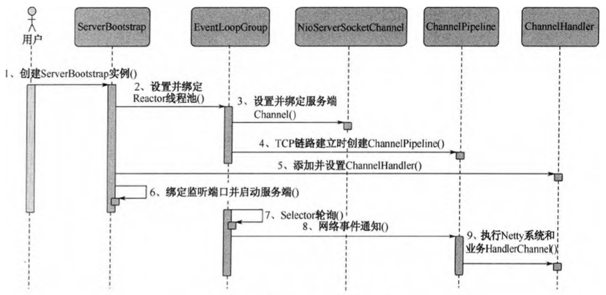

# 服务端创建

ServerBootstrap是Socket服务端的启动辅助类,用户通过ServerBootstrap可以方便地创建Netty的服务端。

## Netty 服务端创建源码分析

1. 创建ServerBootstrap实例

ServerBootstrap是Netty服务端的启动辅助类,它提供了一系列的方法用于设置服务端启动相关的参数。底层通过门面模式对各种能力进行抽象和封装,尽量不需要用户跟过多的底层API打交道,以降低用户的开发难度。

ServerBootstrap只有一个无参的构造函数。ServerBootstrap构造函数没有参数的根本原因是因为它的参数太多了,而且未来也可能会发生变化,为了解决这个问题,就需要引入Builder模式。

2. 设定绑定Reactor线程池

Netty的Reactor线程池是EventLoopGroup,它实际就是EvenlLoop的数组。EventLoop的职责是处理所有注册到本线程多路复用器Selector上的Channel,Selector的轮询操作由绑定的EventLoop线程run方法驱动,在一个循环体内循环执行。值得说明的是,EventLoop的职责不仅仅是处理网络I/O事件,用户自定义的Task和定时任务Task也统一由EventLoop负责处理,这样线程模型就实现了统一。从调度层面看,也不存在从EventLoop线程中再启动其他类型的线程用于异步执行另外的任务,这样就避免了多线程并发操作和锁竞争,提升了I/O线程的处理和调度性能。

3. 设置并绑定服务端Channel

作为NIO服务端,需要创建ServerSocketChannel，Netty对原生的NIO类库进行了封装，对应实现足NioServerSocketChannel。对于用户而言，不需要关心服务端Channel的底层实现细节和工作原理，只需要指定具体使用哪种服务端Channel即可。因此,Netty的ServerBootstrap方法提供了channel方法用于指定服务端Channel的类型。Netty通过工厂类,利用反射创建NioServerSocketChannel对象。由于服务端监听端口往往只需要在系统启动时才会调用，因此反射对性能的影响并不大。

4. 链路违立的时候创建并初始化ChannelPipeline

ChannelPipeline并不是NIO服务端必需的，它本质就是一个负责处理网络事件的职责链，负责管理和执行ChannelHandler。网络事件以事件流的形式在ChannelPipeline中流转,由ChannelPipeline根据ChannelHandler的执行策略调度ChannelHandler的执行。典型的网络事件包括：

- 链路注册
- 链路激活
- 链路断开
- 接收到请求消息
- 请求消息接收并处理完毕
- 发送应答消息
- 链路发生异常
- 发生用户自定义事件

5. 初始化ChannelPipehne完成之后,添加并设置ChannelHandler。ChannelHandler是Netty提供给用户定制和扩展的关键接口。利用ChannelHandler用户可以完成大多数的功能定制,例如消息编解码、心跳、安全认证、TSL/SSL认证、流量控制和流量整形等。Netty同时也提供了大量的系统ChannelHandler供用户使用，比较实用的系统ChannelHandler总结如下：

- 系统编解码框架 ByteToMessageCodec
- 通用基于长度的半包解码器 LengthFieldBasedFrameDecoder
- 码流日志打印Handler LoggingHandler
- SSL安全认证Handler SslHandler
- 链路空闲检测 HandlerIdleStateHandler
- 流量整形Handler ChannelTrafficShapingHandler
- Base64编解码 Base64Decoder和Base64Encoder

6. 绑定并启动监听端口

在绑定监听端口之前系统会做一系列的初始化和检测工作，完成之后，会启动监听端口，并将ServerSocketChannel注册到Selector上监听客户端连接。
