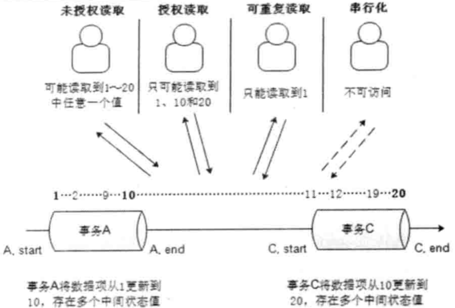
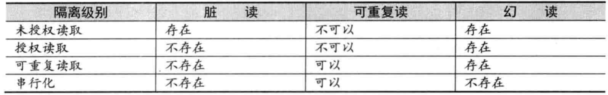

# 分布式架构

## 分布式的特点

分布式系统是一个硬件或软件组件分布在不同的网络计算机上,彼此之间仅仅通过消息传递进行通信和协调的系统。

- 分布性

- 对等性

- 并发性

- 缺乏全局时钟

- 故障总是会发生

### 分布式环境的各种问题

- 通信异常

单机内存访问的延时在纳秒数量级(通常是10ns左右),而正常的一次网络通信的延迟在0.1〜1ms左右(相当于内存访问延时的105〜106倍)

- 网络分区

当网络由于发生异常情况,导致分布式系统中部分节点之间的网络延时不断增大,最终导致组成分布式系统的所有节点中,只有部分节点之间能够进行正常通信,而另一些节点则不能——我们将这个现象称为网络分区,就是俗称的“脑裂”。

- 三态

分布式系统的每一次请求与响应,存在特有的“三态”槪念,即成功、失败与超时。

- 节点故障

组成分布式系统的服务器节点出现的宕机或“僵死”现象。

## ACID

事务(Transaction)是由一系列对系统中数据进行访问与更新的操作所组成的一个程序执行逻辑单元(Unit),狭义上的事务特指数据库事务。一方面,当多个应用程序并发访问数据库时,事务可以在这些应用程序之间提供一个隔离方法,以防止彼此的操作互相干扰。另一方面,事务为数据库操作序列提供了一个从失败中恢复到正常状态的方法,同时提供了数据库即使在异常状态下仍能保持数据一致性的方法。(隔离和回滚)

### 原子性

事务的原子性是指事务必须是一个原子的操作序列单元。

### 一致性

事务的一致性是指事务的执行不能破坏数据库数据的完整性和一致性,一个事务在执行之前和执行之后,数据库都必须处于一致性状态。

也就是说,事务执行的结果必须是使数据库从一个一致性状态转变到另一个一致性状态,因此当数据库只包含成功事务提交的结果时,就能说数据库处于一致性状态。而如果数据库系统在运行过程中发生故障,有些事务尚未完成就被迫中断,这些未完成的事务对数据库所做的修改有一部分已写入物理数据库,这时数据库就处于一种不正确的状态,或者说是不一致的状态。

### 隔离性

事务的隔离性是指在并发环境中,并发的事务是相互隔离的,一个事务的执行不能被其他事务干扰。

在标准SQL规范中,定义了4个事务隔离级別,不同的隔离级別对事务的处理不同,如未授权读取、授权读取、可重复读取和串行化。

- 未授权读取

未授权读取也被称为读未提交(Read Uncommitted),该隔离级别允许脏读取,其隔离级别最低。

- 授权读取

授权读取也被称为读已提交(Read Committed),它和未授权读取非常相近,唯一的区别就是授权读取只允许获取已经被提交的数据。

- 可重复读取

可重复读取(RepeatableRead),简单地说,就是保证在事务处理过程中,多次读取同一个数据时,其值都和事务开始时刻是一致的。

- 串行化

串行化 (Serializable) 是最严格的事务隔离级別。它要求所有事务都被串行执行,即事务只能一个接一个地进行处理,不能并发执行。

4种隔离级别示意图

隔离级别对比

### 持久性

事务的持久性也被称为永久性,是指一个事务一旦提交,它对数据库中对应数据的状态变更就应该是永久性的。

## CAP和BASE理论

**CAP定理** 一个分布式系统不可能同时满足一致性(C:Consistency)、可用性(A:Availability)和分区容错性(P:Partitiontolerance)这三个基本需求,最多只能同时满足其中的两项。

- 一致性

一致性是指数据在多个副本之间是否能够保持一致的特性。

- 可用性

可用性是指系统提供的服务必须一直处于可用的状态,对于用户的每一个操作请求总是能够在有限的时间内返回结果。

- 分区容错性

分布式系统在遇到任何网络分区故障的时候,仍然需要能够保证对外提供满足一致性和可用性的服务,除非是整个网络环境都发生了故障。

## BASE理论

BASE是Basically Available(基本可用)、Softstate(软状态)和Eventually consistent(最终一致性)三个短语的简写

- 基本可用

基本可用是指分布式系统在出现不可预知故障的时候,允许损失部分可用性

响应时间上的损失

功能上的损失

- 弱状态

弱状态也称为软状态,和硬状态相对,是指允许系统中的数据存在中间状态,并认为该中间状态的存在不会影响系统的整体可用性,即允许系统在不同节点的数据副本之间进行数据同步的过程存在延时。

- 最终一致性

最终一致性强调的是系统中所有的数据副本,在经过一段时间的同步后,最终能够达到一个一致的状态。

事实上,最终一致性并不是只有那些大型分布式系统才涉及的特性,许多现代的关系型数据库都采用了最终一致性模型。在现代关系型数据库中,大多都会采用同步和异步方式来实现主备数据复制技术。在同步方式中,数据的复制过程通常是更新事务的一部分,因此在事务完成后,主备数据库的数据就会达到一致。而在异步方式中,备库的更新往往会存在延时,这取决于事务日志在主备数据库之间传输的时间长短,如果传输时间过长或者甚至在日志传输过程中出现异常导致无法及时将事务应用到备库上,那么很显然,从备库中读取的数据将是旧的,因此就出现了数据不一致的情况。当然,无论是采用多次重试还是人为数据订正,关系型数据库还是能够保证最终数据达到一致——这就是系统提供最终一致性保证的经典案例。
