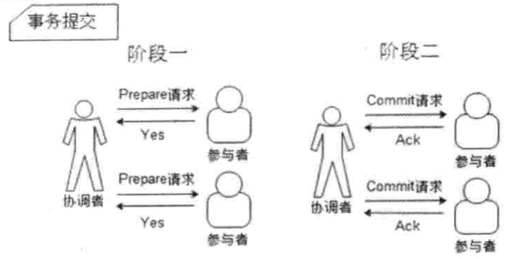
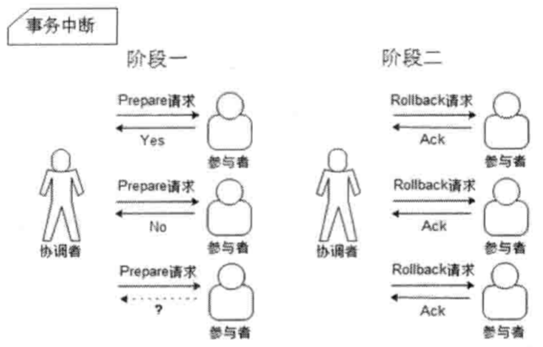
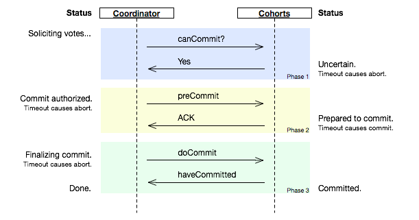
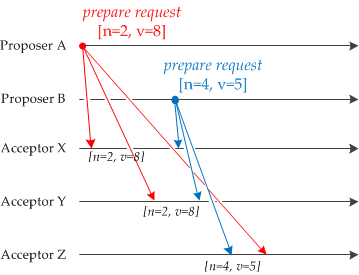
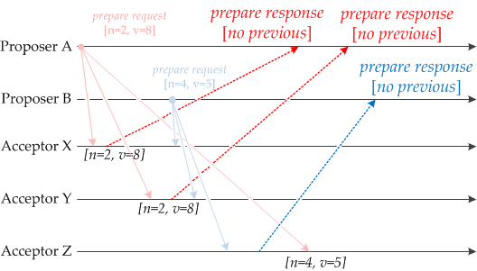
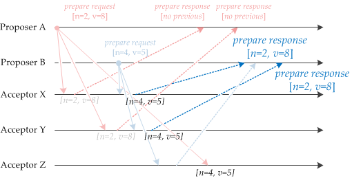
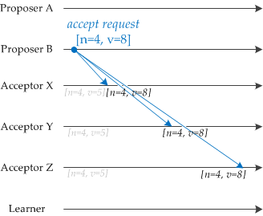
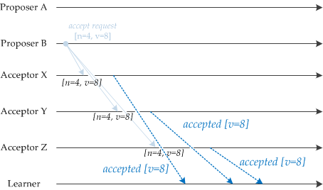
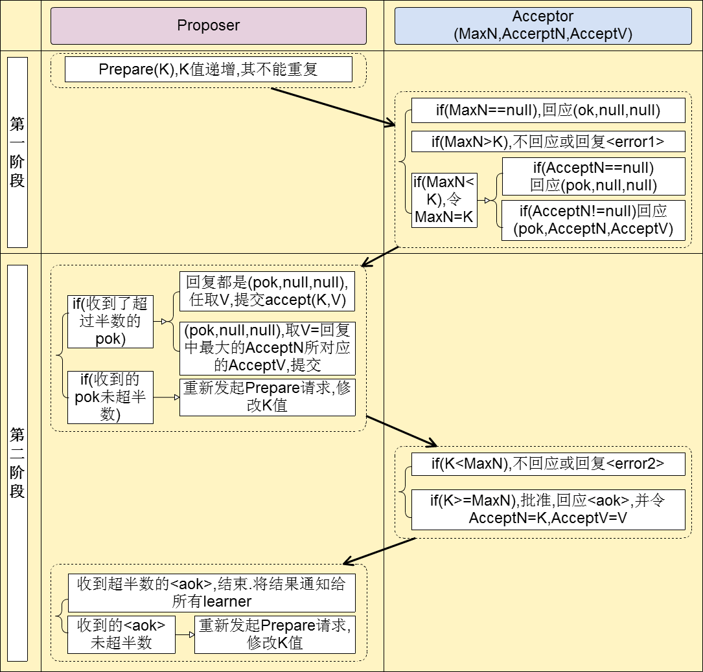

# 一致性协议

为了解决分布式一致性问题,在长期的探索研究过程中,涌现出了一大批经典的一致性协议和算法,其中最著名的就是二阶段提交协议、三阶段提交协议和Paxos算法了。

## 2PC (Two-Phase Commit)

二阶段提交协议是将事务的提交过程分成了两个阶段来进行处理

优点:原理简单,实现方便。

缺点:同步阻塞、单点问题、脑裂、太过保守。

- 同步阻塞

二阶段提交协议存在的最明显也是最大的一个问题就是同步阻塞,这会极大地限制分布式系统的性能。在二阶段提交的执行过程中,所有参与该事务操作的逻辑都处于阻塞状态,也就是说,各个参与者在等待其他参与者响应的过程中,将无法进行其他任何操作。

- 数据不一致

在二阶段提交协议的阶段二,即执行事务提交的时候,当协调者向所有的参与者发送Commit请求之后,发生了局部网络异常或者是协调者在尚未发送完Commit请求之前自身发生了崩溃,导致最终只有部分参与者收到了commit请求。于是,这部分收到了Commit请求的参与者就会进行事务的提交,而其他没有收到Commit请求的参与者则无法进行事务提交,于是整个分布式系统便出现了数据不一致性现象。

- 太过保守

二阶段提交协议没有设计较为完善的容错机制,任意一个节点的失败都会导致整个事务的失败。

## 3PC(Three-Phase Commit)

相较于二阶段提交协议,三阶段提交协议最大的优点就是降低了参与者的阻塞范围,并且能够在出现单点故障后继续达成一致。

三阶段提交协议在去除阻塞的同时也引入了新的问题,那就是在参与者接收到preCommit消息后,如果网络出现分区,此时协调者所在的节点和参与者无法进行正常的网络通信,在这种情况下,该参与者依然会进行事务的提交,这必然出现数据的不一致性。

## Paxos算法

[paxos-simple 论文](http://research.microsoft.com/en-us/um/people/lamport/pubs/paxos-simple.pdf)

### 问题描述

假设有一组可以提出提案的进程集合,那么对于一个一致性算法来说需要保证以下几点:

- 在这些被提出的提案中,只有一个会被选定。
- 如果没有提案被提出,那么就不会有被选定的提案。
- 当一个提案被选定后,进程应该可以获取被选定的提案信息。

> 一个分布式算法有两个最重要的属性:安全性(Safety)和活性(Liveness)。简单来说,Safety是指那些需要保证永远都不会发生的事情,Liveness则是指那些最终一定会发生的事情。

对于一致性来说,安全性(Safety)需求如下:

- 只有被提出的提案才能被选定(Chosen)
- 只能有一个值被选定
- 如果某个进程认为某个提案被选定了,那么这个提案必须是真的被选定的那个

从整体上来说,Paxos算法的目标就是要保证最终有一个提案会被选定,当提案被选定后,进程最终也能获取到被选定的提案。

在该一致性算法中,有三种参与角色,我们用Proposer、Acceptor和Learner来表示。在具体的实现中,一个进程可能充当不止一种角色,在这里我们并不关心进程如何映射到各种角色。假设不同参与者之间可以通过收发消息来进行通信,那么:

- 每个参与者以任意的速度执行,可能会因为出错而停止,也可能会重启。同时,即使一个提案被选定后,所有的参与者也都有可能失败或重启,因此除非那些失败或重启的参与者可以记录某些信息,否则将无法确定最终的值。
- 消息在传输过程中可能会出现不可预知的延迟,也可能会重复或丢失,但是消息不会被损坏,即消息内容不会被篡改。

## Paxos解释1

[参考链接](https://angus.nyc/2012/paxos-by-example/)

## Paxos解释2

> Phase 1

> 1. A proposer selects a proposal number n and sends a prepare request with number n to a majority of acceptors.

> 2. If an acceptor receives a prepare request with number n greater than that of any prepare request to which it has already responded, then it responds to the request with a promise not to accept any more proposals numbered less than n and with the highest-numbered pro-posal (if any) that it has accepted.

> Phase 2

> 1. If the proposer receives a response to its prepare requests (numbered n) from a majority of acceptors, then it sends an accept request to each of those acceptors for a proposal numbered n with a value v , where v is the value of the highest-numbered proposal among the responses, or is any value if the responses reported no proposals.

> 2. If an acceptor receives an accept request for a proposal numbered n, it accepts the proposal unless it has already responded to a prepare request having a number greater than n.

Proposer与Acceptor之间的交互主要有4类消息通信

[参考链接](http://codemacro.com/2014/10/15/explain-poxos/)

## Paxos解释3

[参考链接](https://www.zhihu.com/question/19787937)

有奇数元素定义的集合可以定义法定集合的概念，这个就是多于一半数量的元素组成的集合是法定集合。两个法定集合必然存在非空交集。
