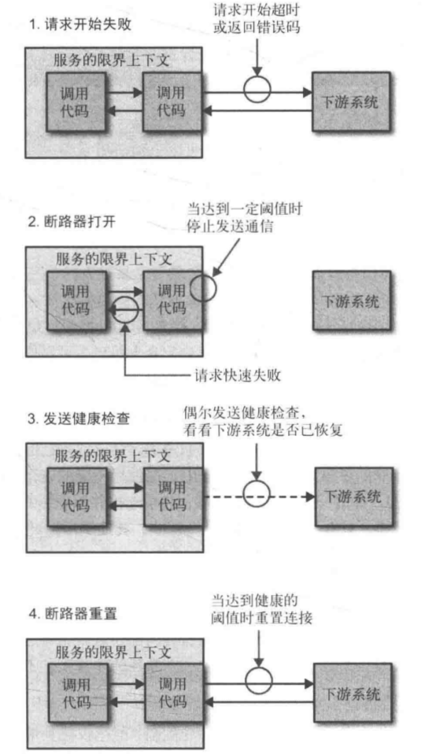
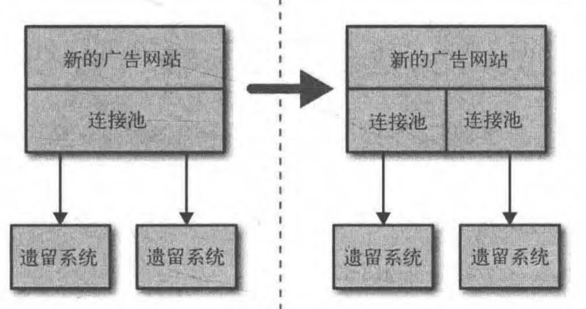

# 规模化微服务

*拥抱故障*

> *非功能需求*
- 响应时间/延迟
- 可用性
- 数据持久性

## 功能降级

对于每个使用多个微服务的面向用户的界面,或每个依赖多个下游合作者的微服务来说,你都需要问自己:“如果这个微服务宕掉会发生什么?”然后你就知道该做什么了。

## 架构性安全措施

正确地设置超时,实现舱壁隔离不同的连接池,并实现一个断路器 ,以便在第一时间避免给一个不健康的系统发送调用。

## 反脆弱的组织

混乱猴子(Chaos Monkey) https://github.com/Netflix/SimianArmy

- 超时

- 断路器

- 舱壁

为每个下游服务的连接使用不同的连接池；关注点分离

- 隔离

一个服务越依赖于另一个,另一个服务的健康将越能影响其正常工作的能力。

## 幕等

对幂等操作来说,其多次执行所产生的影响,均与一次执行的影响相同。如果操作是幂等的,我们可以对其重复多次调用,而不必担心会有不利影响。当我们不确定操作是否被执行,想要重新处理消息,从而从错误中恢复时,幂等会非常有用。

我们认为那些业务操作是幂等的,而不是整个系统状态的。

## 扩展

弹性扩展 异地机房

### 扩展数据库

- 扩展读取

几年前,使用只读副本进行扩展（读写分离）风靡一时,不过现在我建议你首先看看缓存,因为它可以提供更显著的性能改善,而且工作量往往更少。

- 扩展写操作

分片

## 缓存

HTTP 在处理大量请求时,伸缩性如此良好的原因之一就是内置了缓存的概念。

### 客户端、代理和服务器端缓存

哪种缓存最合理取决于你正在试图优化什么。

- 客户端缓存

客户端缓存可以大大减少网络调用的次数,并且是减少下游服务负载的最快方法之一。但是使用由客户端负责缓存这种方式,如果你想改变缓存的方式,让大批的消费者全都变化是很困难的，让过时的数据失效也比较棘手。

- 代理服务器

使用代理服务器缓存时,一切对客户端和服务器都是不透明的。这通常是增加缓存到现有系统的一个非常简单的方法。

- 服务器缓存

使用服务器缓存,一切对客户端都是不透明的,它们不需要关心任何事情。缓存在服务器外围或服务器限界内时,很容易了解一些类似数据是否失效这样的事情,还可以跟踪和优化缓存命中率。在你有多种类型客户端的情况下,服务器缓存可能是提高性能的最快方式。

### HTTP缓存

cache-control  Expire

ETag

### 保持简单

缓存越多,就越难评估任何数据的新鲜程度。所以如果你认为缓存是一个好主意,请保持简单,先在一处使用缓存,在添加更多的缓存前慎重考虑

### 缓存中毒

Expires:Neve「的页面,停留在很多用户的缓存里,永远不会失效,直到缓存已满或者用户手动清理它们。

### 自动伸缩

如果你足够幸运,可以完全自动化地创建虚拟主机以及部署你的微服务实例,那么你已经具备了对微服务进行自动伸缩的基本条件。

### CAP定理

一致性(consistency)、可用性(availability)和分区容忍性(partition tolerance)

系统放弃一致性以保证分区容忍性和可用性的这种做法,被称为 **最终一致性**

### 服务发现

- DNS

- 动态服务注册

Zookeeper本身所提供的特性是相当通用的,你可以认为它只是信息树的一个副本,当它发生更改时对你做出提醒。

## 文档服务
