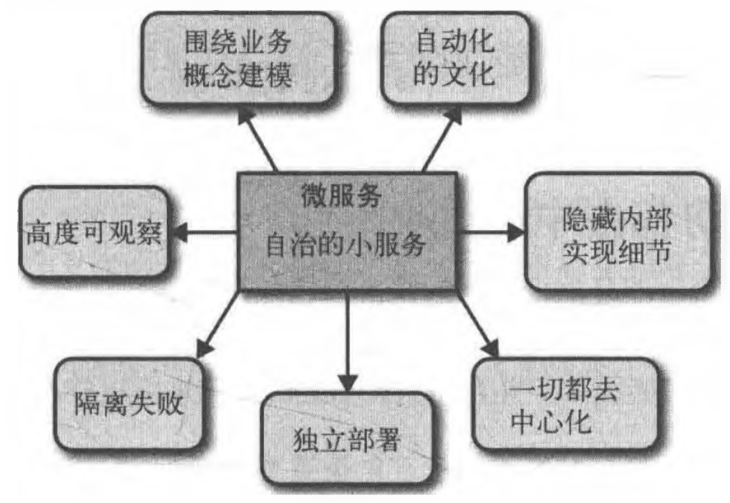

# 总结

## 微服务的原则

- 围绕业务概念建模

使用限界上下文来定义可能的领域边界。

- 接受自动化文化

自动化测试必不可少,因为相比单块系统,确保我们大量的服务能正常工作是一个更复杂的过程。调用一个统一的命令行,以相同的方式把系统部署到各个环境是一个很有用的实践,这也是采用持续交付对每次提交后的产品质量进行快速反馈的一个关键部分。

- 隐藏内部实现细节

选择与技术无关的API

- 让一切都去中心化

确保团队保持对服务的所有权

- 可独立部署

蓝/绿部署或金丝雀部署技术

- 隔离失败

微服务架构能比单块架构更具弹性,前提是我们了解系统的故障模式,并做出相应的计划。如果我们不考虑调用下游可能会失败的事实,系统会遭受灾难性的级联故障,系统也会比以前更加脆弱。

- 高度可观察
