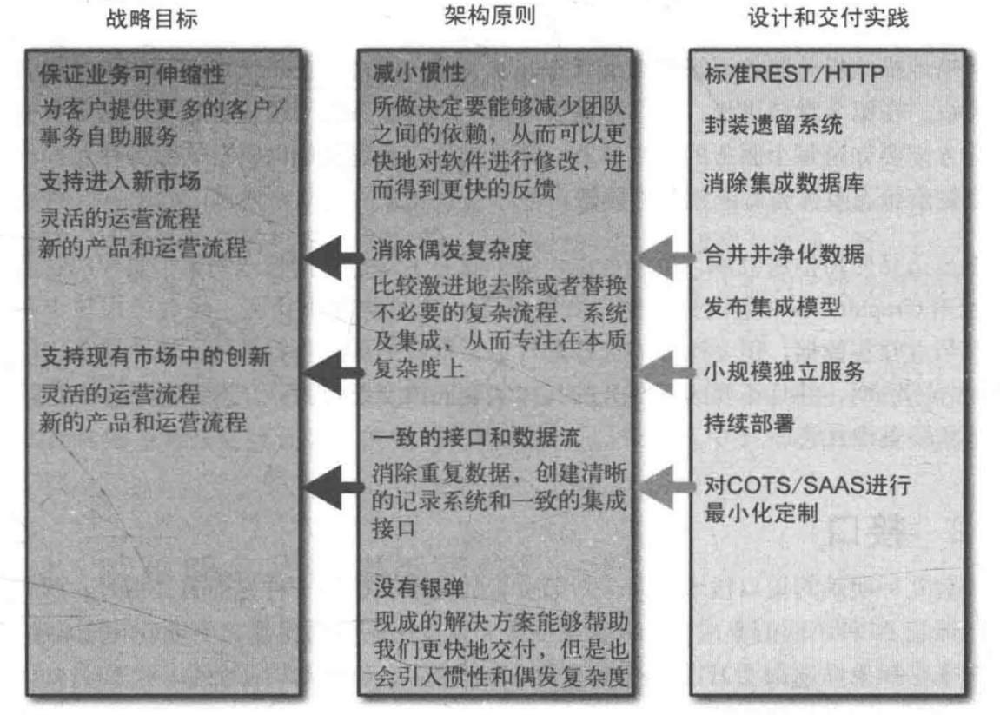

# 演化式架构师

## 不准确的比较

架构师的一个重要职责是,确保团队有共同的技术愿景,以帮助我们向客户交付他们想要的系统。在某些场景下,架构师只需要和一个团队一起工作,这时他们等同于技术引领者。在其他情况下,他们要对整个项目的技术愿景负责,通常需要协调多个团队之间,甚至是整个组织内的工作。

软件并没有类似这种真正的工程师和建筑师在物理规则方面的约束,事实上,我们要创造的东西从设计上来说就是要足够灵活,有很好的适应性,并且能够根据用户的需求进行 *演化* 。

## 架构师的演化视角

我们创造的东西并不是在某个时间点之后就不再变化了,甚至在发布到生产环境之后,软件还能继续演化。

城市规划师可以更好地跟IT架构师相类比,而不是建筑师。

## 分区

作为架构师,不应该过多关注每个区域内发生的事情,而应该多关注区域之间的事情。

担心服务之间的交互，而不需要过于关注各个服务内部发生的事情。

## 一个原则性的方法

基于要达到的目标去定义一些原则和实践对做设计来说非常有好处。

### 战略目标

这些战略目标的层次一般都很高,但通常不会涉及技术这个层面,一般只在公司或者部门层面制定。

### 原则

为了和更大的目标保持一致,我们会制定一些具体的规则,并称之为原则,它不是一成不变的。举个例子,如果组织的一个战略目标是缩短新功能上线的周期,那么一个可能的原则是,交付团队应该对整个软件生命周期有完全的控制权,这样他们就可以及时交付任何就绪的功能,而不受其他团队的限制。如果组织的另一个目标是在其他国家快速增长业务,你需要使用的原则可能就是,整个系统必须能够方便地部署到相应的国家,从而符合该国家对数据存储地理位置方面的要求。

### 实践

我们通过相应的实践来保证原则能够得到实施,这些实践能够指导我们如何完成任务。通常这些实践是技术相关的,而且是比较底层的,所以任何一个开发人员都能够理解。这些实践包括代码规范、日志数据集中捕获或者HTTP/REST作为标准集成风格等。由于实践比较偏技术层面,所以其改变的频率会高于原则。

### 真实的例子

## 要求的标准

### 监控

确保所有的服务使用同样的方式报告健康状态及其与监控相关的数据

### 接口

### 架构安全性

必须保证每个服务都可以应对下游服务的错误请求。没有很好处理下游错误请求的服务越多,我们的系统就会越脆弱。

## 代码治理

- 多写demo

- 裁剪服务代码模板
