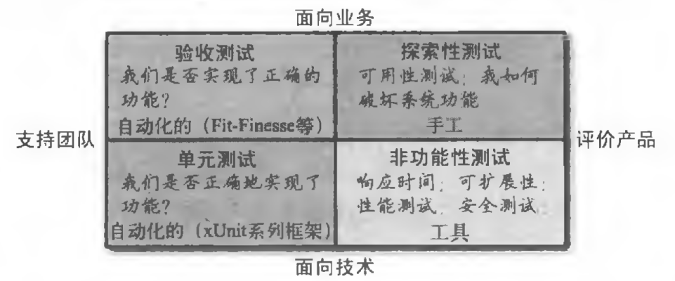
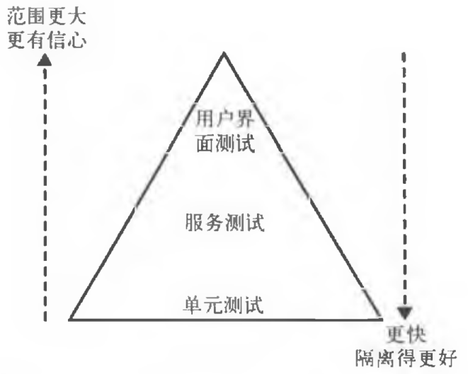
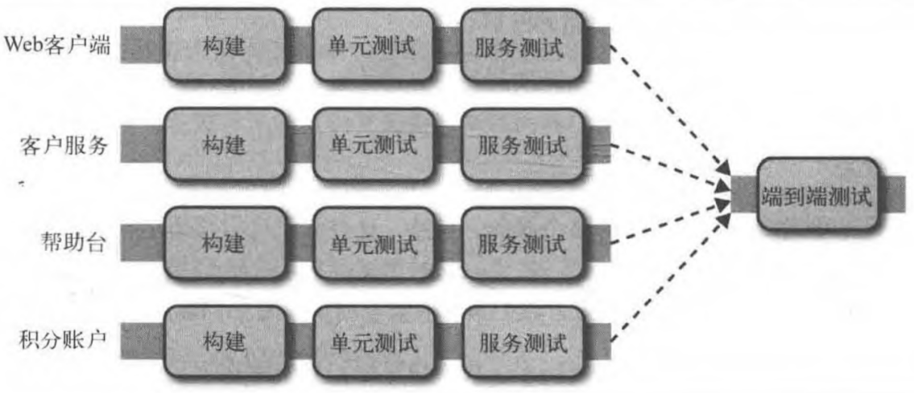

# 测试

## 测试类型

## 测试范围

对于用户界面测试,接下来我们改称它为端到端测试。

- 单元测试

TDD (Test-Driven Design ,测试驱动开发)

单元测试是帮助我们开发人员的,是面向技术而非面向业务的。

- 服务测试

服务测试是绕开用户界面、直接针对服务的测试。在独立应用程序中,服务测试可能只测试为用户界面提供服务的一些类。对于包含多个服务的系统,一个服务测试只测试其中一个单独服务的功能。

只测试一个单独的服务可以提高测试的隔离性,这样我们就可以更快地定位并解决问题。为了达到这种隔离性,我们需要给所有的外部合作者打桩,以便只把服务本身保留在测试范围内。

- 端到端测试

打开一个浏览器来操作图形用户界面 ( GUI )

### 权衡

越靠近金字塔的顶端,测试覆盖的范围越大,同时我们对被测试后的功能也越有信心。而缺点是,因为需要更长的时间运行测试,所以反馈周期会变长。并且当测试失败时,比较难定位是哪个功能被破坏。而越靠近金字塔的底部,一般来说测试会越快,所以反馈周期也会变短,测试失败后更容易定位被破坏的功能,持续集成的构建时间也很短。

为不同目的选择不同的测试来覆盖不同的范围。

### 比例

顺着金字塔向下,下面一层的测试数量要比上面一层多一个数量级。如果当前的权衡确实给你带来了问题,那可以尝试调整不同类型自动化测试的比例

## 实现服务测试

*打桩* 是指为被测服务的请求创建一些有着预设响应的打桩服务。

与打桩相比,*mock* 还会进一步验证请求本身是否被正确调用。如果与期望请求不匹配,测试便会失败。

### 智能的打桩服务

Mountebank (http://www.mbtest.org/)

### 端到端测试

让多个流水线扇入(fanin)到一个独立的端到端测试的阶段(stage)。

包含在测试中的服务数量越多,测试就会越脆弱,不确定性也就越强。如果测试失败以后每个人都只是想重新运行一遍测试,然后希望有可能通过,那么这种测试是脆弱的。不仅这种涉及多个服务的测试很脆弱,涉及多线程功能的测试通常也会有问题。

发现脆弱的测试时应该立刻记录下来,当不能立即修复时,需要把它们从测试套件中移除,然后就可以不受打扰地安心修复它们。修复时,首先看看能不能通过重写来避免被测代码运行在多个线程中,再看看是否能让运行的环境更稳定。更好的方法是,看看能否用不易出现问题的小范围测试取代脆弱的端到端测试。有时候,改变被测软件本身以使之更容易测试也是一个正确的方向。

团队可以随意提交测试到这个套件,但实现服务的团队必须全都负责维护套件的健康。

不给整个系统使用同一个版本号，因为把多个服务一起进行部署经常会导致服务的耦合。

测试场景,而不是故事。我们应该把测试整个系统的重心放到少量核心的场景上来。把任何在这些核心场景之外的功能放在相互隔离的服务测试中覆盖。团队之间需要就这些核心场景达成一致,并共同拥有。

使用之前所提到的端到端测试,我们试图解决的关键问题是什么?是试图确保部署新的服务到生产环境后,变更不会破坏新服务的消费者。有一种不需要使用真正的消费者也能达到同样目的的方式,它就是 CDC ( Consumer-Driven Contract ,消费者驱动的契约)。

### 区分部署和上线

- 蓝/绿部署

- 金丝雀发布(canary releasing)

金丝雀发布是指通过将部分生产流量引流到新部署的系统,来验证系统是否按预期执行。“按预期执行”可以涵盖很多内容,包括功能性的和非功能性的。例如,我们可以验证新部署服务的请求响应时间是否在500毫秒以内,或者查看新服务和旧服务是否有相同的错误率比例(proportional error rate)。甚至更进一步,如果我们要发布一个新版本的推荐服务,可以同时运行两个版本,然后看看新版本的推荐服务是否能够达到预期的销售量,以确保我们没有发布一个次优算法的服务。如果新版本没有达到预期,我们可以迅速恢复到旧版本。如果达到了预期,我们可以引导更多的流量到新版本。金丝雀发布与蓝/绿发布的不同之处在于,新旧版本共存的时间更长,而且经常会调整流量。

### 平均修复时间胜过平均故障间隔时间

有时花费相同的努力让发布变更变得更好,比添加更多的自动化功能测试更加有益。在Web操作的世界,这通常被称为平均故障间隔时间(Mean Time Between Failures,MTBF)和平均修复时间(Mean Time To Repair,MTTR)之间的权衡优化。

减少修复时间的技术可以简单到尽快回滚加上良好的监控,类似蓝/绿部署。
