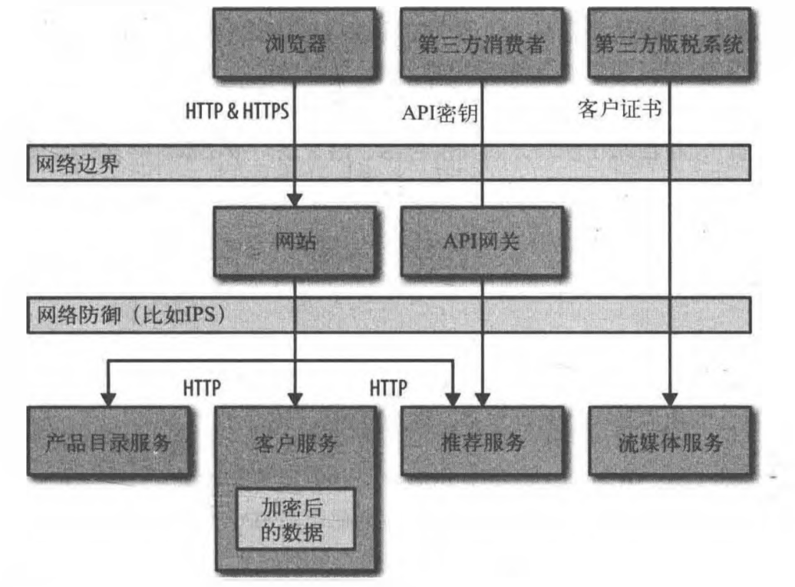

# 安全

## 身份验证和授权

当我们抽象地讨论进行身份验证的人或事时,我们称之为主体(principal)

SSO (Single Sign-On,单点登录)

## 服务间的身份验证和授权

在边界内允许一切。

### HTTP(S)基本身份验证

用户名和密码泄露

### HTTP之上的HMAC

OAuth规范的一部分,并被广泛应用于亚马逊AWS的S3API。

使用HMAC,请求主体和私有密钥一起被哈希处理,生成的哈希值随请求一起发送。然后,服务器使用请求主体和自己的私钥副本重建哈希值。如果匹配,它便接受请求。这样做的好处是,如果一个中间人更改了请求,那么哈希值会不匹配,服务器便知道该请求已被篡改过。并且,私钥永远不会随请求发送,因此不存在传输中被泄露的问题。额外的好处是,这个通信更容易被缓存,而且生成哈希的开销要低于处理HTTPS通信的开销。

缺点：

- 客户端和服务器需要一个共享的、以某种方式交流的密钥。

- 缺乏一个优秀的、开放的且有效的实现方式。

- 这种方法只能保证第三方无法篡改请求,且私钥本身不会泄露。但请求中所带的其他数据,对网络嗅探来说仍是可见的。

### API密钥

像Twitter、谷歌、Hickr和AWS这样的服务商,提供的所有公共API都使用API密钥。API密钥允许服务识別出是谁在进行调用,然后对他们能做的进行限制。限制通常不仅限于特定资源的访问,还可以扩展到类似于针对特定的调用者限速,以保护其他人服务调用的质量等。

API密钥的解决方案在商业和开源领域存在很多选项,每种系统提供的具体功能有所不同。有些产品只处理API密钥交换和一些基本的密钥管理。其他的工具提供包括限速、变现、API目录和发现系统等功能。

一些API系统允许你将API密钥和现有目录服务联系起来。这允许将API密钥发布给你组织中的主体(代表人或系统),从而可以跟管理普通凭证一样,来控制这些密钥的生命周期。这为通过不同的方式访问系统,但保持一样的可靠信息来源提供了可能性。

### 代理问题

有一种安全漏洞叫作 *混淆代理人问题* ,指的是在服务间通信的上下文中,攻击者采用一些措施欺骗代理服务,让它调用其下游服务,从而做到一些他不应该能做的事情。例如,一个用户,登录到在线购物系统时,可以查看账户详情。但如果他使用登录后的凭证,欺骗在线购物用户界面去请求别人的信息。

## 静态数据的安全

使用众所周知的加密算法

- 深度防御

- 防火墙

- 曰志

- 操作系统

