# Data Model Resource Book

## Conventions and Standards 规约和标准

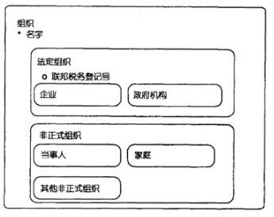

### Entities 实体

An entity is something of significance about which the enterprise wishes to store information.

### Subtypes 子类

A subtype, sometimes referred to as a subentity, is a classification of an entity that has characteristics such as attributes or relationships in common with the more general entity.

### Supertypes 超类

The common attributes and relationships between subtypes are shown in the outside entity, which is known as the supertype.

While the subtypes represent a complete set of possible classifications, there may be more detailed subtypes that are not included in the data model; instead, they may be included in a TYPE entity. In this case, subtypes are shown in two places on a model: as a subtype and in a TYPE entity that shows the domain of allowed types for the entity.

### Non-Mutually Exclusive Sets of Subtypes 子类的非互斥集

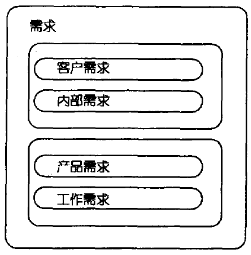

Figure illustrates a convention to show mutually exclusive sets of subtypes by having a box around each set of possible subtypes with no name for the box. The boxes merely serve to establish when there is more than one set of subtypes for a supertype.

### Attributes 属性

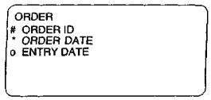

primary key : `#`
mandatory attributes (必选属性) : `*`
optional attributes (可选属性) : `o`

#### Conventions Used in Attribute Naming

- ID

System-generated sequential unique numeric identifier (i.e., 1, 2, 3, 4,...)

- Seqid

System-generated sequence within a parent ID (e.g., order line sequence number)

- Code

Unique pneumonic—used to identify user-defined unique identifiers that may have some meaning embedded in the key (i.e., an example of a geo code to store Colorado may be "CO")

- Name

A proper pronoun such as a person, geographical area, organization

- Description

The descriptive value for a unique code or identifier

- Flag or Ind (indicator)

A binary choice for values (i.e., yes/no or male/female)

- from date

Attribute that specifies the beginning date of a date range and is inclusive of the date specified

- thru date

Attribute that specifies the end date of a date range and is inclusive of the date specified (to date is not used because thru date more clearly represents an inclusive end of date range)

### Relationships 关系

Relationships define how two entities are associated with each other.

#### Optionality 可选性
dotted line 虚线 -> optional 可选
continuous line 实线 -> mandatory 必选

#### Cardinality 基数

one-to-one, one-to-many, or many-to-many

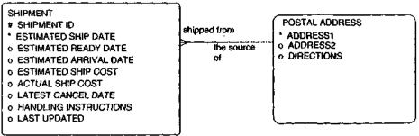

The data models have very few one-to-one relationships because most of the time one-to-one relationships can be grouped together into a single entity when normalized.

The data model diagrams do not show many-to-many relationships because many-to-many-relationships are almost always broken out into intersection entities(交叉实体).

#### Foreign Key 外键

A foreign key is defined as the presence of another entity's (or table's) primary key in an entity (or table).

Any one-to-many relationship indicates that the primary key of the entity on the one side of the relationship is brought into the entity on the many side of the relationship.

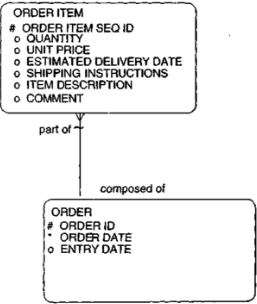

A diagramming convention in this book is to use a tilde ("~") relationship line to indicate that the inherited foreign key is part of the primary key of the child entity.

This convention allows a shorthand notation, providing for the primary key to be identified as a combination of the primary key attributes (identified with a "#") as well as the primary keys of the entity to which the relationship with a tilde is pointing.

#### Intersection Entities 交叉实体

Associative Entities 关联实体

Cross-reference Entities 交叉引用实体

resolve many-to-many relationships by cross-referencing one entity to another

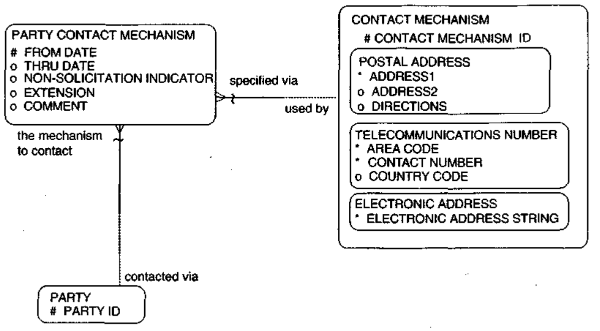

#### Exclusive Arcs 互斥弧

Exclusive arcs are used to identify relationships where an entity is related to two or more other entities, but only one relationship can exist for a specific entity occurrence.

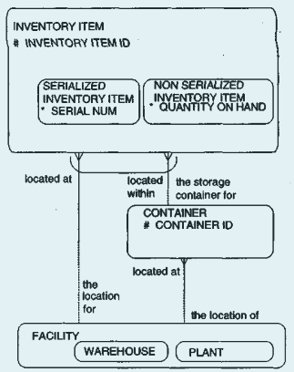

### Recursive递归

Recursive relationships are relationships that show how one entity is related to itself.

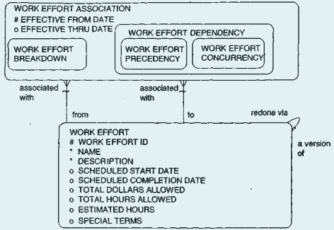

> Work Effort 工作计划

A recursive relationship could be modeled either via a relationship pointing from an entity to itself or via a many-to-many-relationship. This depends on if it is a many-to-many recursion or a one-to-many recursion. It is possible for an entity to have many recursive relationships.

## People and Organizations

### Organization

组织和组织的角色解耦

存储具有共同目标的人的信息

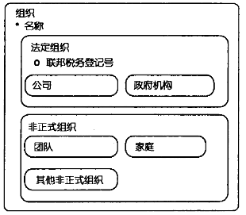

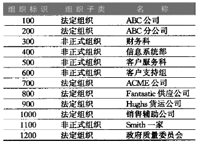

### Person

人员和职务角色解耦

#### 重复属性不分离为实体

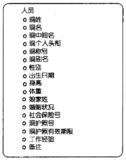

### 重复属性分离为实体

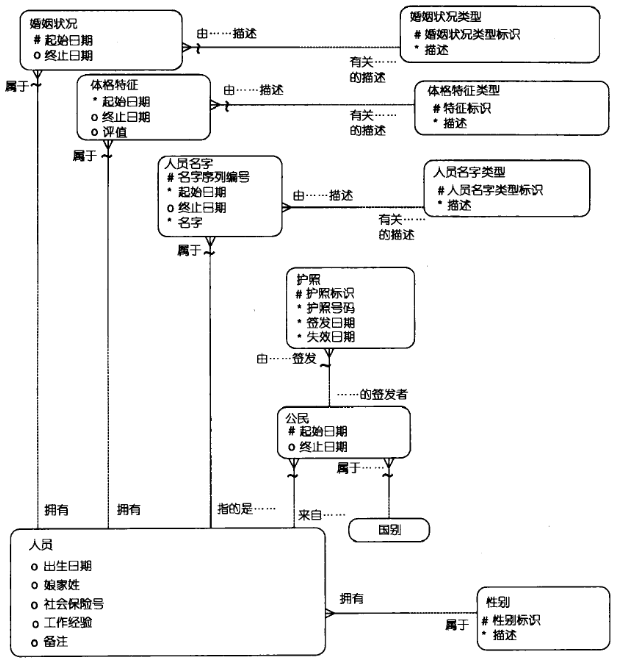

人员类型描述实体可以描述各种类型的名字，比如"名","姓","外号","现称号","现头衔","昵称"

如果在医疗行业，可以在人员和性别类型中设置关联实体 人员性别

### Party

当事人实体负责存储一些人和组织的通用特征和关系

联络员通常将组织和个人都视为联络方，一个订单的客户既可能是组织，又能是个人。如果不抽象出当事人，那么这个订单需要两种关系，一个是到组织另一个是到个人，这两个关系还是互斥的，需要一个互斥弧。

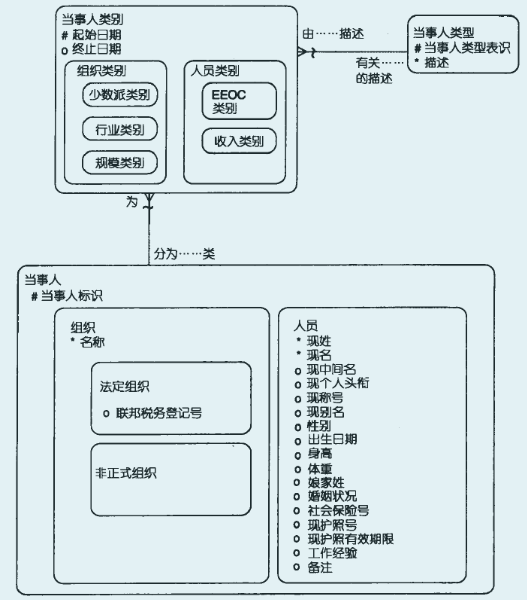

#### 当事人角色

一个人员或组织可以扮演任意数量的角色，如：客户，供应商，雇员等。由于同一个当事人可能在同时或不在同时间扮演多个不同的角色，所以就需要对每个角色的信息进行定义。

当事人实体，定义当事人的本质特征，这些特性不随时间发生变化。

当事人类别将当事人划分为特定类别。当事人角色实体定义当事人如何行为。

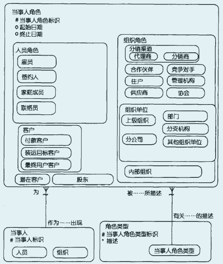

### 当事人关系

记录当事人和其他当事人关联的信息和各自的角色信息

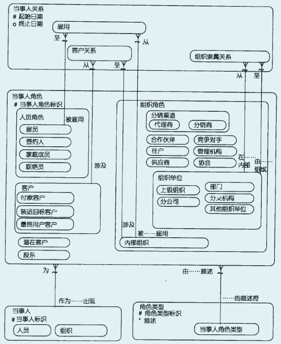

客户关系子类显示一个客户可能是多个内部组织的客户，反之亦然，这是一个多对多关系

### 当事人联络信息

#### 邮政地址信息

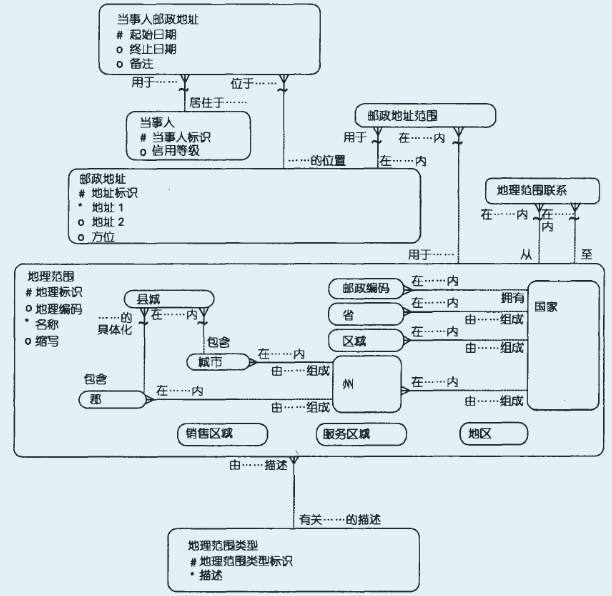

#### 电话和邮箱

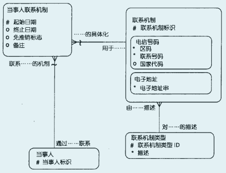

### 合并邮政地址作为联系地址

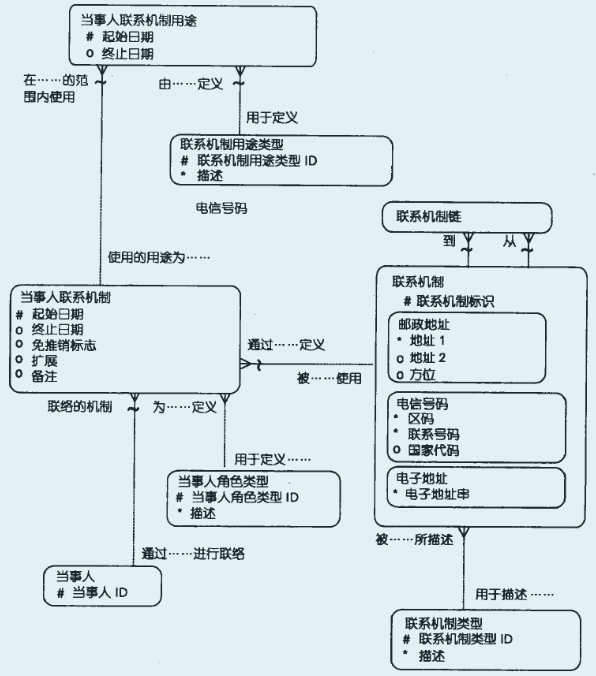

### 设施与联系机制

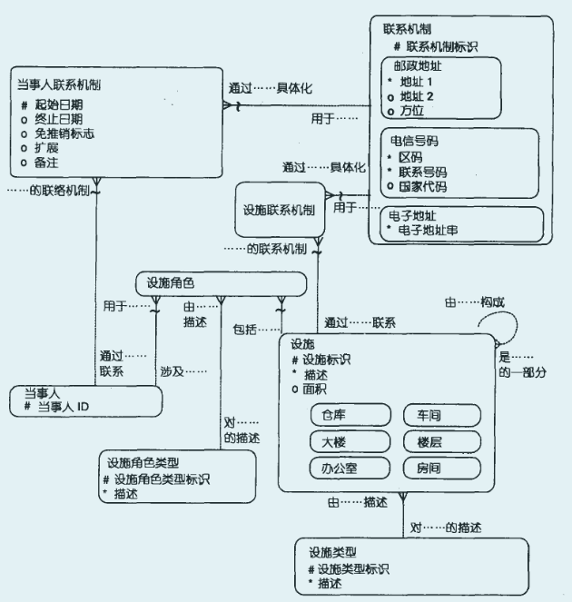

### 当事人通信事件

记录当事人之间谁和谁在什么事件联系或通信

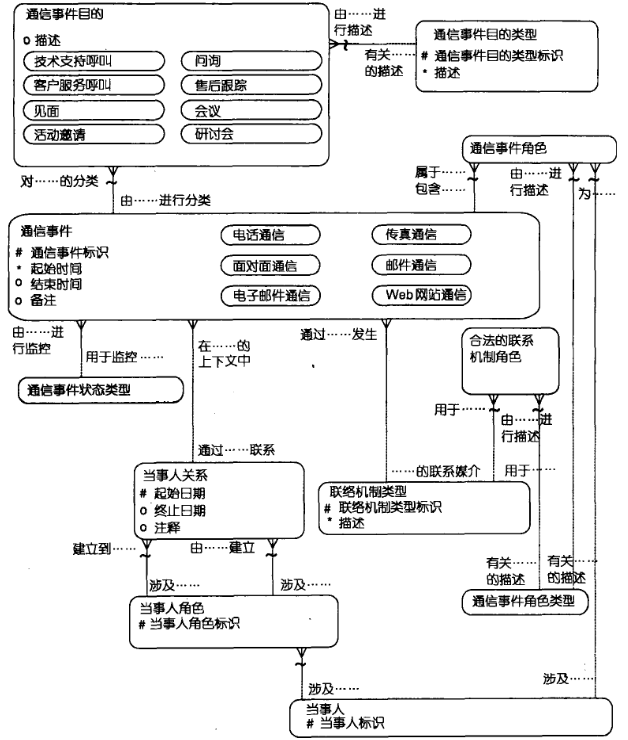

### 总结

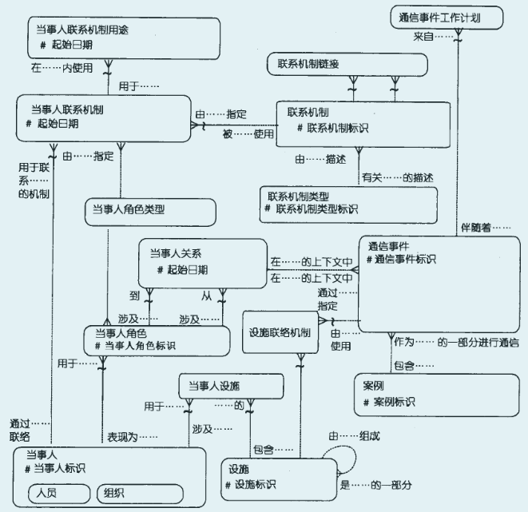

## Products

### Concept

-Product

Products are defined as goods or services that were, are, or will be sold by the enterprise.

- Goods

Goods are products that are more tangible(有形的) in nature and generally created in advance for sale.

- Service

Services are products that involve the use of parties' time and are less tangible in nature.

### Product Definition

Just as parties include both internal and external parties, the product model includes products that the enterprise provides, products from suppliers, and products that competitors provide. Some of the information may be independent of the supplier, such as the description, category, and features of the product. Some of the information about the products, such as the availability and pricing of products, may depend on the supplier of the product.

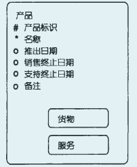

推出日期表示产品第一次可用于销售的日期

### Product Category

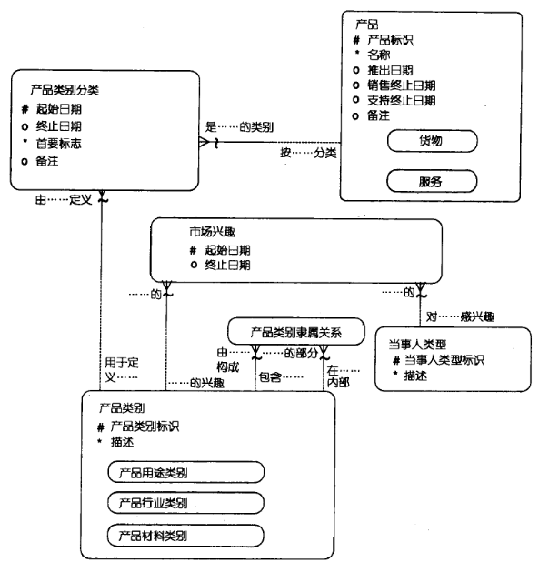

首要标志(Primary Flag)用于标识产品的主类型，防止一个产品统计时计算多次

### Product Identification Codes

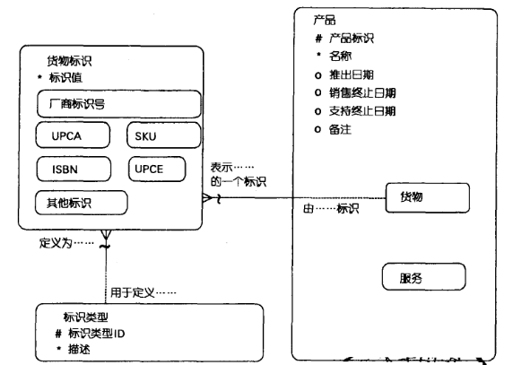

- SKU 库存单元
- UPCA 美国通用产品编码
- UPCE 欧洲通用产品编码
- ISBN 国际标准图书编号

### Product Features

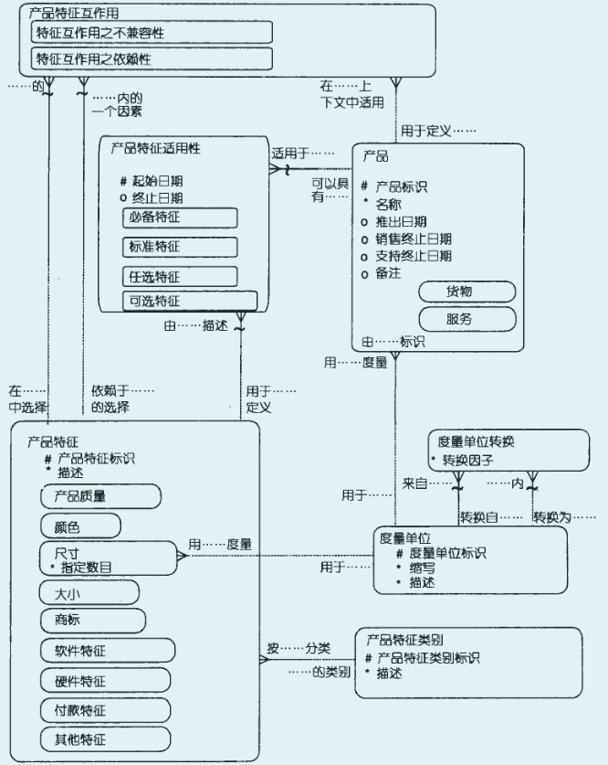

电商系统中产品特征多而且杂，一般采用属性来描述

电商系统中除了要将产品建模，还要对特定产品特征的商品进行建模（比如M号的衣服），商品和货品，区别就在这里

### Summary

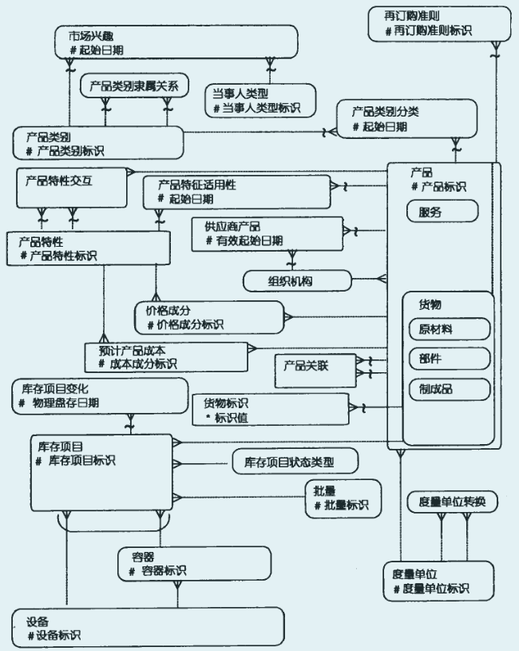

# Creating the Data Warehouse Data Model from the Enterprise Data Model

## Data Warehouse Architecture

### Enterprise Data Model

The enterprise data model is an enterprise-wide view of the data and its relationships.

It normally includes a high-level model that is an overview of each subject data area and the relationships between them, as well as logical data models for each subject data area.

### Data Warehouse Design

The data warehouse design is sometimes referred to as a data warehouse data model.

It represents an integrated, subject-oriented, and very granular(粒度化) base of strategic information that serves as a single source for the decision support environment.

This allows an architecture where information is extracted from the operational environment, cleansed, and transformed into a central, integrated enterprise-wide data warehouse environment.

### Departmental Data Warehouse Design or Data Mart

The departmental data warehouse design is used to maintain departmental information that is extracted from the enterprise data warehouse. This is sometimes referred to as lightly and highly summarized data or as data marts.

It is important to note that as the enterprise moves from the enterprise data model to the data warehouse data model to the departmental data warehouse, the models become more dependent on the particular enterprise.

## Enterprise Data Model

The point of departure for the design and construction of the data warehouse is the enterprise data model.

One of the problems with classical data modeling techniques is that there is no distinction between modeling for the operational and decision support environments.

Because the enterprise data model is not built specifically for the data warehouse, some amount of transformation is necessary to adapt it to the design to build the data warehouse data model.

### Transformation Requirements

- Major subjects of the enterprise
- Relationships between the subjects
- Definitions of the subject areas
- Logical data models for each subject data area (sometimes referred to as entity relationship diagrams)

### Process Models

- Functional decomposition 功能分解
- Data and process matrices 数据和处理矩阵
- Data flow diagrams 数据流图
- State transition diagrams 状态转移图
- HIPO charts HIPO图
- Pseudocode 伪代码

These are generally included in an enterprise process model, as opposed to being part of the enterprise data model.

the process model usually is not of much interest to the data warehouse designer because the process analysis applies directly to the operational environment, not the data warehouse or the decision support system (DSS) environment.

It is the enterprise data model that forms the backbone of design for the data warehouse, not the process models.

### High-Level and Logical Data Models

The enterprise data model is usually divided into multiple levels—a high-level model and logical data models for each subject area.

the high-level enterprise data model does not contain any amount of detail at all

For each subject area identified, there is a single logical data model

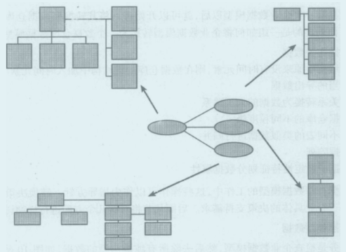

The degree of completion of the larger enterprise data model is of little concern to the data warehouse developer because the data warehouse will be developed iteratively, one stage at a time.

### Making the Transformation

#### Removal of purely operational data

Removing data that will not be used for DSS processing

####  Addition of an element of time to the key structure of the data warehouse if one is not already present

- snapshot_date

In the warehouse, snapshots of customer-related party data are made because customer demographics may change over time.

- from datetime or thru datetime

#### Addition of appropriate derived(导出) data

Derived data is added only to the physical database design for performance or ease of access reasons.

It is appropriate to add derived data to the data warehouse data model where the derived data is popularly accessed and calculated once.

The issue of volume of data in a data warehouse is such that every byte of data needs to be questioned. Otherwise, the data warehouse will quickly grow to unmanageable proportions.

#### Transformation of data relationships into data artifacts

#### Accommodation for the different levels of granularity found in the data warehouse

#### Merging of like data from different tables together

#### Creation of arrays of data

#### Separation of data attributes according to their stability characteristics
