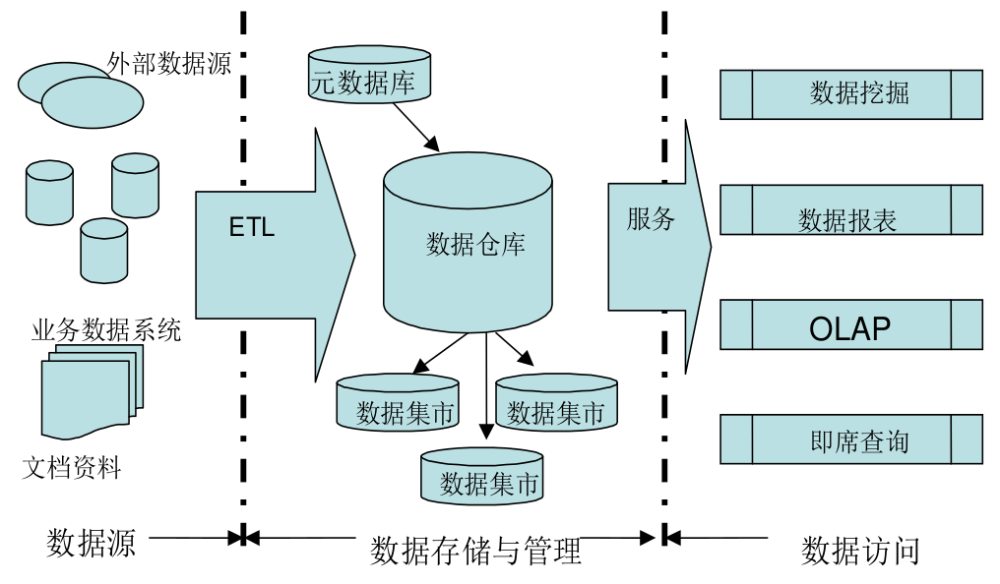

# 数据仓库基础

## 术语

### BI

Business Intelligence,即商业智能,也看到有些媒体里写作商务智能综合企业所有沉淀下来的信息,用科学的分析方法,为企业领导提供科学决策信息的过程。

### BOSS

业务运营支撑系统:Business Operations Support Systems,简称BOSS

### BPM

BUSINESS PERFORMANCE MANAGEMENT(企业绩效管理),是以商业智能(BI)技术、平衡计分卡(BSC)和个人关键绩效指标(KPIs)等先进信息技术和管理理论为基础的战略管理的工具,在财务、客户、内部流程和学习与发展四个维度上进行综合绩效评测,帮助企业从整体上实现对战略实现过程的贯彻和控制。

### BPR

业务流程重整(Business Process Reengineering),指利用数据仓库技术,发现并纠正企业业务流程中的弊端的一项工作。数据仓库的重要作用之一。

### CRM

Customer Relationship Management 客户关系管理。CRM是选择和管理有价值客户及其关系的一种商业策略,CRM要求以客户为中心的商业哲学和企业文化来支持有效的市场营销、销售与服务流程。

### CUBE

立方体

### DM

Data Market,即数据集市,或者叫做“小数据仓库”。如果说数据仓库是建立在企业级的数据模型之上的话。 那么数据集市就是企业级数据仓库的一个子集,他主要面向部门级业务,并且只面向某个特定的主题。数据集市可以在一定程度上缓解访问数据仓库的瓶颈。

### DM

Data Mine,数据挖掘是一个从大型数据库中提取以前未知的,可理解的,可执行的信息并用它来进行关键的商业决策的过程。

### DSS

决策支持系统(Decision Support System),相当于基于数据仓库的应用。决策支持就是在收集所有有关数据和信息,经过加工整理,来为企业决策管理层提供信息,为决策者的决策提供依据。

### DW

Data Warehouse,数据仓库是在企业管理和决策中面向主题的、集成的、与时间相关的、不可修改的数据集合。与其他数据库应用不同的是,数据仓库更像一种过程,对分布在企业内部各处的业务数据的整合、加工和分析的过程。而不是一种可以购买的产品。

### EDM

Enterprise Data Model,企业数据模型

### ERP

Enterprise Resourse Planning,企业资源规划。它是一个以管理会计为核心的信息系统,识别和规划企业资源,从而获取客户订单,完成加工和交付,最后得到客户付款。换言之,ERP将企业内部所有资源整合在一起,对采购、生产、成本、库存、分销、运输、财务、人力资源进行规划,从而达到最佳资源组合,取得最佳效益。

### ETL

数据抽取(Extract)、转换(Transform)、清洗(Cleansing)、装载(Load)的过程。构建 数据仓库的重要一环,用户从数据源抽取出所需的数据,经过数据清洗,最终按照预先定义好的数据仓库模型,将数据加载到数据仓库中去。

### KDD

KDD(Knowledge Discovery in Database),数据库中知识发现。是基于数据库的知识发现,指的是从大型数据库或数据仓库中提取人们感兴趣的知识,这些知识是隐含的、事先未知的、潜在有用的、易被理解的模式。

### MDD

多维数据库(Multi Dimesional Database,MDD) 可以简单地理解为:将数据存放在一个n维数组中,而不是像关系数据库那样以记录的形式存放。因此它存在大量稀疏矩阵,人们可以通过多维视图来观察数据。多维数据库增加了一个时间维,与关系数据库相比,它的优势在于可以提高数据处理速度,加快反应时间,提高查询效率。

### Metadata

### ODS

(Oprational Data Store) 操作型数据存储,对于一些准实时的业务数据库当中的数据的暂时存储,支持一些同时关连到历史数据与实时数据分析的数据暂时存储区域

### 自然键

由现实世界中已经存在的属性组成的键。例如，美国公民被分配了一个唯一（不保证一定正确，但实际上非常接近唯一）的社会保险号（SSN）。如果隐私法允许的话，SSN可能被用作Person实体的自然键（假设组织的人员范围仅限于美国）。

### 代理键

不具有业务含义的键

### 数据总线

数据总线结构，实际上就是首先定义出一整套在企业范围内具有统一解释的标准化维度与事实，建立起数据体系结构的框架，然后根据框架进行插拔开发。

## 相关概念

- 数据仓库
- 面向主题
- 集成的
- 相对稳定的
- 反映历史变化

### OLAP

- MOLAP Multi-Dimension OLAP 多维立方体
- ROLAP Relational OLAP

### 企业信息工厂

Corporate Information Factory,简称EIF

企业信息工厂主要包括集成转换层(I&T)、操作数据存储(ODS)、企业级数据仓库(EDW)、数据集市(DM)、探索仓库(EW)等部件。这些部件有机的结合在一起,为企业提供信息服务。

### 维

维,是人们观察数据的特定角度,是考虑问题时的一类属性,属性集合构成一个维。

#### 代理关键字 Surrogate key

维度表中使用顺序(序列)分配的整数值作为主键代理关键字，用于维度表和事实表的连接

- 使数据仓库环境对操作型环境的变化进行缓冲
- 建立一些不存在的维度记录
- 处理缓慢变化维

#### 缓慢变化维 Slowly Changing Dimensions

处理方法
- 直接覆盖原值
- 添加维度行
- 添加属性列

### 退化维度 Degenerate Dimension

当一个维度没有数据仓库需要的任何数据时就可以退化此维度。需要把退化维度的相关数据迁移到事实表中，然后删除退化的维度。

退化维度一般都是事务的编号,如订单编号、发票编号等。这类编号需要保存到事实表中,但是不需要对应的维度表,所以称为退化维度。

### 微型维度

维度建模的数据仓库中,有一种维度叫MiniDimension,中文一般翻译成“微型维度”。微型维度的提出主要是为了解决快变超大维度(rapidly changing monster dimension)

分析频率比较高或者变化频率比较大的字段提取出来,建立一个单独的维度表。

在微型维度表中如果有像收入这样分布范围较广的属性时,应该将它分段处理。

### 一致性维度

在多维体系结构的数据仓库项目组内需要有专门的维度设计师,他的职责就是建立维度和维护维度的一致性。

在同一个集市内,一致性维度的意思是两个维度如果有关系,要么就是完全一样的,要么就是一个维度在数学意义上是另一个维度的子集。例如,如果建立月维度话,月维度的各种描述必须与日期维度中的完全一致,最常用的做法就是在日期维度上建立视图生成月维度。这样月维度就可以是日期维度的子集,在后续钻取等操作时可以保持一致。如果维度表中的数据量较大,出于效率的考虑,应该建立物化视图或者实际的物理表。

这样,维度保持一致后,事实就可以保存在各个数据集市中。虽然在物理上是独立的,但在逻辑上由一致性维度使所有的数据集市是联系在一起,随时可以进行交叉探察等操作,也就组成了数据仓库。

### 杂项维度

在操作系统中,我们定义好各种维度后,通常还会剩下一些在小范围内取离散值的指示符或者标志字段。例如:支付类型字段,包括现金和信用卡两种类型,在源系统中它们可能是维护在类型表中,也可能直接保存在交易表中。 一张事实表中可能会存在好几个类似的字段,如果作为事实存放在事实表中,会导致事实表占用空间过大;如果单独建立维度表,外键关联到事实表,会出现维度过多的情况;如果将这些字段删除,会有人不同意。 这时,我们通常的解决方案就是建立杂项维度,将这些字段建立到一个维度表中,在事实表中只需保存一个外键。几个字段的不同取值组成一条记录,生成代理键,存入维度表,并将该代理键保存入相应的事实表字段。建议不要直接使用所有的组合生成完整的杂项维度表,在抽取时遇到新的组合时生成相应记录即可。杂项维度的ETL过程比一般的维度略为复杂。

### 事实表

在维度建模的数据仓库中,事实表是指其中保存了大量业务度量数据的表。事实表中的度量值一般称为事实。

事实表的粒度决定了数据仓库中数据的详细程度。

#### 按粒度分

- 事务粒度事实表

事务事实表(Transaction fact table)记录的事务层面的事实,保存的是最原子的数据,也称“原子事实表”。

事务事实表的日期维度记录的是事务发生的日期,它记录的事实是事务活动的内容。用户可以通过事务事实表对事务行为进行特别详细的分析。

- 周期快照粒度事实表

周期快照事实表(Periodic snapshot fact table)以具有规律性的、可预见的时间间隔来记录事实,时间间隔如每天、每月、每年等等。

典型的例子如销售日快照表、库存日快照表等。

- 累积快照事实表

累积快照事实表(Accumulating snapshot fact table)和周期快照事实表有些相似之处,它们存储的都是事务数据的快照信息。但是它们之间也有着很大的不同,周期快照事实表记录的确定的周期的数据,而累积快照事实表记录的不确定的周期的数据。

#### 按用途分

- 原子事实表 Atom Fact Table

是保存最细粒度数据的事实表,也是数据仓库中保存原子信息的场所

- 聚集事实表 Aggregated Fact Table

原子事实表上的汇总数据,也称为汇总事实表。

物化视图是实现聚集事实表的一种有效方式,可以设定刷新方式,具体功能由DBMS来实现。

- 合并事实表 Consolidated Fact Table

将位于不同事实表中处于相同粒度的事实进行组合建模而成的一种事实表。

即新建立一个事实表,它的维度是两个或多个事实表的相同维度的集合;事实是几个事实表中感兴趣的事实。

- 旋转事实表 Pivoted Fact Table

将一条记录中的多个事实字段转化为多条记录,其中每条记录保存一个事实字段的一种建模方法。或者反过来,也可以由多条记录转化为一条记录。

- 预连接聚集表 Pre-joined Aggregagte Table

预连接聚集表是通过对事实表和维度表的联合查询而生成的一类汇总表。在预连接聚集表中,保存有维度表中的描述信息和事实表的事实值。

预连接聚集表有一个很大的缺点,它需要占用大量的存储空间。

- 非事实型事实表 Factless Fact Table

在非事实型事实表,通常会保存十个左右的维度外键和多个度量事实,度量事实是事实表的关键所在。在非事实型事实表中没有这些度量事实,只有多个维度外键。非事实型事实表通常用来跟踪一些事件或者说明某些活动的范围。

第一类非事实型事实表是用来跟踪事件的事实表

学生注册事件,学校需要对学生按学期进行跟踪。维度表包括学期维度、课程维度、系维度、学生维度、注册专业维度和取得学分维度,而事实表是由这些维度的主键组成,事实只有注册数,并且恒为1。这样的事实表可以回答大量关于大学开课注册方面的问题,主要是回答各种情况下的注册数。

第二类非事实型事实表是用来说明某些活动范围的事实表。

促销范围事实表。通常销售事实表可以回答如促销商品的销售情况,但是对于那些没有销售出去的促销商品没法回答。这时,通过建立促销范围事实表,将商场需要促销的商品单独建立事实表保存。然后,通过这个促销范围事实表和销售事实表即可得出哪些促销商品没有销售出去。这样的促销范围事实表只是用来说明促销活动的范围,其中没有任何事实度量。

- 切片事实表 Sliced Fact Table

切片事实表(sliced fact table)中的字段结构和相应的基础表完全相同,差别在于存储的记录的范围。切片事实表中保存记录的是相应基础表中记录的子集,记录数通常与某个维度记录数相同。

这种建模方法一般用来满足特殊需要,如需要分析某些特殊问题时,可以将与之相关的数据切片出来。

这种方法也常用于合并存储在不同地区的数据,即各个地区都保存自己地区的数据,总部和所有地区的表结构都相同,然后总部将所有地区的数据合并在一起。

- 蜈蚣事实表 Centipede Fact Table

蜈蚣事实表是指那些一张事实表中有太多维度的事实表。连接在事实表两边的维度表过多,看起来就像蜈蚣一样,所以称为“蜈蚣事实表”

蜈蚣事实表的出现是由于建模师对事实表和维度表逆规范化过了头。例如,不单将产品主键放入事实表中,对于产品层级结构中的每一层的主键都放入事实表中,这样事实表中与产品相关的就会有产品ID、商标ID、子类ID、类别ID等多个外键。同样,也有建模师将日期相关的日期ID、月ID、年ID都放入事实表中。这些都将产生蜈蚣事实表,使自己落入维度过多的陷阱。

在维度建模的数据仓库中,维度表的字段个数可以尽可能的增加,但是事实表的字段要尽量减少,因为相比而言,事实表的记录数要远远大于维度表的记录数。

一般来说,事实表相关的维度在15个以下为正常,如果维度个数超过25个,就出现了维度过多的蜈蚣事实表。这时,需要做的事情是自己核查,将相关的维度进行合并,减少维度的个数。

### 一致性事实

一致性事实和一致性维度有些不同,一致性维度是由专人维护在后台(Back Room),发生修改时同步复制到每个数据集市,而事实表一般不会在多个数据集市间复制。需要查询多个数据集市中的事实时,一般通过交叉探查(drill across)来实现。 为了能在多个数据集市间进行交叉探查,一致性事实主要需要保证两点。第一个是KPI的定义及计算方法要一致,第二个是事实的单位要一致性。如果业务要求或事实上就不能保持一致的话,建议不同单位的事实分开建立字段保存。

## 数据集市

如果说数据仓库是建立在企业级的数据模型之上的话,那么数据集市就是企业级数据仓库的一个子集,他主要面向部门级业务,并且只面向某个特定的主题。数据集市可以在一定程度上缓解访问数据仓库的瓶颈。

### 即席查询 Ad hoc Queries

即席查询(Ad hoc queries)是指那些用户在使用系统时,根据自己当时的需求定义的查询。

一般的数据展现工具都会提供即席查询的功能。通常的方式是,将数据仓库中的维度表和事实表映射到语义层,用户可以通过语义层选择表,建立表间的关联,最终生成SQL语句。

即席查询的位置通常是在关系型的数据仓库中,即在EDW或者ROLAP中。多维数据库有自己的存储方式,对即席查询和通常查询没有区别。
