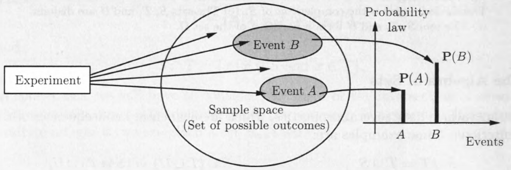
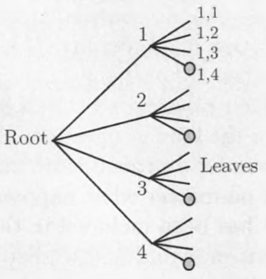

# Sample Space and Probability

## Sets

A set is **countably infinite** if it has one-to-one correspondence with the natural number set, $N$.

$\{x| x \text{ satisfies } P\}$ , the symbol "$|$" is to be read as "such that"(满足...条件)

**Uncountable set** There is no injective function from X to the set of natural numbers.

### Set Operations

$$S∪T=\{x|x∈S \text{ or } x∈T\}$$

$$S∩T=\{x|x∈S \text{ and } x∈T\}$$

$$\bigcup_{n=1}^\infty S_n=S_1∪S_2∪\cdots= \{x|x∈S_n \text{for some n}\}$$

$$\bigcap_{n=1}^\infty S_n=S_1∩S_2∩\cdots= \{x|x∈S_n \text{for all n}\}$$

Sets and the associated operations are easy to visualize in terms of **Venn Diagram(文森图)**

### The algebra of Sets

$$
\begin{array}{cc}
S∪T = T∪S                &    S∪(T∪U) = (S∪T)∪U        \\
S∩(T∪U) = (S∩T)∪(S∩U)   &    S∪(T∩U) = (S∪T)∩(S∪U)   \\
(S^c)^c = S               &    S∩S^c = ∅                 \\
S∪Ω = Ω                  &    S∩Ω = S
\end{array}
$$

**De Morgan’s laws**

$$\left(\bigcup_{n}S_n\right)^c=\bigcap_{n}S_n^c$$

$$\left(\bigcap_{n}S_n\right)^c=\bigcup_{n}S_n^c$$

## Probabilistic Models

### Elements of a Probabilistic Model

- The **sample space $Ω$**, which is the set of all possible **outcomes** of an experiment.
- The **probability law**, which assigns to a set $A$ of possible outcomes
(also called an $event$) a nonnegative number $P(A)$ (called the **probability** of $A$) that encodes our knowledge or belief about the collective “likelihood” of the elements of A . The probability law must **satisfy** certain properties to be introduced shortly. A subset of the sample space, that is, a collection of possible outcomes, is called an **event**.

### Choosing an Appropriate Sample Space

**mutually exclusive** 互斥

**collectively exhaustive** 全体穷尽

### Sequential Models

**tree-based sequential description**

### Probability Axioms

1. **(Nonnegativity)** $P (A) > 0$, for every event A

2. **(Normalization)** The probability of the entire sample space is
equal to 1, that is, $P(Ω) = 1$

3. **(Additivity)** If $A$ and $B$ are two disjoint events, then the probability of their union satisfies
$$P(A∪B) = P(A) + P(B)$$
More generally, if the sample space has an infinite number of elements and $A_1, A_2, \ldots$ is a sequence of disjoint events, then the probability of
their union satisfies
$$P(A_1 ∪ A_2 ∪ \cdots) = P(A_1) + P(A_2) + \cdots $$

### Discrete Models

**Discrete Probability Law**

If the sample space consists of a finite number of possible outcomes, then the probability law is specified by the probabilities of the events that consist of a single element. In particular, the probability of any event $\{s_1, \ldots , s_n\}$ is the sum of the probabilities of its elements:

$$P(\{s_1, \ldots , s_n\}) = P(s_1) + P(s_2) + \cdots + P(S_n)$$

**Discrete Uniform Probability Law**

If the sample space consists of n possible outcomes which are equally likely (i.e., all single-element events have the same probability), then the  probability of any event $A$ is given by

$$P(A) = \cfrac{  \text{number of elements of }A  }{n} $$

### Properties of Probability Laws

- If $A C B$, then P (A) < P{B).
(b) P(A U B) = P(A) + P(B) - P(,4 n B).
(c) P (,4U B )< P (,4) + P(B).
(d) P (A U B UC) = P(A) + P(ACD B) + P(ACn B c n C)

### Models and Reality

## Conditional Probability

## Total Probability Theorem and Baye's Rule
