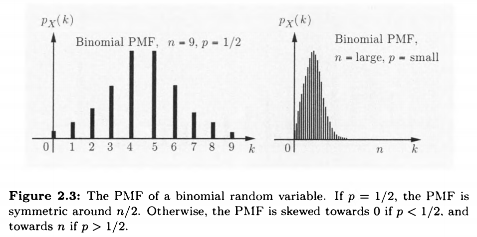

# Discrete Random Variables

## Basic Concepts

A **random variable** is a real-valued function of the experimental outcome.

A **discrete random variable** is a real-valued function of the out come of the experiment th at can take a finite or countably infinite number of values.

A discrete random variable has an associated **probability mass function (PMF)**, which gives the probability of each numerical value th at the random variable can take.

## PROBABILITY MASS FUNCTIONS

The **probability mass** of x, denoted $p_X(x)$, is the probability of the event $\{X = x\}$ consisting of all outcomes that give rise to a value of $X$ equal to $x$ : $$p_X(x) = P(\{X = x\})$$

we will use upper case characters to donote random variables,and lower case characters to denote real numbers such as the numerical values of a random variable.

$$\sum_x{p_X(x)}=1$$

### The Bernoulli Random Variable

The Bernoulli distribution is a special case of the binomial distribution where a single experiment/trial is conducted (n=1).

$$
p_X(k)=
\begin{cases}
p   & \text{if $k$ = 1} \\
1-p & \text{if $k$ = 0}
\end{cases}
$$

### The Binomial Random Variable

$$p_X(k)=C_n^kp^k(1-p)^{k-1} \qquad k=1,2,3,\ldots,n $$

### The Poisson Random Variable

$$p_X(k)=e^{-\lambda}\cfrac{\lambda^k}{k!} \qquad k=0,1,2,3,\ldots $$

The Poisson distribution is actually a limiting case of a Binomial distribution when the number of trials, $n$, gets very large and $p$, the probability of success, is small.

### The Geometric Random Variable

$$p_X(k)=(1-p)^{k-1}p \qquad k=1,2,3,\ldots $$

## EXPECTATION, MEAN, AND VARIANCE

**EXPECTATION**

We define the *expected value* (also called th e expectation or the mean)
of a random variable $X$ , w th PMF $p_X$, by

$$E[X] = \sum_x{xp_X(x)}$$

不考虑期望不存在的情况

## Variance, Moments, and the Expected Value Rule

In mathematics, a **moment(矩)** is a specific quantitative measure, used in both mechanics and statistics, of the shape of a set of points. If the points represent probability density, then the zeroth moment is the total probability (i.e. one), the first moment is the **mean(平均数)**, the second central moment is the **variance(方差)**, the third central moment is the **skewness(偏度)**, and the fourth central moment (with normalization and shift) is the **kurtosis(峰度)**.

$$var(X)=E\left[ (X-E(X))^2 \right]$$

>tip ： moment这块概念挺多，挺乱，详见[wiki](https://en.wikipedia.org/wiki/Moment_(mathematics))

The variance can also be thought of as the covariance of a random variable with itself.

$$cov(X)=E\left[ (X-E(X))(X-E(X)) \right]$$

**standard deviation** of $X$

$$σ_X= \sqrt{var(X)}$$

**Expected Value Rule for Functions of Random Variables**

Let $X$ be a random variable with PMF $p_X$, and let $g(X)$ be a function of $X$. Then, the expected value of the random variable $g(X)$ is given by

$$E[g(X)] = \sum_x{g(x)p_X(x)}$$

**Variance**

$$var(X)=\sum_x(x-E[X])^2p_X(x)$$

### Properties of Mean and Variance

$$var(X) = E[X^2] - (E[X])^2$$

### Independence of Random Variables

random variables $X$ and $Y$ are independent if

$$p_{X,Y}(x,y) = P_X(x)p_Y(y) \qquad \text{for all x,y}$$

conditionally independent

$$p_{X,Y|A}(x,y) = P_{X|A}(x)p_{Y|A}(y) \qquad \text{for all x,y}$$

### Independence of Several Random Variables

$$p_{X,Y,Z}(x.y.z) = p_{X}(x)p_{Y}(y)p_{Z}(z) \qquad \text{for all x,y,z}$$

## Summary of Results for Special Random Variables

**Discrete Uniform over $[a, b]$**

$$
p_X(k)=
\begin{cases}
\cfrac{1}{b-a+1}   & \text{if $k = a,a+1,\ldots,b$} \\
0 & \text{otherwise}
\end{cases}
$$

$$
E[X] = \cfrac{a+b}{2} \qquad var(X) =  \cfrac{(b-a)(b-a+2)}{12}
$$

**Bernoulli with Parameter** p: (Describes the success or failure in a single trial.)

$$
p_X(k)=
\begin{cases}
p   & \text{if $k = 1$} \\
1-p & \text{if $k = 0$}
\end{cases}
$$

$$
E[X] = p \qquad var(X) = p(1-p)
$$

**Binomial with Parameters p and n**: (Describes the number of successes in $n$ independent Bernoulli trials.)

$$p_X(k) = C_n^k p^k (1-p)^{n-k} \qquad k = 0,1,\ldots,n$$

$$
E[X] = np \qquad var(X) = np(1-p)
$$

**Geometric with Parameter p**: (Describes the number of trials until the
first success, in a sequence of independent Bernoulli trials.)

$$p_X(k) = (1-p)^{k-1}p \qquad k = 0,1,\ldots$$

$$
E[X] = \cfrac{1}{p} \qquad var(X) = \frac{1-p}{p^2}
$$

**Poisson with Parameter $λ$**: (Approximates the binomial PMF when n
is large, p is small, and $λ = np$.)

$$p_X(k) = e^{-λ}\cfrac{λ^k}{k!} \qquad k = 0,1,\ldots$$

$$
E[X] = λ \qquad var(X) = λ
$$
