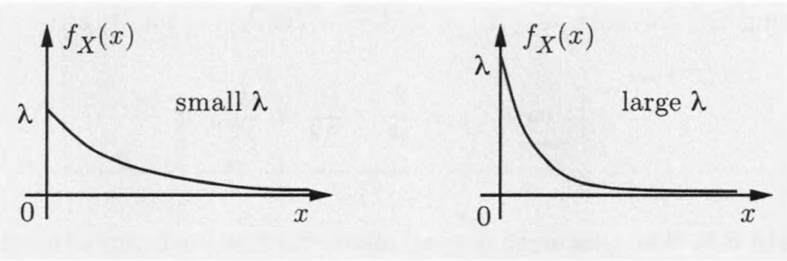

# General Random Variables

## CONTINUOUS RANDOM VARIABLES AND PDFS

A random variable X is called **continuous** if there is a nonnegative function $f_X$ called the probability density function of X , or PDF

$$
P ( X ∈ B ) = \int_B f_X (x)dx
$$

$$
\int_{-∞}^∞ f_X (x)dx = 1
$$

$$P([x, x + δ]) = \int_x^{x+δ}f_x(t) dt ≈ f_x(x) ⋅ δ ,\quad δ \text{ is very small}$$

### Expectation

$$E(X) = \int_{-∞}^∞ xf_X (x)dx$$

Expectation of a Continuous Random Variable and its Properties

$$E(g(X)) = \int_{-∞}^∞ g(x) f_X (x)dx$$

$$var(X) = E [(X-E[X])^2] = \int_{-∞}^∞ (x-E[X])^2 f_X(x)dx$$

$$0 ≤ var(X) = E[X^2]-(E[X])^2$$

If $Y = aX + b$, where $a$ and $b$ are given scalars, then
$$E[Y] = aE[X] + b, var(Y) = a^2\ var(X) $$

### Exponential Random Variable

An **exponential random variable** has a PDF of the form
$$
f_X(x) =
\begin{cases}
λe^{-λx},  & \text{if $x ≥ 0$} \\
0, & \text{otherwise}
\end{cases}
$$

$$
E(X) = \cfrac{1}{λ} \qquad var(X)=\cfrac{1}{λ^2}
$$

## CUMULATIVE DISTRIBUTION FUNCTIONS

$$
F_X(x)=P(X ≤ x) =
\left\{ \begin{array}{ll}
\displaystyle \sum_{k≤x} p_X(k),  & \text{if $X$ is discrete} \\
\displaystyle \int_{-∞}^x f_X(t)dt, & \text{if $X$ is continuous}
\end{array} \right.
$$

### The Geometric and Exponential CDFs

### The Standard Normal Random Variable

## JOINT PDFS OF MULTIPLE RANDOM VARIABLES

$$P((X,Y)∈B) = \iint_{x,y∈B}f_{X,Y}(x,y)\ dx\ dy$$

## CONDITIONING

### Conditioning a Random Variable on an Event

$$P(X∈B \mid A) = \int_B f_{X \mid A}(x)\ dx$$
