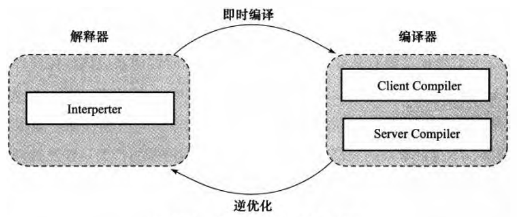

# 运行期优化

由于Java虚拟机规范没有具体的约束规则去限制即时编译器应该如何实现,所以这部分功能完全是与虚拟机具体实现

## HotSpot虚拟机内的即时编译器

### 解释器与编译器

解释器与编译器两者各有优势：当程序需要迅速启动和执行的时候，解释器可以首先发挥作用，省去编译的时间，立即执行。在程序运行后，随着时间的推移，编译器逐渐发挥作用，把越来越多的代码编译成本地代码之后，可以获取更高的执行效率。当程序运行环境中内存资源限制较大(如部分嵌入式系统中)，可以使用解释执行节约内存，反之可以使用编译执行来提升效率。同时，解释器还可以作为编译器激进优化时的一个“逃生门”，让编译器根据概率选择一些大多数时候都能提升运行速度的优化手段，当激进优化的假设不成立，如加载了新类后类型继承结构出现变化、出现“罕见陷阱”(Uncommon Trap)时可以通过逆优化(Deoptimization)退回到解释状态继续执行(部分没有解释器的虚拟机中也会采用不进行激进优化的C1编译器担任“逃生门”的角色),因此,在整个虚拟机执行架构中,解释器与编译器经常配合工作。

HotSpot虚拟机中内置了两个即时编译器，分别称为Client Compiler和Server Compiler，或者简称为C1编译器和C2编译器。

####　编译对象与触发条件

被即时编译器编译的“热点代码”有两类:

- 被多次调用的方法

- 被多次执行的循环体

判断一段代码是不是热点代码，是不是需要触发即时编译，这样的行为称为热点探测(Hot Spot Detection)，目前主要的热点探测判定方式有两种：

- 基于采样的热点探测(Sample Based Hot Spot Detection)

用这种方法的虚拟机会周期性地检査各个线程的栈顶,如果发现某个(或某些)方法经常出现在找顶,那这个方法就是“热点方法”。好处是实现简单、高效，缺点是很难精确地确认一个方法的热度，容易因为受到线程阻塞或别的外界因素的影响。

- 基于计数器的热点探测(Counter Based Hot Spot Detection)

用这种方法的虚拟机会为毎个方法(甚至是代码块)建立计数器,统计方法的执行次数,如果执行次数超过一定的阈值就认为它是“热点方法”。这种统计方法实现起来麻烦一些，需要为每个方法建立并维护计数器，但是它的统计结果相对来说更加准确和严谨。

HotSpot虚拟机中使用的是第二种，包括两个计数器 *方法调用计数器(Invocation Counter)* 和 *回边计数器(BackEdge Counter)*

当超过一定的时间限度,如果方法的调用次数仍然不足以让它提交给即时编译器编译，那这个方法的调用计数器就会被减少一半，这个过程称为方法调用计数器热度的衰减(Counter Decay)，而这段时间就称为此方法统计的半衰周期(Counter Half Life Time)，进行热度衰减的动作是在虚拟机进行垃圾收集时顺便进行的。

与方法计数器不同，回边计数器没有计数热度衰减的过程，因此这个计数器统计的就是该方法循环执行的绝对次数。

#### 编译过程

Server Compiler是专门面向服务端的典型应用并为服务端的性能配置特别调整过的编译器，也是一个充分优化过的髙级编译器，几乎能达到GNU C++编译器使用-O2参数时的优化强度，它会执行所有经典的优化动作，如无用代码消除(Dead Code Elimination)、循环展开(Loop Unrolling)、循环表达式外提(Loop Expression Hoisting)、消除公共子表达式(Common Subexpression Elimination)、常量传播(Constant Propagation)、基本块重排序(Basic Block Reordering)等，还会实施一些与Java语言特性密切相关的优化技术，如范围检査消除(Range Check Elimination)、空值检査消除(Null Check Elimination，不过并非所有的空值检査消除都是依赖编译器优化的，有一些是在代码运行过程中自动优化了)等。另外，还可能根据解释器或ClientCompiler提供的性能监控信息，进行一些不稳定的激进优化，如守护内联(Guarded Inlining)、分支频率预测(Branch Frequency Prediction)等。

### 编译优化技术

#### 公共子表达式消除

如果一个表达式E已经计算过了，并且从先前的计算到现在E中所有变量的值都没有发生变化，那么E的这次出现就成为了公共子表达式。对于这种表达式，没有必要花时间再对它进行计算，只需要直接用前面计算过的表达式结果代替E就可以了。

#### 数组范围检査消除

#### 方法内联

在许多情况下虚拟机进行的内联都是一种激进优化,激进优化的手段在高性能的商用虚拟机中很常见，除了内联之外，对于出现概率很小（通过经验数据或解释器收集到的性能监控信息确定概率大小）的隐式异常、使甩概率很小的分支等都可以被激进优化“移除”，如果真的出现小概率事件，这时才会从“逃生门”回到解释状态垂新执行

#### 逃逸分析

逃逸分析的基本行为就是分析对象动态作用域：当一个对象在方法中被定义后，它可能被外部方法所引用，例如作为调用参数传递到其他方法中，称为方法逃逸。甚至还有可能被外部线程访问到，譬如赋值给类变量或可以在其他线程中访问的实例变量，称为线程逃逸。

- 栈上分配(Stack Allocation)

Java虚拟机中,在Java堆上分配创建对象的内存空间几乎是Java程序员都清楚的常识了，Java堆中的对象对于各个线程都是共享和可见的，只要持有这个对象的引用，就可以访问堆中存储的对象数据。虚拟机的垃圾收集系统可以回收堆中不再使用的对象，但固收动作无论是筛选可回收对象，还是回收和整理内存都需要耗费时间。如果确定一个对象不会逃逸出方法之外，那让这个对象在栈上分配内存将会是一个很不错的主意，对象所占用的内存空间就可以随栈帧出栈而销毁。在一般应用中，不会逃逸的局部对象所占的比例很大，如果能使用栈上分配，那大量的对象就会随着方法的结束而自动销毁了，垃圾收集系统的压力将会小很多。

由于HotSpot虚拟机目前的实现方式导致栈上分配实现起来比较复杂，因此在HotSpot中暂时还没有做这项优化。

- 同步消除(Synchronization Elimination)

线程同步本身是一个相对耗时的过程，如果逃逸分析能够确定一个变量不会逃逸出线程，无法被其他线程访问，那这个变量的读写肯定就不会有竞争，对这个变量实施的同步措施也就可以消除掉。

- 标量替换(Scalar Replacement)

标量(Scalar)是指一个数据已经无法再分解成更小的数据来表示了，Java虚拟机中的原始数据类型(int、long等数值类型以及reference类型等)都不能再进一步分解，它们就可以称为标量。相对的，如果一个数据可以继续分解，那它就称作聚合量(Aggregate)，Java中的对象就是最典型的聚合量。如果把一个Java对象拆散，根据程序访问的情况，将其使用到的成员变量恢复原始类型来访问就叫做标量替换。如果逃逸分析证明一个对象不会被外部访问，并且这个对象可以被拆散的话，那程序真正执行的时候将可能不创建这个对象，而改为直接创建它的若干个被这个方法使用到的成员变量来代替。将对象拆分后，除了可以让对象的成员变量在栈上(找上存储的数据，有很大的概率会被虚拟机分配至物理机器的高速寄存器中存储)分配和读写之外，还可以为后续进一步的优化手段创建条件。
