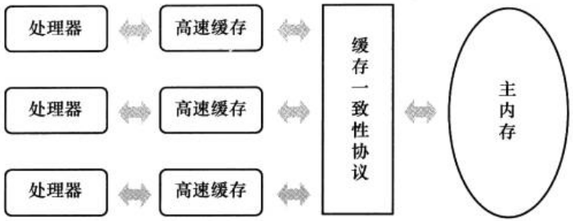
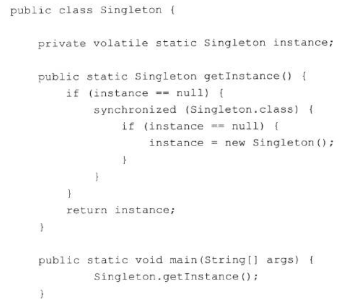
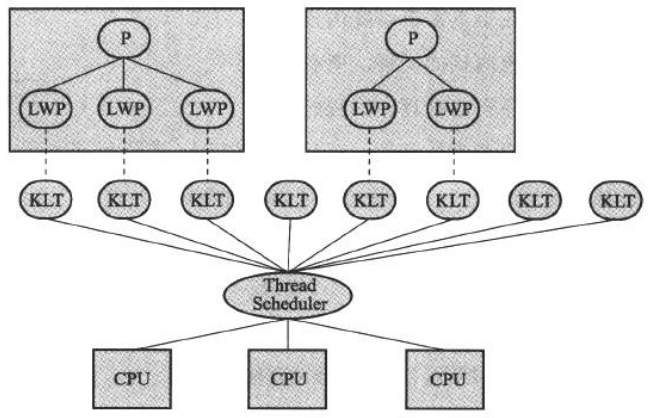
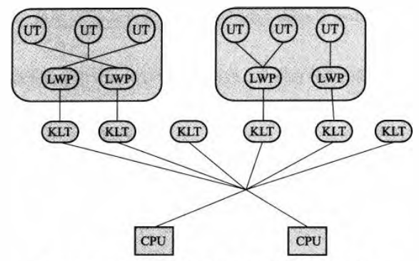
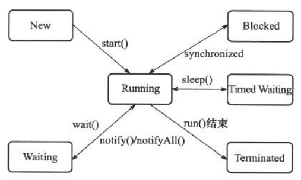

# Java内存模型与线程

并发处理的广泛应用是使得Amdahl定律代替摩尔定律成为计算机性能发展源动力的根本原因,也是人类“压榨”计算机运算能力的最有力武器。

## 概述

并发场景

－　充分利用计算机处理器的能力

－　一个服务端同时对多个客户端提供服务

##　硬件的效率与一致性

物理计算机中的并发问题

基于髙速缓存的存储交互很好地解决了处理器与内存的速度矛盾,但是也为计算机系统带来更高的复杂度,因为它引人了一个新的问题:缓存一致性(Cache Coherence)。在多处理器系统中,每个处理器都有自己的髙速缓存,而它们又共享同一主内存(Main Memory)。

内存模型即在特定的操作协议下,对特定的内存或髙速缓存进行读写访问的过程抽象。

除了增加高速缓存之外,为了使得处理器内部的运算单元能尽量被充分利用,处理器可能会对输人代码进行乱序执行(Out-Of-Order Execution)优化。与处理器的乱序执行优化类似,Java虚拟机的即时编译器中也有类似的指令重排序(Instruction Reorder)优化。

## Java内存模型

Java虚拟机规范中试图定义一种Java内存模型(Java Memory Model,JMM)来屏蔽掉各种硬件和操作系统的内存访问差异,以实现让Java程序在各种平台下都能达到一致的内存访问效果。在此之前,主流程序语言(如C/C++等)直接使用物理硬件和操作系统的内存模型,因此,会由于不同平台上内存模型的差异,有可能导致程序在一套平台上并发完全正常,而在另外一套平台上并发访问却经常出错,因此在某些场景就必须针对不同的平台来编写程序。

### 主内存与工作内存

Java内存模型的主要目标是定义程序中各个变量的访问规则,即在虚拟机中将变量存储到内存和从内存中取出变量这样的底层细节。

*此处的变量(Variables)与Java编程中所说的变量有所区别,它包括了实例字段、静态字段和构成数组对象的元素,但不包括局部变量与方法参数,因为后者是线程私有的®,不会被共享,自然就不会存在竞争问题。*

Java内存模型规定了所有的变量都存储在主内存(Main Memory,类比内存)中。每条线程还有自己的工作内存(Working Memory,类比髙速缓存),线程的工作内存中保存了被该线程使用到的变量的主内存副本拷贝,线程对变量的所有操作(读取、赋值等)都必须在工作内存中进行,而不能直接读写主内存中的变量气不同的线程之间也无法直接访问对方工作内存中的变量,线程间变量值的传递均需要通过主内存来完成。

从变量、主内存、工作内存的定义来看,主内存主要对应于Java堆中的对象实例数据部分,而工作内存则对应于虚拟机栈中的部分区域。从更低层次上说,主内存就直接对应于物理硬件的内存,而为了获取更好的运行速度,虚拟机(甚至是硬件系统本身的优化措施)可能会让工作内存优先存储于寄存器和高速缓存中,因为程序运行时主要访问读写的是工作内存。

### 内存间交互操作

关于主内存与工作内存之间具体的交互协议,即一个变置如何从主内存拷贝到工作内存、如何从工作内存同步回主内存之类的实现细节,Java内存模型中定义了以下8种操作：

- *lock(锁定)* 作用于主内存的变量,它把一个变量标识为一条线程独占的状态。

- *unlock(解锁)* 作用于主内存的变量,它把一个处于锁定状态的变量释放出来,释放后的变量才可以被其他线程锁定。

- *read(读取)* 作用于主内存的变量,它把一个变量的值从主内存传输到线程的工作内存中,以便随后的load动作使用。

- *load(载入)* 作用于工作内存的变量,它把read操作从主内存中得到的变量值放入工作内存的变量副本中。

- *use(使用)* 作用于工作内存的变量,它把工作内存中一个变量的值传递给执行引擎,每当虚拟机遇到一个需要使用到变量的值的字节码指令时将会执行这个操作。

- *assign(赋值)* 作用于工作内存的变量,它把一个从执行引擎接收到的值赋给工作内存的变量,每当虚拟机遇到一个给变量赋值的字节码指令时执行这个操作。

- *store(存储)* 作用于工作内存的变量,它把工作内存中一个变量的值传送到主内存中,以便随后的write操作使用。

- *write(写入)* 作用于主内存的变童,它把store操作从工作内存中得到的变置的值放入主内存的变量中。

由于这种定义相当严谨但又十分烦琐,实践起来很麻烦,后面将介绍一种等效原则先行发生原则,用来确定一个访问在并发环境下是否安全。

### 对于volatile型变屋的特殊规则

volatile的两种特性:

#### 1. 保证此变量对所有线程的可见性

这里的“可见性”是指当一条线程修改了这个变量的值,新值对于其他线程来说是可以立即得知的。

volatile解决了变量在各个线程的工作内存中一致性问题，但是并不意味着volatile变量的运算是线程安全的，因为Java里面的运算并非原子操作。

比如简单的++运算，可以转换成四条字节码指令，而每条字节码可能转化成若干条本地机器码指令。

由于volatile变量只能保证可见性,在不符合以下两条规则的运算场景中,我们仍然要通过加锁(使用synchronized或java.util.concurrent中的原子类)来保证原子性。

> 1. 运算结果并不依赖变量的当前值,或者能够确保只有单一的线程修改变量的值。

> 2. 变量不需要与其他的状态变量共同参与不变约束。（吊大的同学解释下这句话什么意思）

#### 2. 禁止指令重排序优化

普通的变量仅仅会保证在该方法的执行过程中所有依赖赋值结果的地方都能获取到正确的结果,而不能保证变量赋值操作的顺序与程序代码中的执行顺序一致。

DCL单例模式例子：

### 原子性、可见性与有序性

#### 原子性(Atomicity)

由Java内存模型来直接保证的原子性变量操作包括read、load、assign、use、store和write,我们大致可以认为基本数据类型的访问读写是具备原子性的。

如果应用场景需要一个更大范围的原子性保证(经常会遇到),Java内存模型还提供了lock和unlock操作来满足这种需求,尽管虚拟机未把lock和unlock操作直接开放给用户使用,但是却提供了更高层次的字节码指令monitorenter和monitorexit来隐式地使用这两个操作,这两个字节码指令反映到Java代码中就是同步块synchronized关键字,因此在synchronized块之间的操作也具备原子性。

#### 可见性(Visibility)

可见性是指当一个线程修改了共享变量的值,其他线程能够立即得知这个修改。

除了volatile之外,Java还有两个关键字能实现可见性,即synchronized和final。

#### 有序性(Ordering)

果在本线程内观察,所有的操作都是有序的;如果在一个线程中观察另一个线程,所有的操作都是无序的。前半句是指“线程内表现为串行的语义”,后半句是指“指令重排序”现象和“工作内存与主内存同步延迟”现象。

Java语言提供了volatile和synchronized两个关键字来保证线程之间操作的有序性,volatile关键字本身就包含了禁止指令重排序的语义,而synchronized则是由“一个变量在同一个时刻只允许一条线程对其进行lock操作”这条规则获得的,这条规则决定了持有同一个锁的两个同步块只能串行地进入。

### 先行发生(happens-before)原则

先行发生是Java内存模型中定义的两项操作之间的偏序关系,如果说操作A先行发生于操作B,其实就是说在发生操作B之前,操作A产生的影响能被操作B观察到,“影响”包括修改了内存中共享变里的值、发送了消息、调用了方法等。

下面是Java内存模型下一些“天然的”先行发生关系,这些先行发生关系无须任何同步器协助就已经存在,可以在编码中直接使用。

- 程序次序规则(Program Order Rule)

在一个线程内,按照程序代码顺序（控制流顺序）,书写在前面的操作先行发生于书写在后面的操作。

- 管程锁定规则(Monitor Lock Rule)

一个unlock操作先行发生于后面对同一个锁的lock操作。这里必须强调的是同一个锁,而“后面”是指时间上的先后顺序。

- volatile变量规则(Volatile Variable Rule)

对一个volatile变量的写操作先行发生于后面对这个变量的读操作,这里的“后面”同样是指时间上的先后顺序。

- 线程启动规则(Thread Start Rule)

Thread对象的start方法先行发生于此线程的每个动作。

- 线程终止规则(Thread Termination Rule)

线程中的所有操作都先行发生于对此线程的终止检测,我们可以通过Thread.join()方法结束、Thread.isAlive()的返回值等手段检测到线程已经终止执行。

- 线程中断规则(Thread Interruption Rule)

对线程interrupt()方法的调用先行发生于被中断线程的代码检测到中断亊件的发生,可以通过Thread.interrupted()方法检测到是否有中断发生。

- 对象终结规则(Finalize Rule)

—个对象的初始化完成(构造函数执行结束)先行发生于它的finalize()方法的开始。

- 传递性(Transitivity)

如果操作A先行发生于操作B,操作B先行发生于操作C,那就可以得出操作A先行发生于操作C的结论。

> tips：时间先后顺序与先行发生原则之间基本没有太大的关系,所以我们衡量并发安全问题的时候不要受到时间顺序的干扰,一切必须以先行发生原则为准。

## Java与线程

### 线程的实现

实现线程主要有3种方式:使用内核线程实现、使用用户线程实现和使用用户线程加轻量级进程混合实现。

#### 使用内核线程实现

内核线程(Kernel-Level Thread, KLT)就是直接由操作系统内核(Kernel,下称内核)支持的线程,这种线程由内核来完成线程切换,内核通过操纵调度器(Scheduler)对线程进行调度,并负责将线程的任务映射到各个处理器上。

程序一般不会直接去使用内核线程，而是去使用内核线程的一种高级接口——轻量级进程(Light Weight Process, LWP),轻量级进程就是我们通常意义上所讲的线程,由于每个轻量级进程都由一个内核线程支持。

轻量级进程具有它的局限性：首先,由于是基于内核线程实现的，所以各种线程操作，如创建、析构及同步，都需要进行系统调用。而系统调用的代价相对较高，需要在用户态(User Mode)和内核态(Kernel Mode)中来回切换。其次，每个轻量级进程都需要有一个内核线程的支持，因此轻量级进程要消耗一定的内核资源(如内核线程的栈空间)，因此一个系统支持轻量级进程的数量是有限的。

Java采用这种方式。

#### 使用用户线程实现

狭义上的用户线程指的是完全建立在用户空间的线程库上,系统内核不能感知线程存在的实现。用户线程的建立、同步、销毁和调度完全在用户态中完成,不需要内核的帮助。

现在使用用户线程的程序越来越少了,Java、Ruby等语言都曾经使用过用户线程,最终又都放弃使用它。

#### 使用用户线程加轻置级进程混合实现

线程除了依赖内核线程实现和完全由用户程序自己实现之外,还有一种将内核线程与用户线程一起使用的实现方式。在这种混合实现下,既存在用户线程，也存在轻量级进程。用户线程还是完全建立在用户空间中，因此用户线程的创建、切换、析构等操作依然廉价，并且可以支持大规模的用户线程并发。而操作系统提供支持的轻量级进程则作为用户线程和内核线程之间的桥梁，这样可以使用内核提供的线程调度功能及处理器映射，并且用户线程的系统调用要通过轻量级线程来完成，大大降低了整个进程被完全阻塞的风险。在这种混合模式中，用户线程与轻量级进程的数量比是不定的，即为N:M的关系。

### Java线程调度

线程调度是指系统为线程分配处理器使用权的过程,主要调度方式有两种,分别是协同式线程调度(Cooperative Threads-Scheduling)和抢占式线程调度(Preemptive Threads-Scheduling)。

如果使用协同式调度的多线程系统，线程的执行时间由线程本身来控制，线程把自己的工作执行完了之后，要主动通知系统切换到另外一个线程上。协同式多线程的最大好处是实现简单，而且由于线程要把自己的事情干完后才会进行线程切换，切换操作对线程自己是可知的，所以没有什么线程同步的问题。Lua语言中的“协同例程”就是这类实现。它的坏处也很明显，线程执行时间不可控制，甚至如果一个线程编写有问题，一直不告知系统进行线程切换，那么程序就会一直阻塞在那里。

如果使用抢占式调度的多线程系统，那么每个线程将由系统来分配执行时间，线程的切换不由线程本身来决定（在Java中，Threadyield()可以让出执行时间，但是要获取执行时间的话，线程本身是没有什么办法的）。在这种实现线程调度的方式下，线程的执行时间是系统可控的，也不会有一个线程导致整个进程阻塞的问题，Java使用的线程调度方式就是抢占式调度。

虽然Java线程调度是系统自动完成的，但是我们还是可以“建议”系统给某些线程多分配一点执行时间，这时可以采用线程优先级。不过线程优先级并不是太靠谱，不仅仅是说在一些平台上不同的优先级实际会变得相同这一点，还有优先级被系统自行改变的情况。

### 状态转换

