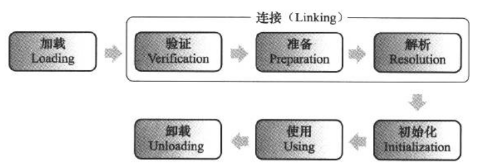
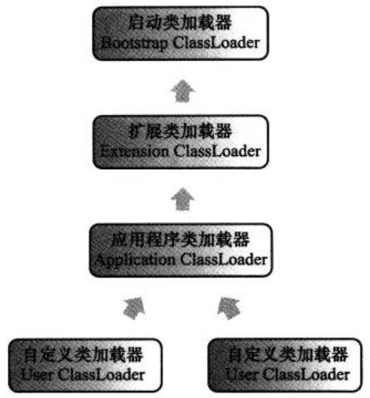

# 虚拟机类加载机制

## 概述

虚拟机把描述类的数据从Class文件加载到内存,并对数据进行校验、转换解析和初始化,最终形成可以被虚拟机直接使用的Java类型,这就是虚拟机的类加载机制。

在Java语言里面,类型的加载、连接和初始化过程都是在程序运行期间完成的,这种策略虽然会令类加载时稍微增加一些性能开销,但是会为Java应用程序提供高度的灵活性,Java里天生可以动态扩展的语言特性就是依赖运行期动态加载和动态连接这个特点实现的。

##　类加载的时机

加载(Loading)、验证(Verification)、准备(Preparation)、解析(Resolution)、初始化(Initialization)、使用(Using)和卸载(Unloading)

验证、准备、解析3个部分统称为连接(Linking)

## 类加载的过程

### 加载

- 通过一个类的全限定名来获取定义此类的二进制字节流。

从ZIP包中读取(JAR、EAR、WAR)

从网络中获取(Applet)

运行时计算生成(动态代理)

由其他文件生成(JSP)

从数据库中读取(中间件服务器SAP Netweaver)

- 将这个字节流所代表的静态存储结构转化为方法区的运行时数据结构。

- 在内存中生成一个代表这个类的java.lang.Class对象,作为方法区这个类的各种数据的访问人口。

### 验证

### 准备

准备阶段是正式为类变量(被static修饰的变量)分配内存并设置类变量初始值的阶段,这些变量所使用的内存都将在方法区中进行分配。

### 解析

解析阶段是虚拟机将常量池内的符号引用替换为直接引用的过程

### 初始化

类初始化阶段是类加载过程的最后一步,前面的类加载过程中,除了在加载阶段用户应用程序可以通过自定义类加载器参与之外,其余动作完全由虚拟机主导和控制。到了初始化阶段,才真正开始执行类中定义的Java程序代码(或者说是字节码)。

## 类加载器

类加载器在类层次划分、OSGi、热部署、代码加密等领域大放异彩。

### 类与类加载器

类加载器虽然只用于实现类的加载动作,但它在Java程序中起到的作用却远远不限于类加载阶段。对于任意一个类,都需要由加载它的类加载器和这个类本身一同确立其在Java虚拟机中的唯一性,每一个类加载器,都拥有一个独立的类名称空间。

###　双亲委派模型

从Java虚拟机的角度来讲,只存在两种不同的类加载器：一种是启动类加载器(Bootstrap ClassLoader),这个类加载器使用C++语言,是虚拟机自身的一部分；另一种就是所有其他的类加载器,这些类加载器都由Java语言实现,独立于虚拟机外部,并且全都继承自抽象类java.lang.ClassLoader。

3种系统提供的类加载器

- 启动类加载器(Bootstrap ClassLoader)

- 扩展类加载器(Extension ClassLoader)

- 应用程序类加载器(Application ClassLoader)

它负责加载用户类路径(classPath)上所指定的类库,开发者可以直接使用这个类加载器,如果应用程序中没有自定义过自己的类加载器,一般情况下这个就是程序中默认的类加载器

类加载器之间的这种层次关系,称为类加载器的双亲委派模型(Parents Delegation Model)。双亲委派模型要求除了顶层的启动类加载器外,其余的类加载器都应当有自己的父类加载器。这里类加载器之间的父子关系一般不会以继承(Inheritance)的关系来实现,而是都使用组合(Composition)关系来复用父加载器的代码。

双亲委派模型的工作过程是，如果一个类加载器收到了类加载的请求,它首先不会自己去尝试加载这个类,而是把这个请求委派给父类加载器去完成,每一个层次的类加载器都是如此,因此所有的加载请求最终都应该传送到顶层的启动类加载器中,只有当父加载器反馈自己无法完成这个加载请求(它的搜索范围中没有找到所需的类)时 ,子加载器才会尝试自己去加载。

### 破坏双亲委派模型

双亲委派模型并不是一个强制性的约束模型,而是Java设计者推荐给开发者的类加载器实现方式。

OSGi中的类加栽器并不符合传统的双亲委派的类加载器。
