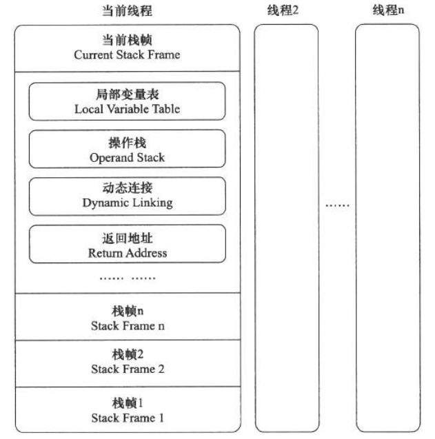

# 虚拟机字节码执行引擎

在Java虚拟机规范中制定了虚拟机宇节码执行引擎的概念模型,这个概念模型成为各种虚拟机执行引擎的统一外观(Facade)。在不同的虚拟机实现里面,执行引擎在执行java代码的时候可能会有解释执行(通过解释器执行)和编译执行(通过即时编译器产生本地代码执行)两种选择,也可能两者兼备,甚至还可能会包含几个不同级别的编译器执行引擎。

## 运行时栈帧结构

*栈帧(Stack Frame)* 是用于支持虚拟机进行方法调用和方法执行的数据结构,它是虚拟机运行时数据区中的虚拟机栈(Virtual Machine Stack)的栈元素。

栈帧存储了方法的局部变量表 、操作数栈、动态连接和方法返回地址等信息。

每一个方法从调用开始至执行完成的过程,都对应着一个栈帧在虚拟机桟里面从入栈到出栈的过程。

### 局部变量表

局都变量表（Local Variable Table）是一组变量值存储空间，用于存放方法参数和方法内部定义的局部变量。

### 操作数栈

操作数找(Operand Stack)也常称为操作栈,它是一个后人先出(Last In First Out,LIFO)栈。

###　动态连接

字节码中的方法调用指令就以常量池中指向方法的符号引用作为参数。这些符号引用一部分会在类加载阶段或者第一次使用的时候就转化为直接引用,这种转化称为静态解析。另外一部分将在每一次运行期间转化为直接引用,这部分称为动态连接。

### 方法返回地址

当一个方法开始执行后,只有两种方式可以退出这个方法。

*正常完成出口(NormalMethodInvocationCompletion)* 执行引擎遇到任意一个方法返回的字节码指令

*异常完成出口(AbruptMethodInvocationCompletion)* 在方法执行过程中遇到了异常,并且这个异常没有在方法体内得到处理

### 附加信息

虚拟机规范允许具体的虚拟机实现增加一些规范里没有描述的信息到栈帧之中,例如与调试相关的信息

## 方法调用

方法调用并不等同于方法执行,方法调用阶段唯一的任务就是 *确定被调用方法的版本(即调用哪一个方法)* ,暂时还不涉及方法内部的具体运行过程。

_Class文件的编译过程中不包含传统编译中的连接步骤,一切方法调用在Class文件里面存储的都只是符号引用,而不是方法在实际运行时内存布局中的人口地址(相当于之前说的直接引用)。这个特性给Java带来了更强大的动态扩展能力,但也使得Java方法调用过程变得相对复杂起来,需要在类加载期间,甚至到运行期间才能确定目标方法的直接引用。_

### 解析

在类加载的解析阶段,会将其中的一部分符号引用转化为直接引用,这种解析能成立的前提是:方法在程序真正运行之前就有一个可确定的调用版本,并且这个方法的调用版本在运行期是不可改变的。这类方法的调用称为解析(Resolution)。

静态方法和私有方法,前者与类型直接关联,后者在外部不可被访问,这两种方法各自的特点决定了它们都不可能通过继承或别的方式重写其他版本,因此它们都适合在类加载阶段进行解析。

### 分派

#### 静态分派

解析与分派这两者之间的关系并不是二选一的排他关系,它们是在不同层次上去筛选、确定目标方法的过程。例如,前面说过,静态方法会在类加载期就进行解析,而静态方法显然也是可以拥有重载版本的,选择重载版本的过程也是通过静态分派完成的。

#### 动态分派

在运行期根据实际类型确定方法执行版本的分派过程称为动态分派。
