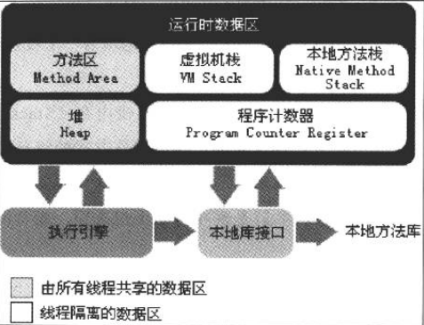

# Java内存区域与内存溢出异常

Java与C++之间有一堵由内存动态分配和垃圾收集技术所围成的“高墙”,墙外面的人
想进去,墙里面的人却想出来。

## 运行时数据区域

### 程序计数器

程序计数器(ProgramCounterRegister)是一块较小的内存空间,它可以看作是当前线程所执行的宇节码的行号指示器.在虚拟机的概念模型里(仅是概念模型,各种虚拟机可能会通过一些更高效的方式去实现),字节码解释器工作时就是通过改变这个计数器的值来选取下一条需要执行的字节码指令,分支、循环、跳转、异常处理、线程恢复等基础功能都需要依赖这个计数器来完成。

由于Java虚拟机的多线程是通过线程轮流切换并分配处理器执行时间的方式来实现的,
在任何一个确定的时刻,一个处理器(对于多核处理器来说是一个内核)都只会执行一条线程中的指令。因此,为了线程切换后能恢复到正确的执行位置,每条线程都需要有一个独立的程序计数器,各条线程之间计数器互不影响,独立存储,我们称这类内存区域为“线程私有”的内存。

如果线程正在执行的是一个Java方法,这个计数器记录的是正在执行的虚拟机宇节码指
令的地址:如果正在执行的是Native方法,这个计数器值则为空(Undefined)。此内存区域是唯一一个在Java虚拟机规范中没有规定任何OutOfMemoryError情况的区域。

### Java虚拟机栈

与程序计数器一样,Java虚拟机栈(JavaVirtualMachineStacks)也是线程私有的。它的生命周期与线程相同。

虚拟机栈描述的是Java方法执行的内存模型:每个方法在执行的同时都会创建一个栈帧(StackFrames)用于存储局部变量表、操作数栈、动态链接、方法出口等信息。每一个方法从调用直至执行完成的过程,就对应着一个栈帧在虚拟机栈中人桟到出栈的过程。

局部变量表存放了编译期可知的各种基本数据类型(boolean、byte、char、short、int、float、long、double)、对象引用(reference类型,它不等同于对象本身,可能是一个指向对象起始地址的引用指针,也可能是指向一个代表对象的句柄或其他与此对象相关的位置)和retumAddress类型(指向了一条字节码指令的地址)。

局部变量表所需的内存空间在编译期间完成分配,当进人一个方法时,这个方法需要在帧中分配多大的局部变量空间是完全确定的,在方法运行期间不会改变局部变童表的大小。

在Java虚拟机规范中,对这个区域规定了两种异常状况:如果线程请求的栈深度大于虚拟机所允许的深度,将抛出StackOverflowError异常:如果虚拟机栈可以动态扩展(当前大部分的Java虚拟机都可动态扩展,只不过Java虚拟机规范中也允许固定长度的虚拟机栈),如果扩展时无法申请到足够的内存,就会抛出OutOfMemoryError异常。

### 本地方法栈

本地方法栈(NativeMethodStack)与虚拟机栈所发挥的作用是非常相似的,它们之间的区别不过是虚拟机栈为虚拟机执行Java方法(也就是字节码)服务,而本地方法栈则为虚拟机使用到的Native方法服务。

有的虚拟机(替如SunHotSpot虚拟机)直接就把本地方法栈和虚拟机栈合二为一。

本地方法栈区域也会抛出 StackOverflowError 和 OutOfMemoryError 异常。

### Java堆

对千大多数应用来说,Java堆(JavaHeap)是Java虚拟机所管理的内存中最大块。Java堆是被所有线程共享的一块内存区域,在虚拟机启动时创建。java堆是垃圾收集器管理的主要区域。

从内存回收时角度来看,现在收集器基本都采用分代收集算法。

如果在堆中没有内存完成实例分配并且堆也无法再扩展时,将会抛OutOfMemoryError异常。

### 方法区

方法区(MethofArea)与Java堆一样,是各个线程共享的内存区域,它用于存储已被虚拟机加载的类信息、常量、静态变量、即时编译器编译后的代码等数据。

对于习惯在HotSpot虚拟机上开发、部署程序的开发者来说,很多人都更愿意把方法区称为“永久代”(PermanentGeneration),本质上两者并不等价,仅仅是因为HotSpot虛拟机的设计团队选择把GC分代收集扩展至方法区,或者说使用永久代来实现方法区而已,这样HotSpot的垃圾收集器可以像管理Java堆一样管理这部分内存,能够省去专门为方法区编写内存管理代码的工作。对于其他虚拟机(如BEAJRockit、IBMJ9等)来说是不存在永久代的概念的。

使用永久代来实现方法区,现在看来并不是一个好主意,因为这样更容易遇到内存溢出问题(永久代有-XX:MaxPermSize的上限，J9和JRockit只要没有触碰到进程可用内存的上限,例如32位系统中的4GB,就不会出现问题)。

当方法区无法满足内存分配需求时,将抛出OutOfMemoryrEror异常。

### 运行时常量池

运行时常量池(RuntimeConstantPool)是方法区的一部分。Class文件中除了有类的版本、字段、方法、接口等描述信息外,还有一项信息是常量池(ConstantPoolTable),用于存放编译期生成的各种字面量和符号引用,这部分内容将在类加载后进人方法区的运行时常量池中存放。

既然运行时常量池是方法区的一部分, 自然受到方法区内存的限制,当常量池无法再申
请到内存时会抛出OutOfMemoryError异常。

### 直接内存

在JDK1.4中新加人了NIO(NewInput/Output)类,引人了一种基于通道(Channel)与缓冲区(Buffer)的I/O方式,它可以使用Native函数库直接分配堆外内存,然后通过一个存储在Java堆中的DirectByteBuffer对象作为这块内存的引用进行操作。这样能在一些场景中显著提高性能,因为避免了在Java堆和Native堆中来回复制数据。

显然,本机直接内存的分配不会受到Java堆大小的限制,但是,既然是内存,肯定还是会受到本机总内存(包括RAM以及SWAP区或者分页文件)大小以及处理器寻址空间的限制。服务器管理员在配置虚拟机参数时,会根据实际内存设置-Xmx等参数信息,但经常忽略直接内存,使得各个内存区域总和大于物理内存限制(包括物理的和操作系统级的限制),从而导致动态扩展时出现OutOfMemoryError异常。

## HotSpot虚拟机对象探秘

### 对象的创建

虚拟机遇到一条new指令时,首先将去检査这个指令的参数是否能在常量池中定位到一个类的符号引用,并且检査这个符号引用代表的类是否已被加载、解析和初始化过。如果没有,那必须先执行相应的类加载过程。

在类加栽检査通过后,接下来虚拟机将为新生对象分配内存。对象所需内存的大小在类加载完成后便可完全确定，为对象分配空间的任务等同于把一块确定大小的内存从Java堆中划分出来。

内存分配完成后，虚拟机需要将分配到的内存空间都初始化为零值。

接下来,虚拟机要对对象进行必要的设置，例如这个对象是哪个类的实例、如何才能找到类的元数据信息、对象的哈希码、对象的GC分代年龄等信息。
