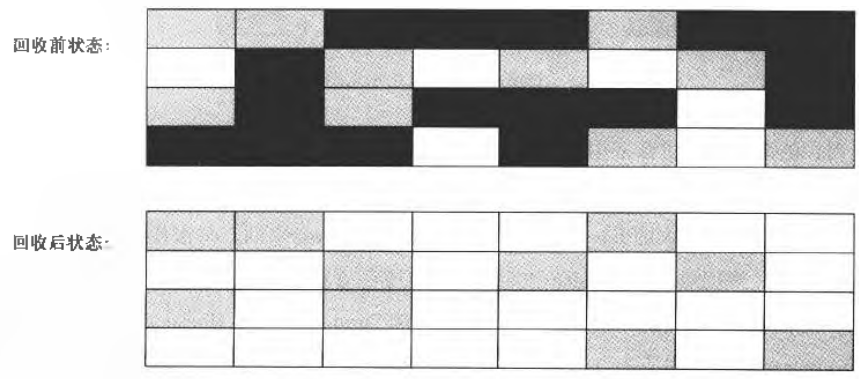
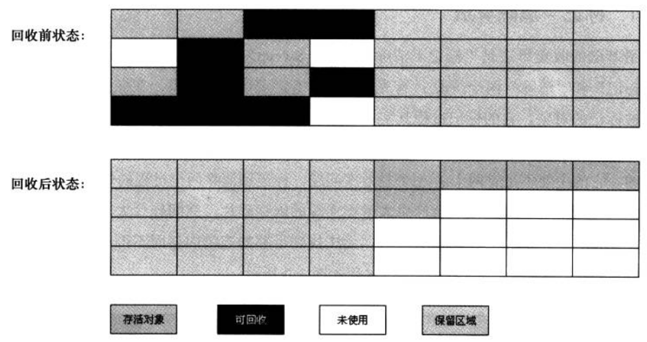
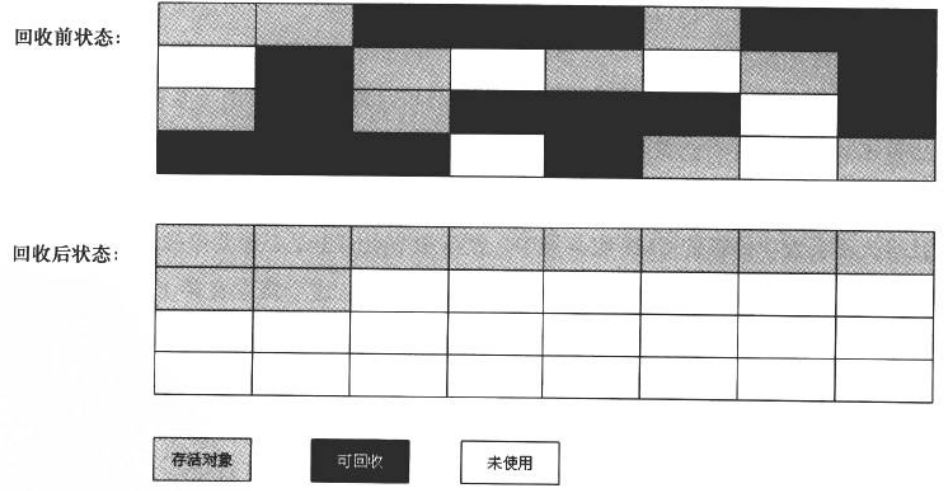

# 垃圾收集器与内存分配策略

## 概述

程序计数器、虚拟机栈、本地方法栈3个区域随线程而生,随线程而灭。因此这几个区域的内存分配和回收都具备确定性,在这几个区域内就不需要过多考虑回收的问题,因为方法结束或者线程结束时,内存自然就跟随着回收了。

Java堆和方法区则不一样,一个接口中的多个实现类需要的内存可能不一样,一个方法中的多个分支需要的内存也可能不一样,我们只有在程序处于运行期间时才能知道会创建哪些对象,这部分内存的分配和回收都是动态的，垃圾收集器所关注的是这部分内存。

## 对象销毁

### 引用计数算法

每当有一个地方引用计数器值就加1，当引用失效时，计数器值就减1，任何时刻计数器为0的对象就是不可能再被使用的。

引用计数算法(ReferenceCounting〉的实现简单,判定效率也很高,在大部分情况下它都是一个不错的算法。但是,至少主流的Java虚拟机里面没有选用引用计数算法来管理内存,其中最主要的原因是它很难解决对象之间相互循环引用的问题。

### 可达性分析算法

这个算法的基本思路就是通过一系列的称为GC Root的对象作为起始点,从这些节点开始向下搜索,搜索所经过的路径称为引用链(Reference Chain),等一个对象到GC Root没有任何引用链相连(用图论的话来说,就是从GCRoots到这这个对象不可达)时,则明此对象是不可用的。

在Java语言中,可作为GC Roots的对象包括下面几种：

- 虚拟机栈(栈帧中的本地变量表)中引用的对象。
- 方法区中类静态属性引用的对象。
- 方法区中常量引用的对象。
- 本地方法栈中JNI（即一般说的Native方法）引用的对象。

### 引用概念扩充

强引用(Strong Reference)、软引用(Soft Reference)、弱引用(Weak Reference)、虚引用(Phantom Reference)

### 对象回收判定

可达性分析箅法中不可达的对象，也并非是“非死不可”的，这时候它们暂时处于“缓刑”阶段，要真正宣告一个对象死亡，至少要经历两次标记过程。如果对象在进行可达性分析后发现没有与GC Roots相连接的引用链，那它将会被第一次标记并且进行一次筛选，筛选的条件是此对象是否有必要执行finalize()方法。当对象没有覆盖finalize()方法，或者finalize()方法已经被虚拟机调用过，虚拟机将这两种情况都视为“没有必要执行”。

### 回收方法区

很多人认为方法区(或者HotSpot虚拟机中的永久代)是没有垃圾收集的，Java虚拟机规范中确实说过可以不要求虚拟机在方法区实现垃圾收集。

是否对类进行回收,HotSpot虚拟机提供了-Xnoclassgc参数进行控制。

## 垃圾收集算法

### 标记-清除算法

最基础的收集算法是“标记-清除”(Marie-Sweep)算法,如同它的名字一样,算法分为“标记”和“清除”两个阶段:首先标记出所有需要回收的对象,在标记完成后统一回收所有被标记的对象,它的标记过程其实在前一节讲述对象标记判定时已经介绍过了。之所以说它是最基础的收集算法,是因为后续的收集算法都是基于这种思路并对其不足进行改进而得到的。它的主要不足有两个:

一个是效率问题,标记和清除两个过程的效率都不高

另一个是空间问题,标记清除之后会产生大量不连续的内存碎片,空间碎片太多可能会导致以后在程序运行过程中需要分配较大对象时,无法找到足够的连续内存而不得不提前触发另一次垃圾收集动作。

### 复制算法

为了解决效率问题,一种称为“复制”(Copying)的收集算法出现了,它将可用内存按容量划分为大小相等的两块,每次只使用其中的一块。当这一块的内存用完了,就将还存活着的对象复制到另外一块上面,然后再把已使用过的内存空间一次清理掉。这样使得每次都是对整个半区进行内存回收,内存分配时也就不用考虑内存碎片等复杂情况,只要移动堆顶指针,按顺序分配内存即可,实现简单,运行髙效。

现在的商业虚拟机都采用这种收集算法来回收新生代。

将内存分为一块较大的Eden空间和两块较小的Survivor空间,每次使用Eden和其中一块Survivor,当回收时,将Eden和Survivor中还存活着的对象一次性地复制到另外一块Survivor空间上,最后清理掉Eden和刚才用过的Survivor空间。HotSpot虚拟机默认Eden和Survivor的大小比例是8:1,也就是每次新生代中可用内存空间为整个新生代容量的90%(80%+10%)。

### 标记-整理算法

复制收集算法在对象存活率较高时就要进行较多的复制操作,效率将会变低。更关键的是,不想浪费50%的空间,就需要有额空间进行分配担保,以应对被使用的内存中所有对象都100%存活的极端情况,所以在老年代一般不能直接选用这种算法。

标记-整理算法：标记过程仍然与“标记-清除”算法一样,但后续步骤不是直接对可回收对象进行清理,而是让所有存活的对象都向一端移动,然后直接清理掉端边界以外的内存。

### 分代收集算法

当前商业虚拟机的垃圾收集都采用“分代收集”(GenerationalCollection)算法,这种算法并没有什么新的思想,只是根据对象存活周期的不同将内存划分为几块。一般是把Java堆分为新生代和老年代,这样就可以根据各个年代的特点采用最适当的收集算法。在新生代中,每次垃圾收集时都发现有大批对象死去.只有少量存活,那就选用复制算法,只需要付出少量存活对象的复制成本就可以完成收集。而老年代中因为对象存活率高、没有额外空间对它进行分配担保,就必须使用“标记一清理”或者“标记一整理”算法来进行回收。
