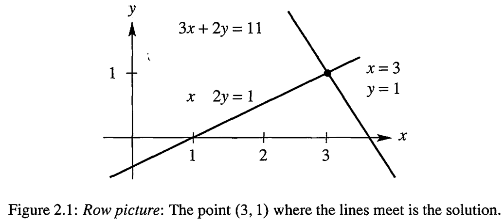
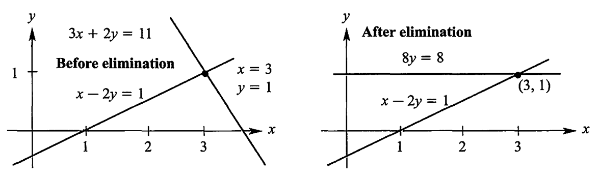

# Solving Linear Equations

## Vectors and Linear Equations

**The row picture** shows tow lines meeting at a single point(solution).

**The column picture** combines the column vectors on the left side to product the vector $b$ on the right side.

**The Matrix Form of the Equations**  $Ax=b$

Multiplication by rows : $Ax$ comes from dot products, each row times the column $x$ :
$$
Ax =
\begin{bmatrix}
(row1) \cdot x \\
(row2) \cdot x \\
(row3) \cdot x \\
\end{bmatrix}
$$

Multiplication by columns $Ax$ is **a combination of column vectors** :

$$
Ax = x\ (column\ 1) + y\ (column\ 2) + z\ (column \ 3)
$$

消元的几何意义是坐标系的变换

## The idea of Elimination

**Pivot** first nonzero in the row that does the elimination.

$$Ax=b \quad \Rightarrow \quad Ux=c $$

## Elimination Using Matrices

**$Ax$ is a combination of the column of $A$.**

Components of $Ax$ are dot products with rows of $A$.

### Matrix Multiplication

*Associative law is true* $A(BC)=(AB)C$
*Commutative law is false* $Often\ AB≠BA$

### Permutation Matrix

$P_{ij}$ is the identify matrix with row $i$ and $j$ reversed.

### Augmented Matrix

**Augmented Matrix** include $b$ as an extra column and follow it through elimination.

## Rules for Matrix Operations

The entry in row $i$ and column $j$ is called **$a_{ij}$** or **$A(i, j)$**

### Rows and Columns of $AB$

Each column of $AB$ is a combination of the columns of $A$.

### The Laws for Matrix Operations

$AB≠BA$ (the commutative "law" is usually broke)
$C(A + B) = CA + CB$ (distributive law from the left)
$(A + B)C = AC + BC$ (distributive law from the right)
$A(BC)=(AB)C$ (associative law for ABC)

### Block Matrices and Block Multiplication

Suppose $A, B, C, D$ are respectively $p×p$, $p×q$, $q×p$ and $q×q$ matrices, and $D$ is invertible.

$$
\begin{bmatrix}
A & B \\
C & D \\
\end{bmatrix}
=
\begin{bmatrix}
I_p & BD^{-1} \\
0 & I_q \\
\end{bmatrix}
\begin{bmatrix}
A-BD^{-1}C & 0 \\
0 & D \\
\end{bmatrix}
\begin{bmatrix}
I_p & 0 \\
D^{-1}C & I_q \\
\end{bmatrix}
$$

 the **Schur complement** of the block $D$ of the matrix $M$ is the $p×p$ matrix $A-BD^{-1}C$

[reference](https://en.wikipedia.org/wiki/Schur_complement)

## Inverse Matrices

The matrix $A$ is **invertible** if there exists a matrix $A^{-1}$ such that $$A^{-1}A=I$$ and $$AA^{-1}=I$$

elimination produces n pivots $⇔$ the inverse exists $⇔$ non-singular matrix

### The Inverse of a Product $AB$

$$(AB)^{-1}=B^{-1}A^{-1}$$

### Gauss-Jordan Elimination

Multiply $\begin{bmatrix} A & I \end{bmatrix}$ by $A^{-1}$ to get $\begin{bmatrix} I & A^{-1} \end{bmatrix}$

A square matrix is called **lower triangular matrix** if all the entries above the main diagonal are zero. Similarly, a square matrix is called **upper triangular matrix** if all the entries below the main diagonal are zero.A **triangular matrix** is one that is either lower triangular or upper triangular. A matrix that is both upper and lower triangular is called a **diagonal matrix**.

*A triangular matrix is invertible if and only if no diagonal entries are zero*

## Elimination = Factorization: $A = LU$

The factors $L$ and $U$ are triangular matrices. The factorization that comes from elimination is $A = LU$ or $A=LDU$. This is elimination without row exchanges.

## Transposes and Permutations

The entry in row i, column j of AT comes from row j, column i of the original A : $(A^T)_{ij}=A_{ji}$

- Sum

$$A+B=A^T+B^T$$

- Product

$$(AB)^T=B^TA^T$$

- Inverse

$$(A^{-1})^T=(A^{T})^{-1}$$

### The Meaning of Inner Products

The dot product or inner product is $x^Ty$ (1 x n) (n x 1)

The rank one product or outer product is $xy^T$ (n x 1) (1 x n)

$x^Ty$ is a number, $xy^T$ is a matrix.

### Symmetric Matrices

A **symmetric matrix** has $A^T=A$

*The inverse of a symmetric matrix is also symmetric.*

### Symmetric Products $R^TR$ and $RR^T$ and $LDL^T$

The transpose of $R^TR$ is $R^T(R^T)^T$ which is $R^TR$

The symmetric factorization of a symmetric matrix is $A = LDL^T$

### Permutation Matrices

A **permutation matrix** $P$ has the rows of the identify $I$ in any order.

$$P^T = P^{-1}$$

### The $PA = LU$ Factorization with Row Exchanges

If $A$ is invertible then a permutation $P$ will reorder its rows for $PA = LU$
