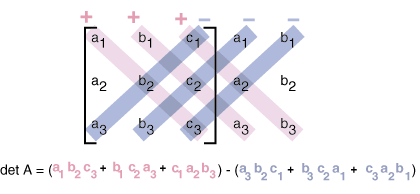
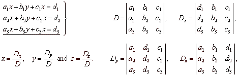

# Determinants

**The determinant is zero when the matrix has no inverse.**

$$\begin{vmatrix}a & b \\ c & d \end{vmatrix}=ad-bc$$

## The Properties of Determinants

1. The determinant of the $n$ by $n$ identity matrix is 1

$$\begin{vmatrix}1 & 0 \\ 0 & 1 \end{vmatrix}=1
\text{ and }
\begin{vmatrix}1 &  \\  & \ddots &  \\  & & 1 \end{vmatrix}=1$$

2. The determinant changes sign when two rows are exchanged

$$\begin{vmatrix}c & d \\ a & b \end{vmatrix}=-\begin{vmatrix}c & d \\ a & b \end{vmatrix}$$

3. The determinant is a linear function of each row separately

$$
\begin{array}{l}
\text{multiply row 1 by any number }t &
\begin{vmatrix} ta & tb \\ c & d \end{vmatrix} =
t\begin{vmatrix} a & b \\ c & d \end{vmatrix} \\
\text{add row 1 of }A\text{ to row 1 of }A': &
\begin{vmatrix} a + a' & b + b' \\ c & d \end{vmatrix} =
\begin{vmatrix} a & b \\ c & d \end{vmatrix} +
\begin{vmatrix} a' & b' \\ c & d \end{vmatrix}
\end{array}
$$

4. If two rows of A are equal, then $det\ A = 0$

5. Subtracting a multiple of one row from another row leaves $det\ A$ unchanged.

$$\begin{vmatrix}a & b \\ c-la & d-la \end{vmatrix}=\begin{vmatrix}a & b \\ c & d \end{vmatrix}$$

6. A matrix with a row of zeros has $det A = 0$

7. If $A$ is triangular then $det\ A = a_{11}a_{22} \cdots a_{nn} =$ product of diagonal entries.

8. If $A$ is singular then $det\ A = 0$. If $A$ is invertible then $det\ A \neq 0$

9. The determinant of $AB$ is $det\ A$ times $det B$ : $|AB| = |A||B|$

10. The transpose $A^T$ has the same determinant as $A$.

## Permutations and Cofactors

### Determinant by Cofactors

Cofactor Formula :

$$det\ A = a_{i1}C_{i1} + a_{i2}C_{i2} + \ldots + a_{in}C_{in}$$

$$Cofactor \quad C_{ij}= (-1)^{ij} det\ M_{ij} $$

## Cramer's Rule

**Cramer's Rule** If $det A$ is not zero , $Ax=b$ is solved by determinants:

$$
  x_1 = \frac {det B_1} {det A}
  \qquad
  x_2 = \frac {det B_2} {det A}
  \quad \ldots \quad
  x_n = \frac {det B_n} {det A}
$$

The matrix $B_j$ has the $j$th column of $A$ replaced by the vector $b$

example:

## Formula of Inverse

Formula of $A^{-1}$ :

$$A^{-1} = \cfrac{C^T}{det\ A}$$
