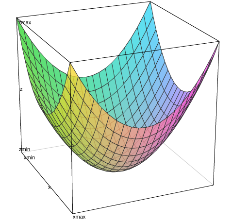
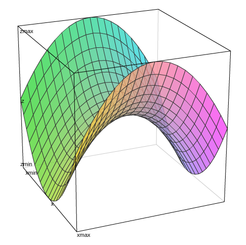
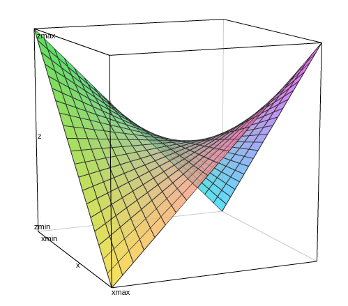

# Eigenvalues and Eigenvectors

## Introduction to Eigenvalues

The basic equation is $Ax = λx$. The number $λ$ is an **eigenvalue** of $A$.The vector $x$ is an **eigenvector** of $A$.

### The Equation for the Eigenvalues

$$Ax = λx \\
\Downarrow \\
(A-λI)x = 0 \\
\Downarrow \\
det(A-λI)=0
$$

To solve the eigenvalue problem for an n by n matrix, follow these steps:

1. Compute the determinant of $A-λI$
2. Find the roots of this polynomial
3. Solve $(A-λI)x=0$ to find an eigenvector $x$

> 矩阵A乘以x表示，对向量x进行一次转换（旋转或拉伸）（是一种线性转换），而该转换的效果为常数λ乘以向量x（即只进行拉伸）。
我们通常求特征值和特征向量即为求出该矩阵能使哪些向量（当然是特征向量）只发生拉伸，使其发生拉伸的程度如何（特征值大小）。这样做的意义在于，看清一个矩阵在那些方面能产生最大的效果（power），并根据所产生的每个特征向量（一般研究特征值最大的那几个）进行分类讨论与研究。

## Diagonalizing a Matrix

Suppose the $n$ by $n$ matrix $A$ has $n$ linearly independent eigenvectors $x_1,\ldots,x_n$.(**Without n independent eigenvectors, we can't diagonalize.**) Put them into the columns of an eigenvector matrix $S$. Eigenvalue matrix $Λ$
$$
Λ=\begin{bmatrix} λ_1 \\   & \ddots \\ & & λ_n \end{bmatrix}
$$
than
$$A=SΛS^{-1}$$

if **all the $λ$'s are different** then **n independent eigenvectors**

if **repeated eigenvectors** then **may or may not have n independent eigenvectors**

Remember that there is no connection between invertibility and diagonalizability:

**Invertibility** is concerned with the eigenvalues ($λ = 0$ or $λ \neq 0$).
**Diagonalizability** is concerned with the eigenvectors (too few or enough for $S$).

>If that diagonal matrix has any zeroes on the diagonal, then $A$ is not invertible. Otherwise, $A$ is invertible.

 $\begin{aligned} \textbf{Powers of }A \end{aligned} \qquad A^k =SΛ^kS^{-1}$

### Nondiagonalizable Matrices

**Eigenvectors (geometric)** There are nonzero solutions to $Ax = λx$
**Eigenvalues (algebraic)** The determinant of $A - λI$ is zero

The number A may be a simple eigenvalue or a multiple eigenvalue, we call this  **multiplicity**.

**geometric multiplicity , GM** Count the independent eigenvectors for A. This is the dimension of the nullspace of $A - λI$

**algebraic multiplicity , AM** Count the repetitions of $λ$ among the eigenvalues. Look at the $n$ roots of $det\ (A - λI) = 0$

*when GM is below AM means that A is not diagonalizable*

## Applications to Differential Equations

To convert **constant-coefficient differential equations** into linear algebra.

### Solution of $du/dt = Au$

$$Substitute \quad u= e^{kt}x \quad into \quad \cfrac{du}{dt} = Au\\
\Downarrow \\
ke^{kt}x=Ae^{kt}x \\
\Downarrow \\
kx=Ax \\
\Downarrow \\
k \text{ is eigenvalue } \quad x \text{ is eigenvector }
$$

$$
u= e^{kt}x \quad ⇒ \quad u(t) = c_1e^{λ_1t}x_1 + \cdots + c_ne^{λ_nt}x_n
$$

### Stability of 2 by 2 Matrices

Reference:

[微分方程](http://wenku.baidu.com/view/ef58aa75f242336c1eb95e72.html)

[What do eigenvalues and eigenvectors represent intuitively?](https://www.quora.com/What-do-eigenvalues-and-eigenvectors-represent-intuitively)

### The Exponential of a Matrix

$e^{At}$由级数展开式定义

$$e^{At} = I + At + \cfrac{1}{2}(At)^2 + \cfrac{1}{6}(At)^3 + \cdots + \cfrac{1}{n!}(At)^n + \cdots $$

## Symmetric Matrices

Spectrum of A The set of eigenvalues $\{λ_1,\cdots,λ_m\}$. Spectral radius $= |λ_{max}|$

**谱定理（Spectral Theorem）** : Every symmetric matrix has the factorization $A=QΛQ^T=QΛQ^{-1}$ with real eigenvalues in $Λ$ and orthonormal eigenvectors in $S=Q$.

Every real symmetric $A$ can be diagonalized by an orthogonal matrix $Q$. Every Hermitian matrix can be diagonalized by a unitary $U$:

$$
\begin{array}{rlll}
(real)    & Q^{-1}AQ = Λ & or & A = QΛQ^T \\
(complex) & U^{-1}AU = Λ & or & A = UΛU^H
\end{array}
$$
The columns of $Q$ (or $U$) contain orthonormal eigenvectors of $A$

### Eigenvalues versus Pivots

product of pivots = determinant = product of eigenvalues

For symmetric matrices the pivots and the eigenvalues have the same signs

### All Symmetric Matrices are Diagonalizable

The **Schur Decomposition** reads as follows: if $A$ is a $n × n$ square matrix with complex entries, then $A$ can be expressed as
$$A=QUQ^{-1}$$
where $Q$ is a unitary matrix (so that its inverse $Q^{−1}$ is also the conjugate transpose $Q^* $ of $Q$), and $U$ is an upper triangular matrix, which is called a **Schur form** of $A$. Since $U$ is similar to $A$, it has the same spectrum, and since it is triangular, those eigenvalues are the diagonal entries of $U$.

## Positive Definite Matrices

Symmetric matrices that have positive eigenvalues are called **positive definite**.

正定矩阵等价判定条件:

1. All $n$ eigenvalues are positive
2. All $n$ pivots are positive
3. All $n$ upper left determinants are positive
4. $x^TAx$ is positive except at $x=0$.(This is the energy-based definition.)
5. $A$ equals $R^TR$ for a matrix R with independent columns.

$A = R^TR$ is automatically positive definite if $R$ has independent columns.

### Quadratic Form

a **quadratic form(二次型)** is a homogeneous polynomial of degree two in a number of variables.

$$
\begin{array}{lll}
q(x) & = ax^2 & \text{(unary)} \\
q(x,y) & = ax^2 + bxy + cy^2 & \text{(binary)} \\
q(x,y,z) & = ax^2 + by^2 + cz^2 + dxy + exz + fyz & \text{(ternary)}
\end{array}
$$

$x^TAx$ 是二次型的矩阵形式

二次型的主要用途：

- 不等式证明（比起拿各种公式凑，用这个证明简直不要太简单）

- 多项式的因式分解

- 判断二次曲线的形状

- 曲面在平面上截取的曲线

- 求极值

[参考:二次型及其应用](https://wenku.baidu.com/view/50a41aba6294dd88d0d26bcd.html)

Definite $A = \begin{bmatrix} 1 & 0 \\ 0 & 1 \end{bmatrix}$ 对应函数 $z=x^2+y^2$

$A = \begin{bmatrix} 1 & 0 \\ 0 & -1 \end{bmatrix}$ 对应函数 $z=x^2-y^2$

Indefinite $A = \begin{bmatrix} 0 & 1 \\ 1 & 0 \end{bmatrix}$ 对应函数 $z=2xy$

## Similar Matrices

Diagonalization is not possible for every $A$. Some matrices have too few eigenvectors. In this new section, the eigenvector matrix $S$ remains the best choice when we can find it, but now we allow any invertible matrix $M$.

A typical matrix $A$ is similar to a whole family of other matrices because there are so many choices of $M$.

Let $M$ be any invertible matrix. Then $B = M^{-1}AM$ is **similar** to $A$.

## Singular Value Decomposition (SVD)

The eigenvectors in $S$ have three big problems: They are usually not orthogonal, there are not always enough eigenvectors, and $Ax = λx$ requires $A$ to be square. The singular vectors of $A$ solve all those problems in a perfect way.

**Singular Value Decomposition** : Any $m$ by $n$ matrix A can be factored into
$$
A = UΣV^T = (\boldsymbol{orthogonal})(\boldsymbol{diagonal})(\boldsymbol{orthogonal})
$$
The columns of $U$ ($m$ by $m$) are eigenvectors of $AA^T$, and the columns of $V$ ($n$ by $n$) are eigenvectors of $A^TA$. The $r$ **singular values** on the diagonal of $Σ$ ($m$ by $n$) are the square roots of the nonzero eigenvalues of both $AA^T$ and $A^TA$.

**Remark 1.** For positive definite matrices, $Σ$ is $Λ$ and $UΣV^T$ is identical to $QΛQ^T$. For other symmetric matrices, any negative eigenvalues in $Λ$ become positive in $Σ$. For complex matrices, $Σ$ remains real but $U$ and $V$ become unitary (the complex version of orthogonal). We take complex conjugates in $U^HU = I$ and $V^HV = I$ and $A = UΣV^H$.

**Remark 2.** $U$ and $V$ give orthonormal bases for all four fundamental subspaces:
$$
\begin{array}{ccl}
first & r   & \text{columns of U :} & \text{column space}   & of\ A \\
last  & m-r & \text{columns of U :} & \text{left nullspace} & of\ A \\
first & r   & \text{columns of V :} & \text{row space}      & of\ A \\
last  & n-r & \text{columns of V :} & \text{nullspace}      & of\ A \\
\end{array}
$$

**Remark 3.** The $SVD$ chooses those bases in an extremely special way. They are more than just orthonormal. When $A$ multiplies a column $v_j$ of $V$ , it produces $σ_j$ times a column of $U$. That comes directly from $AV = UΣ$, looked at a column at a time.

at a time : 依次

## Table of Eigenvalues and Eigenvectors

$$
\begin{array}{lll}
\text{Matrix} & \text{Eigenvalue Feature} & \text{Eigenvector Feature} \\
\hline
\mathbf{Symmetric:\ } A^T = A & \\
\mathbf{Orthogonal:\ } Q^T = Q^{-1} \\
\mathbf{Skew-symmetric:\ } A^T = -A \\
\mathbf{Complex\ Hermitian:\ } \overline{A}^T = A \\
\mathbf{Positive\ Definite:\ } x^TAx>0 \\
\mathbf{Markov:\ } m_{ij} > 0, \sum_{i=1}^n m_{ij} = 1 \\
\mathbf{Similar:\ } B= \\
\end{array}
$$
