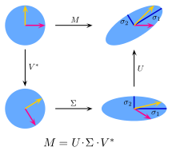
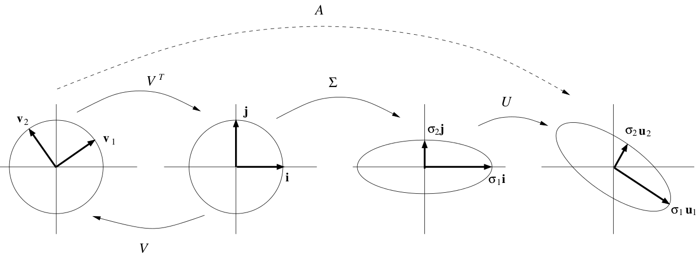

# Eigenvalues and Eigenvectors

## Introduction to Eigenvalues

The basic equation is $Ax = λx$. The number $λ$ is an **eigenvalue** of $A$.The vector $x$ is an **eigenvector** of $A$.

### The Equation for the Eigenvalues

$$Ax = λx \\
\Downarrow \\
(A-λI)x = 0 \\
\Downarrow \\
det(A-λI)=0
$$

To solve the eigenvalue problem for an n by n matrix, follow these steps:

1. Compute the determinant of $A-λI$
2. Find the roots of this polynomial
3. Solve $(A-λI)x=0$ to find an eigenvector $x$

> 矩阵A乘以x表示，对向量x进行一次转换（旋转或拉伸）（是一种线性转换），而该转换的效果为常数λ乘以向量x（即只进行拉伸）。
我们通常求特征值和特征向量即为求出该矩阵能使哪些向量（当然是特征向量）只发生拉伸，使其发生拉伸的程度如何（特征值大小）。这样做的意义在于，看清一个矩阵在那些方面能产生最大的效果（power），并根据所产生的每个特征向量（一般研究特征值最大的那几个）进行分类讨论与研究。

## Diagonalizing a Matrix

Suppose the $n$ by $n$ matrix $A$ has $n$ linearly independent eigenvectors $x_1,\ldots,x_n$.(**Without n independent eigenvectors, we can't diagonalize.**) Put them into the columns of an eigenvector matrix $S$. Eigenvalue matrix $Λ$
$$
Λ=\begin{bmatrix} λ_1 \\   & \ddots \\ & & λ_n \end{bmatrix}
$$
than
$$A=SΛS^{-1}$$

Remember that there is no connection between invertibility and diagonalizability:

**Invertibility** is concerned with the eigenvalues ($λ = 0$ or $λ \neq 0$).
**Diagonalizability** is concerned with the eigenvectors (too few or enough for $S$).

>If that diagonal matrix has any zeroes on the diagonal, then $A$ is not invertible. Otherwise, $A$ is invertible.

 $\begin{aligned} \textbf{Powers of }A \end{aligned} \qquad A^k =SΛ^kS^{-1}$

## Applications to Differential Equations

## Symmetric Matrices

What is special about $Ax = λx$ when A is symmetric?

1. A symmetric matrix has only *real eigenvalues*.
2. The eigenvectors can be chosen *orthonormal*.

Why do we use the word "choose"? Because the eigenvectors do not have to be unit vectors. Their lengths are at our disposal. We will choose unit vectors-eigenvectors of length one, which are orthonormal and not just orthogonal. Then $SΛS^{-1}$ is in its special and particular form $QΛQ^T$ for symmetric matrices.

**Symmetric diagonalization** : Every symmetric matrix has the factorization $A=QΛQ^T=QΛQ^{-1}$ with real eigenvalues in $Λ$ and orthonormal eigenvectors in $S=Q$.

### All Symmetric Matrices are Diagonalizable

Every square matrix can be "triangularized" by $A = QTQ^{-1}$.

## Positive Definite Matrices

Symmetric matrices that have positive eigenvalues are called **positive definite**.

正定矩阵等价判定条件:

1. All $n$ eigenvalues are positive
2. All $n$ pivots are positive
3. All $n$ upper left determinants are positive
4. $x^TAx$ is positive except at $x=0$.(This is the energy-based definition.)
5. $A$ equals $R^TR$ for a matrix R with independent columns.

$A = R^TR$ is automatically positive definite if $R$ has independent columns.

## Similar Matrices

Diagonalization is not possible for every $A$. Some matrices have too few eigenvectors. In this new section, the eigenvector matrix $S$ remains the best choice when we can find it, but now we allow any invertible matrix $M$.

A typical matrix $A$ is similar to a whole family of other matrices because there are so many choices of $M$.

Let $M$ be any invertible matrix. Then $B = M^{-1}AM$ is **similar** to $A$.

## Singular Value Decomposition (SVD)

The eigenvectors in $S$ have three big problems: They are usually not orthogonal, there are not always enough eigenvectors, and $Ax = λx$ requires $A$ to be square. The singular vectors of $A$ solve all those problems in a perfect way.

$$A = UΣV^T$$

The $u$'s are eigenvectors of $AA^T$ and the $v$'s are eigenvectors of $A^TA$.

