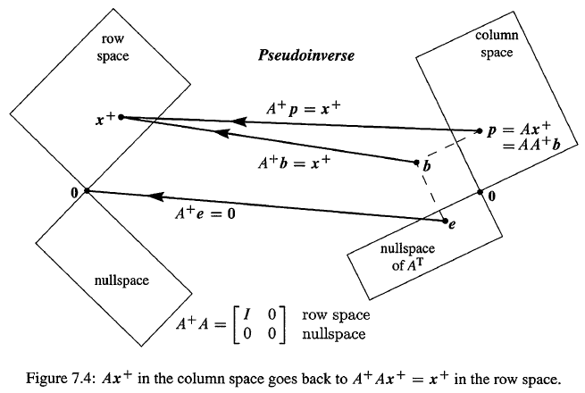

# Linear Transformations

## The Idea of a Linear Transformation

A transformation $T$ assigns an output of $T(v)$ to each input vector $v$ in $V$. The transformation is linear if it meets these requirements for all $v$ and $w$ :
$$ T(cv+dw) = cT(v)+dT(w)$$

## The Matrix of a Linear Transformation

$$\left \{
\begin{array}{l}
\text{Linear transformation } T  \\
\text{Input basis } v_1,\ldots,v_n \\
\text{Output basis } w_1,\ldots,w_m \\
\end{array}
\right \}
\Rightarrow
\begin{array}{c}
\text{Matrix } A (m\ by\ n)  \\
\text{represents T} \\
\text{in these bases} \\
\end{array}$$

## Diagonalization and the Pseudoinverse

### Polar Decomposition

The **polar decomposition** extends this factorization to matrices: orthogonal times semidefinite, $A = QH$.

$\textbf{Polar decomposition} \qquad A = UΣV^T=(UV^T)(VΣV^T)=(Q)(H)$

### The Pseudoinverse

$$A^+= UΣ^+V^T$$

The pseudoinverse $A$ transforms the column space of $A$ back to its row space. $A^+A$ is the identity on the row space (and zero on the nullspace).

