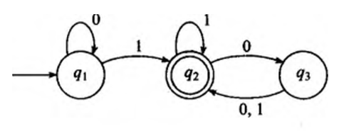
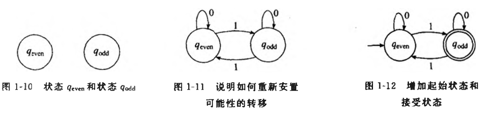

#  正则语言

计算模型（Computational Model)

## 有穷自动机

**有穷状态机(Finite State Machine)** 是描述能力和资源极其有限的计算机的模型。

有穷自动机和与之对应的 **马尔科夫链（Markov Chains)** 常用于识别数据中的模式。

**状态图(State Diagram)**

从一个状态指向另一个状态的箭头称为 **转移** 。

### 有穷自动机的形式化定义

有穷自动机是一个5元组(Q,∑,δ,q0,F)，其中

1. Q是一个有穷集合，称为状态集。
2. ∑是一个有穷集合，称为字母表。
3. δ：Q×∑→Q是转移函数。
4. q0∈Q是起始状态。
5. F⊆Q是接受状态集。

若A是机器M接受的全部字符串集，则称A是机器M的 **语言**，记作L(M)=A。又称 **M识别A** 或 **M接受A** 。一台机器可能接受若干字符串，但是它永远只能识别一个语言。如果机器不接受任何字符串，那么它仍然识别一个语言，即空语言∅。

### 计算的形式化定义

设M=(Q,∑,δ,q0,F)是一台有穷自动机，w=w1w2...wn是一个字符串并且其中任一w是字母表∑的成员。如果存在Q中的状态序列r0,r1,...,rn，满足下述条件:

1. r0=q0
2. δ(ri,wi+1) = ri+1 , i = 0,..., n-1
3. rn ∈ F

则M接受w。

如果一个语言被一台有穷自动机识别，则称它是 **正则语言** （regular language)

### 设计有穷自动机

### 正则运算

在算术中，基本对象是数，工具是处理数的运算，如+和×。在计算理论中，对象是语言，工具包括为处理语言专门设计的运箅。定义语言的三种运算，称为正则运算（regular operation),并且使用这些运算来研究正则语言的性质。

设A和B是两个语言，定义正则运算并（union)、连结（concatenation)和星号(star)如下:
- **并** ： A∪B={ x | x∈A或x∈B }
- **连结** ：A○B={ xy | x∈A且x∈B }
- **星号** ：A\* = {x1x2x3...xk|k≥0且每一个xi∈A}

星号运算是一元运算（unary operation)而不是二元运算（binary operation)。它把A中的任意个字符串连结在一起得到新语言中的一个字符串。因为“任意个”包括0个在内，所以不管A是什么，空串ε总是A\*的一个成员。

如果把某种运算应用于一个对象集合的成员得到的对象仍在这个集合中，则称这个对象集合在该运算下 **封闭** 。

$$
\sum_{i=0}^n i^2 = \frac{(n^2+n)(2n+1)}{6}
$$
