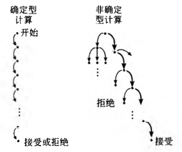
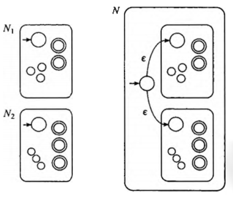
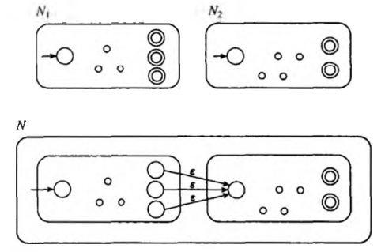
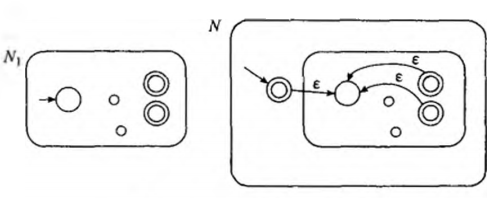

#  正则语言

计算模型（Computational Model)

## 有穷自动机

**有穷状态机(Finite State Machine)** 是描述能力和资源极其有限的计算机的模型。

有穷自动机和与之对应的 **马尔科夫链（Markov Chains)** 常用于识别数据中的模式。

**状态图(State Diagram)**

从一个状态指向另一个状态的箭头称为 **转移** 。

### 有穷自动机的形式化定义

有穷自动机是一个5元组$(Q,Σ,δ,q_0,F)$，其中

1. $Q$是一个有穷集合，称为状态集。
2. $Σ$是一个有穷集合，称为字母表。
3. $δ：Q×Σ→Q$是转移函数。
4. $q_0∈Q$是起始状态。
5. $F⊆Q$是接受状态集。

若A是机器M接受的全部字符串集，则称A是机器M的 **语言**，记作L(M)=A。又称 **M识别A** 或 **M接受A** 。一台机器可能接受若干字符串，但是它永远只能识别一个语言。如果机器不接受任何字符串，那么它仍然识别一个语言，即空语言∅。

### 计算的形式化定义

设$M=(Q,Σ,δ,q_0,F)$是一台有穷自动机，$w=w_1w_2...w_n$是一个字符串并且其中任一$w$是字母表$Σ$的成员。如果存在$Q$中的状态序列$r_0,r_1,...,r_n$，满足下述条件:

1. $r_0 = q_0$
2. $δ(r_i,w_{i+1}) = r_{i+1} , i = 0,..., n-1$
3. $r_n ∈ F$

则$M$接受$w$。

如果一个语言被一台有穷自动机识别，则称它是 **正则语言** （regular language)

### 设计有穷自动机

### 正则运算

在算术中，基本对象是数，工具是处理数的运算，如+和×。在计算理论中，对象是语言，工具包括为处理语言专门设计的运箅。定义语言的三种运算，称为正则运算（regular operation),并且使用这些运算来研究正则语言的性质。

设A和B是两个语言，定义正则运算并（union)、连结（concatenation)和星号(star)如下:
- **并** ： $A∪B=\{ x|x∈A或x∈B \}$
- **连结** ：$A○B=\{ xy | x∈A且x∈B \}$
- **星号** ：$A^* = {x_1x_2x_3 \dots x_k|k≥0且每一个x_i∈A}$

星号运算是一元运算（unary operation)而不是二元运算（binary operation)。它把A中的任意个字符串连结在一起得到新语言中的一个字符串。因为“任意个”包括0个在内，所以不管$A$是什么，空串$ε$总是 $A^* $ 的一个成员。

如果把某种运算应用于一个对象集合的成员得到的对象仍在这个集合中，则称这个对象集合在该运算下 **封闭** 。

**正则语言类在并运算下封闭。**

## 非确定性

**DFA**，Deterministic Finite Automata，确定的有限状态自动机。
**NFA**，Nondeterministic Finite Automata，不确定的有限状态自动机。

DFA的每一个状态对于字母表中的每一个符号总是恰好有一个转移箭头射出。

在NFA中，一个状态对于字母表中的每一个符号可能有0个、1个或多个射出的箭头。

>NTA计算方式
>把非确定性计算看作一棵可能性的树。树根对应计算的开始，树中的每一个分支点对应计算中机器有多种选择的点。如果计算分支中至少有一个结束在接受状态，则机器接受。
>

下图中的NFA $N_3$，它的输人字母表$\{0\}$由一个符号组成。只含一个符号的字母表称为一元字母表。

这台机器说明了有$ε$箭头的方便之处。它接受所有形如$0^k$的字符串，其中$k$是2或3的倍数(注意上标表示重复，不是数值的指数）。

### 非确定型有穷自动机的形式化定义

NFA与DFA本质差别，转移函数不同。在DFA中，转移函数取一个状态和一个输入符号，产生下一个状态。在NFA中，转移函数取一个状态和一个输入符号或者空串，产生可能的下一个状态的集合。

对任意的集合$Q$，记$P(Q)$为$Q$的所有子集组成的集合。这里称$P(Q)$是$Q$的幂集。

对任意的字母表$Σ$,把$Σ∪\{ε\}$记作$Σ_ε$

非确定型有穷自动机是一个5元组$(Q,Σ,δ,q_0,F)$，其中

1. $Q$是一个有穷的状态集。
2. $Σ$是一个有穷的字母表。
3. $δ：Q×Σ_ ε→P(Q)$ 是转移函数。
4. $q_0∈Q$是起始状态。
5. $F⊆Q$是接受状态集。

## NFA与DFA的等价性

定理: **每一台非确定型有穷自动机都等价于某一台确定型有穷自动机。**

### 在正则运算下的封闭性

定理: **正则语言类在并运算下封闭。**

并运算证明示意图

连结运算证明示意图

星号运算证明示意图

## 正则表达式

### 正则表达式的形式化定义

称$R$是一个正则表达式，如果$R$是:
1. 这里$a$是字母表$Σ$中的一个元素
2. $ε$
3. $\varnothing$
4. $(R_1∪R_2)$，这里R_1 2)，这里$R_1$和$R_2$是正则表达式
5. $(R_1○R_2)$，这里$R_1$和$R_2$是正则表达式
6. $(R_1^* )$，这里$R_1$是正则表达式

在第1条和第2条中，正则表达式$a$和$e$分别表示语言$\{a\}$和$\{e\}$。在第3条中，正则表达式$\varnothing$表示空语言。

为便于描述将$RR^* $记作$R^+$。换句话说，鉴于$R^* $表示由0个或多个$R$中的串连结构成的所有串，$R^+$表示由1个或多个$R$中的串连结构成的所有串。因此$R^+∪ε=R^* $。此外，将$k$个$R$中的中通过连结得到的串简记作$R^k$。

### 与有穷自动机的等价性

任何正则表达式都能够转换成能识别它所描述语言的有穷自动机，反之亦然。

**广义非确定型有穷自动机(Generalized nondeterministic finite automaton)**
就是非确定型有穷自动机，只是转移箭头可以用任何正则表达式作标号，而不是只能用字母表的成员或e作标号。

广义非确定型有穷自动机$(Q,Σ,δ,q_{start},q_{accept})$是一个五元组，其中

1. $Q$是一个有穷的状态集。
2. $Σ$是一个输入的字母表。
3. $δ：(Q-q_{accept})×(Q-q_{start})→R$ 是转移函数。
4. $q_{start}$是起始状态。
5. $q_{accept}$是接受状态集。

## 非正则语言

证明非正则性的技术源于一个关于正则语言的定理，通常把它称为泵引理。该定理指出所有的正则语言都有一种特殊的性质。如果能够证明一个语言没有这种性质，则可以保证它不是正则的。这条性质是：语言中的所有字符串只要它的长度不小于某个特定的值——**泵长度**，就可以被“抽取”。它的意思是指每一个这样的字符串都包括一段子串，把这段子串重复任意次，得到的字符串仍在这个语言中。
