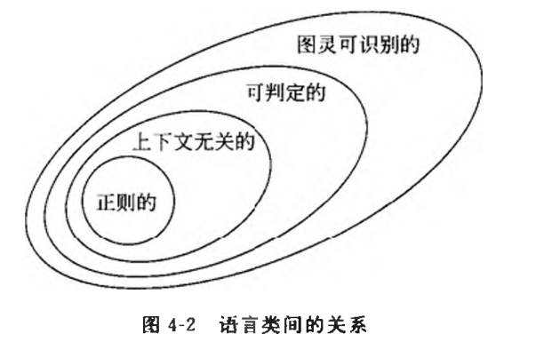

# 可判定性

## 可判定语言

### 与正则语言相关的可判定性问题

### 与上下文无关语言相关的可判定性问题

**每个上下文无关语言都是可判定的。**

## 停机问题

**检査一个图灵机是否接受一个给定的串问题是不可解的。**

### 对角化方法

康托对*测量无限集合的规模问题*提出了一个非常好的解决办法。他注意到：对于两个有限集合，如果其中一个集合的元素能与另一集合的元素配对，则它们有相同的规模。这个方法没有凭借计数就比较了规模，因而可以将此思想推广到无限集合上。

设$A$和$B$是两个集合，$f$是从$A$到$B$的函数。如果$f$从不将两个不同元素映射到同一个对象，即：只要有$a≠b$就有$f(a)≠f(b)$,則称$f$是 **一对一映射** 的。如果$f$能击中$B$的每个元素，即：对$B$的每个元素$b$,都存在$a∈A$,使得$f(a)=b$,则称$f$是 **满映射**。如果存在函数$f:A→B$,$f$是一对一映射又是满映射，则称集合$A$和$B$有 **相同规模**。而既是一对一映射又是满映射的函数称为 **对应**。在对应中，$A$的每个元素映射到$B$的唯一一个元素，且$B$的每个元素都有$A$的唯一一个元素映射到它。对应就是将$A$的元素与$B$的元素进行配对的方法。

设$N$是自然数集合$\{1,2,3,...\}$，如果一个集合$A$是有限的或者与$N$有相同的规模，則称$A$是 **可数的**。没有与$N$的对应的无限集合称为 **不可数的**。

**实数集是不可数的**

上述定理对计算理论有着重要的应用，它表明有些语言是不可判定的，甚至不是图灵可识别的，原因是：有不可数个语言，却只有可数个图灵机。由于一个图灵机只能识别一个语言，而语言比图灵机更多，故有些语言不能用任何的图灵机识别。这样的语言就不是图灵可识别的，正如如下推论所说。**存在不能被任何图灵机识别的语言。**

### 停机问题是不可判定的

### 一个图灵不可识别语言

**一个语言是可判定的，当且仅当它既是图灵可识别的，也是补图灵可识别的。**
