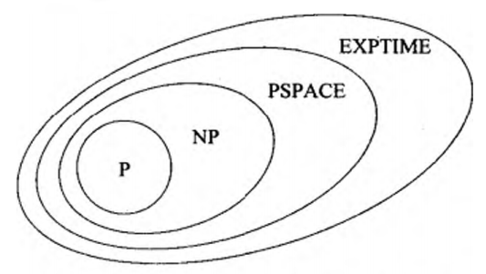

# 空间复杂性

令$M$是一个在所有输入上都停机的确定型图灵机。$M$的**空间复杂度(space complexity)** 足一个函数$f:N→N$，其中$f(n)$是$M$在任何长为$n$的输入上扫描带方格的最大数。若$M$的空间复杂度为$f(n)$，则称$M$在空间$f(n)$内运行。

## 萨维奇定理

该定理表明确定型机器可以用非常少的空间模拟非确定型机器。对于时间复杂性，这种模拟似乎需要指数倍地增加时间。对于空间复杂性，萨维奇定理说明，任何消耗$f(n)$空间的非确定型TM都可以转变为仅消耗$f^2(n)$空间的确定型TM。

